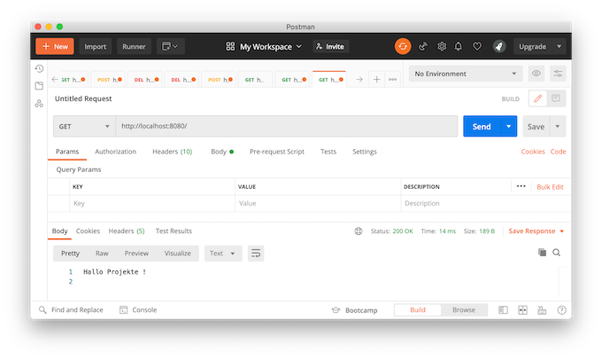

# Backend

Zur Implementierung des Backends verwenden wir in dieser Anleitung [**node.js**](https://nodejs.org/). 


## Installation

Dort finden Sie auch die [**Download-Seite**](https://nodejs.org/en/download/) von node.js für alle Betriebssysteme. Sollten Sie node.js auf dem virtuellen Server installieren wollen oder müssen, dann geht dies mittels 

```bash
sudo apt-get install nodejs
```

`sudo` kann weggelassen werden, wenn Sie das Kommando bereits als `root` ausführen. Nach erfolgreicher Installation sollte die Eingabe von 

```bash
node -v
```

die Versionsnummer der installierten Instanz ausgeben, z.B. `v12.19.0`. 

## Projekt erstellen

Wir erstellen uns einen Ordner `backend`. Wechseln Sie in diesen Ordner und geben Sie ein:

```bash
npm init 
```

Es wird eine `package.json` erstellt. Dafür werden Ihnen einige Fragen gestellt. Die meisten können Sie einfach mit `Enter` bestätigen (die Frage nach dem `test command:`) bleibt dann erstmal unbeantwortet. Bei der Frage nach dem `git repository` wäre es gut, wenn Sie sich bereits ein passendes Repository bei Ihrem Git-Host angelegt haben und dieses dann hier verbinden können (bei mir z.B. `https://github.com/jfreiheit/backend.git`).

Die entstandene `package.json` könnte dann z.B. so aussehen:

```json
{
  "name": "backend",
  "version": "1.0.0",
  "description": "Backend für Projekte-Anleitungen",
  "main": "server.js",
  "scripts": {
    "test": "echo \"Error: no test specified\" && exit 1",
    "start": "node server.js"
  },
  "repository": {
    "type": "git",
    "url": "git+https://github.com/jfreiheit/backend.git"
  },
  "keywords": [
    "backen",
    "projekte",
    "node.js"
  ],
  "author": "HTW FIW",
  "license": "ISC",
  "bugs": {
    "url": "https://github.com/jfreiheit/backend/issues"
  },
  "homepage": "https://github.com/jfreiheit/backend#readme"
}
```

Fügen Sie nun noch die Pakete `express` (HTTP-Unterstützung), `mysql` (MySQl-Anbindung), `body-parser` (Parsen von Daten, die per Request übergeben werden (POST)) und `morgan` (ein HTTP-Request-Logger) hinzu:

```bash
npm install express --save
npm install mysql --save
npm install body-parser --save
npm install morgan --save
```

und in diesem Ordner erstellen wir mithilfe der [**IDE Ihrer Wahl**](./frontend.md#ide) eine Datei `index.js`. Diese Datei soll folgenden Inhalt haben (wir fangen erstmal einfach an und bauen uns einen simplen Webserver):

=== "backend/index.js"
	```javascript
	const http = require('http');

	const server = http.createServer(function(request, response) {
	    response.writeHead(200, { 'content-type': 'text/plain; charset=utf-8'});
	    response.write('Hallo ');
	    response.end('Projekte !\n')
	});

	server.listen(8080, () => {
	    console.log('Server is listening to http://localhost:8080');
	});
	```

Diesen können wir nun starten, indem wir im Terminal in den `backend`-Ordner wechseln und dort 

```bash
node index.js
```

eingeben. Rufen Sie nun Ihren Browser auf und geben als URL `http://localhost:8080/`ein. Noch besser ist es (für später), wenn Sie [**Postman**](https://www.postman.com/) aufrufen und dort in die Zeile neben `GET``http://localhost:8080/' eingeben und dann auf 'Send` drücken. Das Ergebnis sieht dann so aus:



Wenn Sie etwas an Ihrem Source Code ändern und die Änderungen ausprobieren möchten, müssen Sie den `node`-Prozess im Terminal immer mit `Ctrl-C` beenden und dann mit `node index.js` erneut starten. Um dies zu umgehen, gibt es `nodemon`. Installieren Sie `nodemon` mit

```bash
npm install -g nodemon
```

und führen Ihre Anwendung dann mit 

```bash
nodemon index.js
```
aus. 