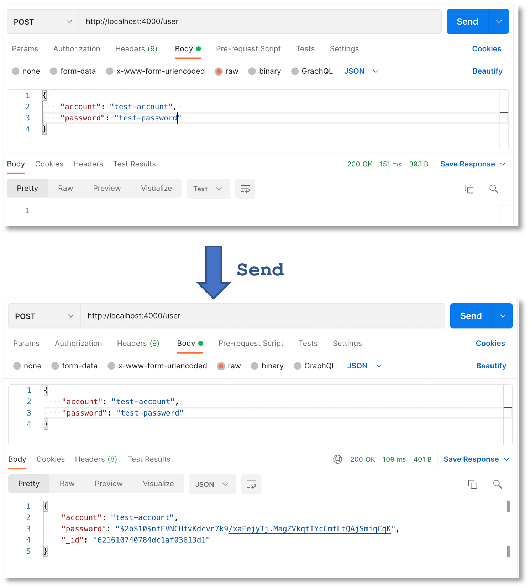
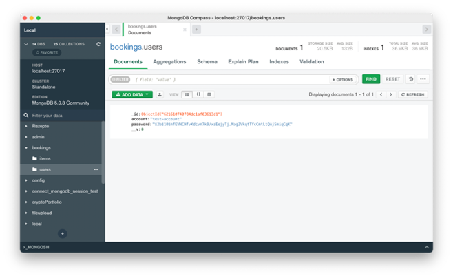
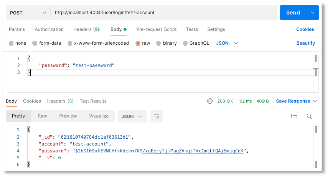
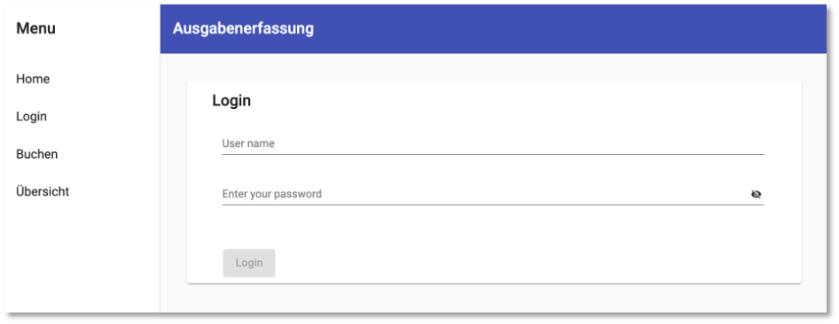
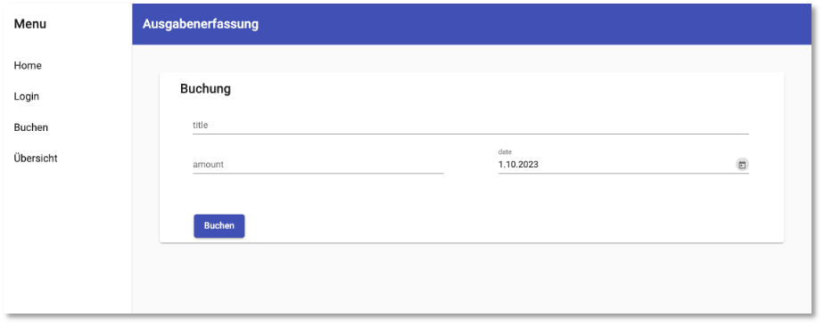

# Ausgabenerfassung

Wir zeigen eine kleine Anwendung als vollständiges Beispiel. Es geht um die Erfassung und Anzeige von Ausgaben. Dazu wird eine kleine Nutzerverwaltung implementiert. Die Anwendung besteht aus einem [Frontend](#frontend) und einem [Backend](#backend). Zur persistenten Datenspeicherung wird eine MongoDB verwendet. 


## Backend


```bash
mkdir backend
cd backend
npm init
npm install cors express mongoose dotenv bcrypt express-session
npm install nodemon --save-dev
```

Die `main`-Datei soll `server.js` sein und wir erstellen ein `watch`-Skript, das `nodemon` startet:

=== "package.json"
	```json linenums="1"
	{
	  "name": "backend",
	  "version": "1.0.0",
	  "description": "Buchungen",
	  "main": "server.js",
	  "scripts": {
	    "watch": "nodemon ./server.js",
	    "test": "echo \"Error: no test specified\" && exit 1"
	  },
	  "author": "J. Freiheit",
	  "license": "ISC",
	  "dependencies": {
	    "cors": "^2.8.5",
	    "dotenv": "^16.0.0",
	    "express": "^4.17.3",
	    "mongoose": "^6.2.3"
	  },
	  "devDependencies": {
	    "nodemon": "^2.0.15"
	  }
	}
	```

### Models

Zuerst erstellen wir uns mithilfe von [mongoose](https://mongoosejs.com/) zwei *Models*, ein Model für `User` und das andere für die `Item`s, die wir speichern wollen. Diese Models erstellen wir im `models`-Ordner:

=== "models/user.model.js"
	```js linenums="1"
	const mongoose = require('mongoose');

	// users Schema
	const usersSchema = new mongoose.Schema({
	    account: String,
	    password: String
	});

	// Exporting our model objects
	module.exports = mongoose.model('User', usersSchema);
	```

=== "models/item.model.js"
	```js linenums="1"
	const mongoose = require('mongoose');

	// items Schema
	const itemSchema = new mongoose.Schema({
	    title: String,
	    amount: Number,
	    date: Date,
	    user_id: String
	});

	// Exporting our model objects
	module.exports = mongoose.model('Item', itemSchema);
	```

Diese Modelle werden als *Collections* in der MongoDB verwendet. Dabei ist zu beachten, dass die Collections kleingeschrieben und als englischer Plural angelegt werden, also `users` und `items`. 

### Routes

Auf den *Collections* (Modelle) lassen sich in der MongoDB nun CRUD-Funktionen (*Queries*) ausführen, siehe dazu z.B. [hier](https://mongoosejs.com/docs/queries.html). Wir erstellen nun einzelne REST-Endpunkte in den Routen. Dazu legen wir im `routes`-Ordner eine `user.route.js` und eine `item.route.js` wie folgt an:


=== "routes/user.route.js"
	```js linenums="1"
	const express = require('express');
	const router = express.Router();
	const bcrypt = require('bcrypt');

	const User = require('../models/user.model');

	// get all users
	router.get('/', async(req, res) => {
	    const allUsers = await User.find();
	    console.log(allUsers);
	    res.send(allUsers);
	});

	// post one user
	router.post('/', async(req, res) => {
	    const saltRounds = 10;
	    let pwHash = '';
	    await bcrypt.genSalt(saltRounds, (err, salt) => {
	        bcrypt.hash(req.body.password, salt, (errHash, hash) => {
	            pwHash = hash;
	            const newUser = new User({
	                account: req.body.account,
	                password: pwHash
	            });
	            console.log('newUser', newUser);
	            newUser.save();
	            res.send(newUser);
	        });
	    });

	});

	// get one user via account and password
	router.post('/login/:account', async(req, res) => {
	    try {
	        const user = await User.findOne({ account: req.params.account });
	        let sendPw = req.body.password;
	        let userPW = user.password;
	        bcrypt.compare(sendPw, userPW, (err, result) => {
	            if (result) {
	                console.log('Passwort korekt!');
	                res.send(user);
	            } else {
	                console.log('falsches Passwort!');
	                res.status(403);
	                res.send({
	                    error: "Wrong password!"
	                });
	            }
	        });
	    } catch {
	        res.status(404);
	        res.send({
	            error: "User does not exist!"
	        });
	    }
	});

	// get one user via account
	router.get('/:account', async(req, res) => {
	    try {
	        const user = await User.findOne({ account: req.params.account });

	        console.log(req.params);
	        res.send(user);
	    } catch {
	        res.status(404);
	        res.send({
	            error: "User does not exist!"
	        });
	    }
	});

	module.exports = router;
	```

=== "routes/item.route.js"
	```js linenums="1"
	const express = require('express');
	const router = express.Router();

	const Item = require('../models/item.model');

	// post one item
	router.post('/', async(req, res) => {
	    const newItem = new Item({
	        title: req.body.titel,
	        amount: req.body.betrag,
	        date: req.body.datum,
	        user_id: req.session.user_id
	    })
	    await newItem.save();
	    res.send(newItem);

	});

	// get all items for user_id
	router.get('/', async(req, res) => {
	    try {
	        const item = await Item.find({ user_id: req.session.user_id });
	        res.send(item);
	    } catch {
	        res.status(404);
	        res.send({
	            error: "User does not exist!"
	        });
	    }
	});

	// delete one item via id
	router.delete('/:id', async(req, res) => {
	    try {
	        await Item.deleteOne({ _id: req.params.id })
	        res.status(204).send()
	    } catch {
	        res.status(404)
	        res.send({ error: "Item does not exist!" })
	    }
	});

	module.exports = router;
	```

Für die `User` werden also folgende Anfragen zur Verfügung gestellt:

- Eine `GET`-Anfrage, die alle in der Collection `users` enthaltenen Einträge liefert. 
- Eine `POST`-Anfrage, der im `body` der Anfrage ein `account` und ein `password` übermittelt wird. Das Passwort wird mithilfe von `bcrypt` in einen Hashwert umgewandelt und dieser Hashwert wird gespeichert. 
- Eine `POST`-Anfrage unter `/login/:account`, wobei `:account` ein Parameter ist. Nach diesem `account` wird in der Collection `users` gesucht und der zugehörige Datensatz ermittelt. Im `body` der Anfrage wird das `password` mitgesendet. Mithilfe von `bcrypt` wird überprüft, ob das gesendete Passwort mit dem als Hashwert gespeicherten Passwort übereinstimmt. 
- Eine `GET`-Anfrage, der der `account`-Name als Parameter geschickt wird. Die `_id` des entsprechenden Datensatzes wird zurückgeschickt, ohne eine Passwortabfrage. 

Für die `Item`s werden folgende Anfragen zur Verfügung gestellt:

- Eine `POST`-Anfrage zur Erzeugung eines `item` in der `items`-Collection. Die zum `item` gehörenden Daten werden im `body` der Anfrage übergeben. 
- Eine `GET`-Anfrage für alle `item`s, die zu einer bestimmten `user_id` gehören. Diese `user_id` wird aus der `Session` ermittelt. 
- Eine `DELETE`-Anfrage, der eine `_id` als Parameter übergeben wird. Der Datensatz mit dieser `_id` wird gelöscht. 

### server.js

Die `server.js` sieht dann wie folgt aus:

=== "server.js"
	```js linenums="1"
	const express = require('express');
	const cors = require('cors');
	const mongoose = require('mongoose');
	const session = require('express-session');
	require('dotenv').config();

	// Routes to Handle Request
	const userRoute = require('./routes/user.route');
	const itemRoute = require('./routes/item.route');

	// Setup Express.js and Cors
	const app = express();
	app.use(express.json());
	app.use(cors());

	app.use(session({
	    secret: 'key that will sign the cookie',
	    resave: false,
	    saveUninitialized: false
	}));

	// API Routes
	app.use('/user', userRoute);
	app.use('/item', itemRoute);

	const port = process.env.PORT || 4000;
	app.listen(port, () => {
	    console.log('Connected to port ' + port)
	})

	// connect to mongoDB
	mongoose.connect(process.env.DB_CONNECTION, { useNewUrlParser: true, useUnifiedTopology: true })
	    .then(
	        () => { console.log('connected to DB'); },
	        err => { console.error.bind(console, 'connection error:') }
	    );
    ```

In der `server.js` wird die URL zur MongoDB aus der `.env`-Datei ausgelesen:

=== ".env"
	```js linenums="1"
	DB_CONNECTION = mongodb://127.0.0.1:27017/bookings
    ```


Das Backend lässt sich mithilfe von `npm run watch` starten. Auf der Konsole erscheint dann folgende Ausgabe:

```bash

> backend@1.0.0 watch
> nodemon ./server.js

[nodemon] 2.0.15
[nodemon] to restart at any time, enter `rs`
[nodemon] watching path(s): *.*
[nodemon] watching extensions: js,mjs,json
[nodemon] starting `node ./server.js`
Connected to port 4000
connected to DB
```

### user-Endpunkte testen mit Postman

Wir testen die Endpunkte für `user` mit [Postman](https://www.postman.com/). 

#### C-reate User

Wir können z.B. neue `user` anlegen. Dazu geben wir in Postman die URL `http://localhost:4000/user` ein und wählen als Anfragemethode `POST`. Im `body` (klicken Sie auf `Body` und `raw` und wählen Sie `JSON`) geben wir z.B. ein: 

```bash
{ 
    "account": "test-account", 
    "password": "test-password"
}
```

Wenn wir auf `Send` klicken, wird ein neuer Datensatz erzeugt, in dem das `password` einem Hashwert entspricht und der eine automatisch erzeugte `_id` besitz, z.B. 

```bash
{
    "account": "test-account",
    "password": "$2b$10$nfEVNCHfvKdcvn7k9/xaEejyTj.MagZVkqtTYcCmtLtQAjSmiqCqK",
    "_id": "621610740784dc1af03613d1"
}
```

Hier nochmal als Bild:



Öffnen Sie zur Kontrolle auch [MongoDB Compass](https://www.mongodb.com/products/compass) und verbinden Sie sich dort mit `localhost:27017`. In der `booking`-Datenbank erscheint in der Collection `users` der neue Eintrag:



Der neue Eintrag erscheint übrigens auch in der Konsole, da wir in der `routes/user.route.js` in Zeile `25` die entsprechende Konsolenausgabe implementiert hatten:

```bash
newUser {
  account: 'test-account',
  password: '$2b$10$nfEVNCHfvKdcvn7k9/xaEejyTj.MagZVkqtTYcCmtLtQAjSmiqCqK',
  _id: new ObjectId("621610740784dc1af03613d1")
}
```

#### R-ead one User

Ein gespeicherter `user` mit z.B. dem `account` `test-account` kann angefragt werden, indem eine `POST`-Anfrage an die URL `http://localhost:4000/user/login/test-account` gestellt und im `body` der Anfrage das Passwort übergeben wird.




Wir als `account` ein nicht existierender Nutzeraccount übergeben, z.B. `http://localhost:4000/user/login/wrong-account`, erscheint als *Response* 

```json
{
    "error": "User does not exist!"
}
```

Der HTTP-Fehlercode ist `404 Not found`.

Existiert zwar der `account`, jedoch ist das im `body` übergebene Passwort falsch, erscheint als *Response* 

```json
{
    "error": "Wrong password!"
}
```

mit dem HTTP-Fehlercode `403 Forbidden`.

#### R-ead one user_id

Um die `user_id` zu einem gegebenen `account` zu ermitteln, wird eine `GET`-Anfrage gestellt, der der `account` als Parameter der URL übergeben wird, also z.B. 

```bash
http://localhost:4000/user/test-account
```

Als Antwort erhält man `"621610740784dc1af03613d1"` mit dem HTTP-Code `200 OK`. `GET`-Anfragen können auch direkt im Browser gestellt werden, indem man einfach die URL eingibt. 

#### R-ead all users

Alle in der Datenbank gespeicherten `user` können über die `GET`-Anfrage `http://localhost:4000/user` ermittelt werden. Als *Response* wird ein Arry zurückgegeben, das alle `user` als JSON enthält, z.B. 

```json
[
    {
        "_id": "621610740784dc1af03613d1",
        "account": "test-account",
        "password": "$2b$10$nfEVNCHfvKdcvn7k9/xaEejyTj.MagZVkqtTYcCmtLtQAjSmiqCqK",
        "__v": 0
    },
    {
        "_id": "621622d70784dc1af03613db",
        "account": "test-account-2",
        "password": "$2b$10$GcLuHnE1fImdvxwjkPje1.9jnbNBQXzXi3lkmMq462WZrITfV7GFe",
        "__v": 0
    }
]
```


### item-Endpunkte testen mit Postman

Wir testen die Endpunkte für `item` mit [Postman](https://www.postman.com/). Dies ist teilweise ein wenig aufwendiger, da wir dort bereits mit `Sessions` arbeiten.

#### C-reate Item

So ist beispielsweise das Erstellen eines neuen Items so definiert, dass `title`, `amount` und `date` aus dem `body` der Anfrage entnommen werden (siehe Zeilen `9-11` in `item.route.js`), die `user_id` der Nutzerin, die dieses `Item` erstellt, wird jedoch aus der `Session` ausgelesen. 


## Frontend


```bash
ng new frontend
```


```bash
cd frontend
ng add ngx-bootstrap
ng add @angular/material
ng generate @angular/material:address-form input
ng generate @angular/material:address-form login
ng generate @angular/material:table table
ng generate @angular/material:navigation nav
ng generate @angular/material:dashboard home
ng g c pagenotfound
ng g interface models/user
ng g interface models/item
ng g service services/backend
ng g service services/auth
ng g guard guards/auth
```

Für den `AuthGuard` `CanActivate` wählen. 


### Routing

Zunächst einen *Service*, über den wir später verwalten, ob eine Nutzerin eingelogged ist oder nicht. Wir geben zunächst immer ein `true` zurück, damit alle Routen angewählt werden können. 

=== "services/auth.service.ts"
	```js linenums="1"
	import { Injectable } from '@angular/core';

	@Injectable({
	  providedIn: 'root'
	})
	export class AuthService {

	  constructor() {}

	  loggedIn():boolean {
	    return true;
	  }
	}
	```


Der `AuthGuard` gibt für die `canActivate()`-Funktion ein `true` zurück, wenn die Nutzerin eingelogged ist. Wenn nicht, wird die *Route*  nach `/login` umgeleitet und ein `false` zurückgegeben. 

=== "guards/auth.guard.ts"
	```js linenums="1"
	import { Injectable } from '@angular/core';
	import { ActivatedRouteSnapshot, CanActivate, Router, RouterStateSnapshot, UrlTree } from '@angular/router';
	import { Observable } from 'rxjs';
	import { AuthService } from '../services/auth.service';

	@Injectable({
	  providedIn: 'root'
	})
	export class AuthGuard implements CanActivate {
	  constructor(private authService: AuthService, private router: Router) {}

	  canActivate(
	    route: ActivatedRouteSnapshot,
	    state: RouterStateSnapshot): Observable<boolean | UrlTree> | Promise<boolean | UrlTree> | boolean | UrlTree {
	    if (this.authService.loggedIn()) {
	      return true;
	    } else {
	      this.router.navigate(['/login']);
	      return false;
	    }
	  }

	}
	```

Die Routen werden wie folgt definiert. Wenn Sie im `auth.service` anstelle von `return true` ein `false` zurückgeben, können die Komponenten `Home`, `Input` und `Table` nicht ausgewählt werden, sondern Sie werden dann stets auf die `LoginComponent` umgeleitet. 

=== "app-routing.module.ts"
	```js linenums="1"
	import { NgModule } from '@angular/core';
	import { RouterModule, Routes } from '@angular/router';
	import { HomeComponent } from './home/home.component';
	import { LoginComponent } from './login/login.component';
	import { PagenotfoundComponent } from './pagenotfound/pagenotfound.component';
	import { TableComponent } from './table/table.component';
	import { InputComponent } from './input/input.component';

	const routes: Routes = [
	    { path: '', component: HomeComponent, pathMatch: 'full', canActivate: [AuthGuard] },
	    { path: 'login', component: LoginComponent },
	    { path: 'input', component: InputComponent, canActivate: [AuthGuard] },
	    { path: 'table', component: TableComponent, canActivate: [AuthGuard] },
	    { path: '**', component: PagenotfoundComponent }
	];

	@NgModule({
	  imports: [RouterModule.forRoot(routes)],
	  exports: [RouterModule]
	})
	export class AppRoutingModule { }
	```

In der `AppComponent` wird statisch die `NavComponent` eingebunden. Man hätte also auch gleich die `AppComponent` zur `NavComponent` machen können. 

=== "app.component.html"
	```html linenums="1"
	<app-nav></app-nav>
	```

In der `NavComponent` werden die `routerLink` für die einzelnen Menüeinträge definiert und es wird die `<router-outlet>`-Direktive eingebunden, in die dann dynamisch die jeweils aufgerufene Komponente eingebunden wird. 

=== "nav.component.html"
	```html linenums="1" hl_lines="8-11 27"
	<mat-sidenav-container class="sidenav-container">
	  <mat-sidenav #drawer class="sidenav" fixedInViewport
	      [attr.role]="(isHandset$ | async) ? 'dialog' : 'navigation'"
	      [mode]="(isHandset$ | async) ? 'over' : 'side'"
	      [opened]="(isHandset$ | async) === false">
	    <mat-toolbar>Menu</mat-toolbar>
	    <mat-nav-list>
	      <a mat-list-item routerLink="/" routerLinkActive="active">Home</a>
	      <a mat-list-item routerLink="/login" routerLinkActive="active">Login</a>
	      <a mat-list-item routerLink="/input" routerLinkActive="active">Buchen</a>
	      <a mat-list-item routerLink="/table" routerLinkActive="active">Übersicht</a>
	    </mat-nav-list>
	  </mat-sidenav>
	  <mat-sidenav-content>
	    <mat-toolbar color="primary">
	      <button
	        type="button"
	        aria-label="Toggle sidenav"
	        mat-icon-button
	        (click)="drawer.toggle()"
	        *ngIf="isHandset$ | async">
	        <mat-icon aria-label="Side nav toggle icon">menu</mat-icon>
	      </button>
	      <span>Ausgabenerfassung</span>
	    </mat-toolbar>
	    <!-- Add Content Here -->
	    <router-outlet></router-outlet>
	  </mat-sidenav-content>
	</mat-sidenav-container>
	```


### Login

Ein *Interface* für `User`:

=== "models/user.ts"
	```js linenums="1"
	export interface User {
		_id: string;
	  	account: string;
	  	password: string;
	}
	```


*Reactive Formular* für `Login`:


=== "login.component.ts"
	```js linenums="1"
	import { Component } from '@angular/core';
	import { FormBuilder, Validators } from '@angular/forms';
	import { User } from '../models/user';

	@Component({
	  selector: 'app-login',
	  templateUrl: './login.component.html',
	  styleUrls: ['./login.component.css']
	})
	export class LoginComponent {
	  loginForm = this.fb.group({
	    account: [null, Validators.required],
	    password: [null, Validators.required]
	  });

	  hide = true;

	  constructor(private fb: FormBuilder) {}

	  onSubmit(): void {
	    let user: User = {
	      "account": this.loginForm.value.account,
	      "password": this.loginForm.value.password
	    }
	    alert(user.account + " " + user.password);
	  }
	}
	```


=== "login.component.html"
	```html linenums="1"
	<form [formGroup]="loginForm" novalidate (ngSubmit)="onSubmit()">
	  <mat-card class="login-card">
	    <mat-card-header>
	      <mat-card-title>Login</mat-card-title>
	    </mat-card-header>
	    <mat-card-content>
	      <div class="row">
	        <div class="col">
	          <mat-form-field class="full-width">
	            <input matInput placeholder="User name" formControlName="account">
	            <mat-error *ngIf="loginForm.controls['account'].hasError('required')">
	              user name is <strong>required</strong>
	            </mat-error>
	          </mat-form-field>
	        </div>
	      </div>
	      <div class="row">
	        <div class="col">
	          <mat-form-field class="full-width">
	            <mat-label>Enter your password</mat-label>
	            <input matInput [type]="hide ? 'password' : 'text'" formControlName="password">
	            <button mat-icon-button matSuffix (click)="hide = !hide" [attr.aria-label]="'Hide password'" [attr.aria-pressed]="hide">
	              <mat-icon>{{hide ? 'visibility_off' : 'visibility'}}</mat-icon>
	            </button>
	            <mat-error *ngIf="loginForm.controls['password'].hasError('required')">
	              password is <strong>required</strong>
	            </mat-error>
	          </mat-form-field>
	        </div>
	      </div>
	    </mat-card-content>
	    <mat-card-actions>
	      <button mat-raised-button color="primary" type="submit" [disabled]="!loginForm.valid">Login</button>
	    </mat-card-actions>
	  </mat-card>
	</form>
	```


=== "login.component.css"
	```css linenums="1"
	.full-width {
	  width: 96%;
	  margin: 1% 4% auto;
	}

	form {
	  margin: 4% 4%;
	}

	.login-card {
	  min-width: 120px;
	  margin: 4% auto;
	}

	.mat-card-actions {
	  margin: 4% 4%;
	}

	.row {
	  display: flex;
	  flex-direction: row;
	}

	.col {
	  flex: 1;
	  margin-right: 4%;
	}

	.col:last-child {
	  margin-right: 4%;
	}
	```




## Buchung


Ein *Interface* für ein Buchungs-`Item`:

=== "models/item.ts"
	```js linenums="1"
	export interface Item {
	  titel: string;
	  betrag: number;
	  datum: Date;
	}
	```

Im Formular wird der [Datepicker](https://material.angular.io/components/datepicker/overview) von [Angular Materail](https://material.angular.io/) verwendet. Außerdem wollen wir die deutsche Darstellung des Datums und benötigen dafür [DatePipe](https://angular.io/api/common/DatePipe). Diese Module müssen zunächst in der `app.module.ts` importiert werden:

=== "app.module.ts"
	```js linenums="1" hl_lines="29-31 63-64 66"
	import { NgModule } from '@angular/core';
	import { BrowserModule } from '@angular/platform-browser';

	import { AppRoutingModule } from './app-routing.module';
	import { AppComponent } from './app.component';
	import { BrowserAnimationsModule } from '@angular/platform-browser/animations';
	import { InputComponent } from './input/input.component';
	import { MatInputModule } from '@angular/material/input';
	import { MatButtonModule } from '@angular/material/button';
	import { MatSelectModule } from '@angular/material/select';
	import { MatRadioModule } from '@angular/material/radio';
	import { MatCardModule } from '@angular/material/card';
	import { ReactiveFormsModule } from '@angular/forms';
	import { LoginComponent } from './login/login.component';
	import { TableComponent } from './table/table.component';
	import { MatTableModule } from '@angular/material/table';
	import { MatPaginatorModule } from '@angular/material/paginator';
	import { MatSortModule } from '@angular/material/sort';
	import { NavComponent } from './nav/nav.component';
	import { LayoutModule } from '@angular/cdk/layout';
	import { MatToolbarModule } from '@angular/material/toolbar';
	import { MatSidenavModule } from '@angular/material/sidenav';
	import { MatIconModule } from '@angular/material/icon';
	import { MatListModule } from '@angular/material/list';
	import { HomeComponent } from './home/home.component';
	import { MatGridListModule } from '@angular/material/grid-list';
	import { MatMenuModule } from '@angular/material/menu';
	import { PagenotfoundComponent } from './pagenotfound/pagenotfound.component';
	import { MatNativeDateModule } from '@angular/material/core';
	import { MatDatepickerModule } from '@angular/material/datepicker';
	import { DatePipe } from '@angular/common';

	@NgModule({
	  declarations: [
	    AppComponent,
	    InputComponent,
	    LoginComponent,
	    TableComponent,
	    NavComponent,
	    HomeComponent,
	    PagenotfoundComponent
	  ],
	  imports: [
	    BrowserModule,
	    AppRoutingModule,
	    BrowserAnimationsModule,
	    MatInputModule,
	    MatButtonModule,
	    MatSelectModule,
	    MatRadioModule,
	    MatCardModule,
	    ReactiveFormsModule,
	    MatTableModule,
	    MatPaginatorModule,
	    MatSortModule,
	    LayoutModule,
	    MatToolbarModule,
	    MatSidenavModule,
	    MatIconModule,
	    MatListModule,
	    MatGridListModule,
	    MatMenuModule,
	    MatNativeDateModule,
	    MatDatepickerModule
	  ],
	  providers: [DatePipe],
	  bootstrap: [AppComponent]
	})
	export class AppModule { }

	```


*Reactive Formular* für `Input`:


=== "input.component.ts"
	```js linenums="1"
	import { Component } from '@angular/core';
	import { FormBuilder, Validators } from '@angular/forms';
	import { DatePipe } from '@angular/common';
	import { DateAdapter } from '@angular/material/core';
	import { Item } from '../models/item';

	@Component({
	  selector: 'app-input',
	  templateUrl: './input.component.html',
	  styleUrls: ['./input.component.css']
	})
	export class InputComponent {
	  today = new Date();

	  inputForm = this.fb.group({
	    titel: [null, Validators.required],
	    betrag: [null, Validators.required],
	    datum: [this.datepipe.transform(this.today, 'yyyy-MM-dd'), Validators.required]
	  });

	  constructor(
	    private fb: FormBuilder,
	    private datepipe: DatePipe,
	    private dateAdapter: DateAdapter<Date>
	    ){
	      this.dateAdapter.setLocale('de-DE');
	  }

	  onSubmit(): void {
	    let item: Item = {
	      "titel": this.inputForm.value.titel,
	      "betrag": this.inputForm.value.betrag,
	      "datum": this.inputForm.value.datum
	    }
	    alert(item.titel + " " + item.betrag + " " + item.datum);
	  }
	}
	```


=== "input.component.html"
	```html linenums="1"
	<form [formGroup]="inputForm" novalidate (ngSubmit)="onSubmit()">
	  <mat-card class="booking-card">
	    <mat-card-header>
	      <mat-card-title>Buchung</mat-card-title>
	    </mat-card-header>
	    <mat-card-content>
	      <div class="row">
	        <div class="col">
	          <mat-form-field class="full-width">
	            <input matInput placeholder="title" formControlName="titel">
	            <mat-error *ngIf="inputForm.controls['titel'].hasError('required')">
	              title is <strong>required</strong>
	            </mat-error>
	          </mat-form-field>
	        </div>
	      </div>
	      <div class="row">
	        <div class="col first">
	          <mat-form-field class="full-width">
	            <input matInput type="number"  onfocus="this.select()" placeholder="amount" formControlName="betrag">
            	<mat-icon matSuffix class="smaller">euro_symbol</mat-icon>
	          </mat-form-field>
	        </div>
	        <div class="col">
	          <mat-form-field class="full-width">
	            <mat-label>date</mat-label>
	            <input matInput [matDatepicker]="datum" formControlName="datum">
	            <mat-datepicker-toggle matSuffix [for]="datum"></mat-datepicker-toggle>
	            <mat-datepicker #datum></mat-datepicker>
	          </mat-form-field>
	        </div>
	      </div>
	    </mat-card-content>
	    <mat-card-actions>
	      <button mat-raised-button color="primary" type="submit">Buchen</button>
	    </mat-card-actions>
	  </mat-card>
	</form>
	```


=== "input.component.css"
	```css linenums="1"
	.full-width {
	  width: 96%;
	  margin: 1% 4% auto;
	}

	form {
	  margin: 4% 4%;
	}

	.booking-card {
	  min-width: 120px;
	  margin: 4% auto;
	}

	.mat-card-actions {
	  margin: 4% 4%;
	}

	.row {
	  display: flex;
	  flex-direction: row;
	}

	.first {
	  margin-left: 2%;
	}

	.col {
	  flex: 1;
	  margin-right: 4%;
	}

	.col:last-child {
	  margin-right: 4%;
	}

	.smaller {
	  transform: scale(0.7);
	}
	```




### AuthService

Wir erweitern die `Login`-Komponente und den `Auth`-Service, um die Informationen zur eingeloggten Nutzerin zu verwalten.