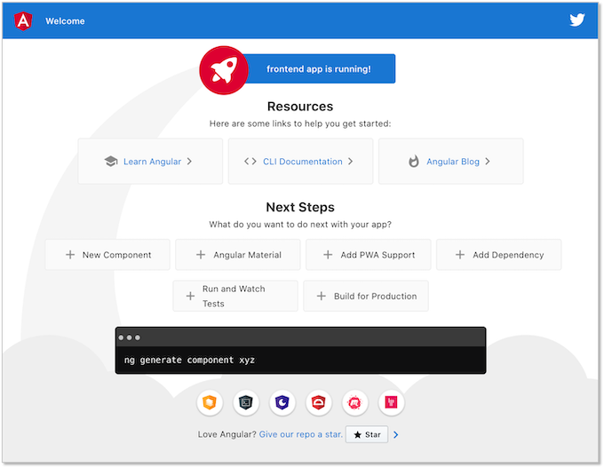
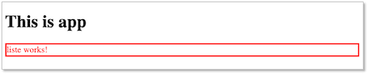
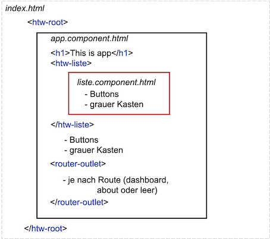
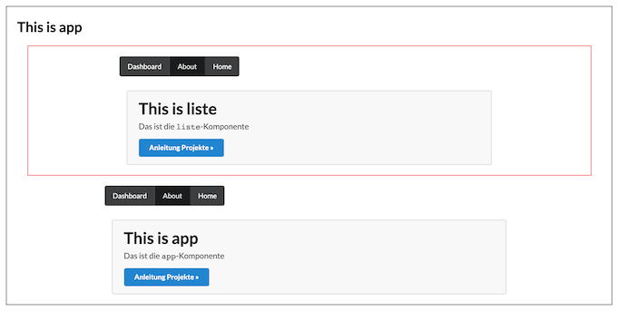
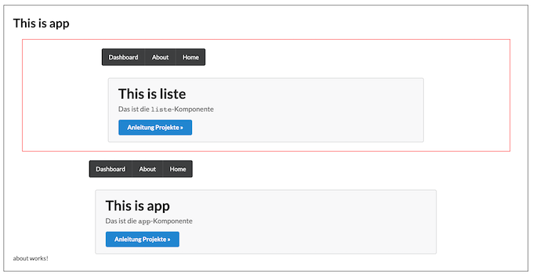

# Frontend

Um das Frontend zu erstellen, können Sie auf verschiedene JavaScript-Frameworks zurückgreifen, die sich in den letzten Jahren etabliert haben: 

- [Angular](https://angular.io/) 
- [React.js](https://reactjs.org/) 
- [Vue.js](https://vuejs.org/) 
- [Electron](https://www.electronjs.org/)

Diese gehören zu den meisteverwendeten Frameworks für die Entwicklung sogenannter *Single-Page-Applikationen*. In einer Single-Page-Applikation wird eine Seite vom Webserver geladen und diese Seite durch unterschiedliche Inhalte befüllt, je nach Nutzerinteraktion. Diese Inhalte werden in Angular durch sogenannte *Komponenten* bereitgestellt. Komponenten sind die Grundbausteine einer Angular-Anwendung. Wir zeigen hier exemplarisch den Beginn der Erstellung eines Frontends am Beispiel von Angular. 

## Installationen

Sie benötigen den Paketmanager `npm`. Laden sie sich dafür `node.js` [**hier**](https://nodejs.org/en/download/) herunter und installieren Sie es. Nach erfolgreicher Installation sollte sowohl 

```bash
node -v
```

funktionieren und eine Versionsnummer ausgeben (z.B. `v13.3.0` - aktuell stabile Version ist aber `v12.19.x`) als auch 

```bash 
npm -v
```

(z.B. `6.14.8`). 

Außerdem benötigen Sie das *Angular-Command-Line-Interface (CLI)*, das Sie mithilfe des Befehls 

```bash 
npm install -g @angular/cli 
```

installieren. Danach sollte 

```bash
ng --version 
```

funktionieren und Ihnen etwas in dieser Art ausgeben:

```bash
     _                      _                 ____ _     ___
    / \   _ __   __ _ _   _| | __ _ _ __     / ___| |   |_ _|
   / △ \ | '_ \ / _` | | | | |/ _` | '__|   | |   | |    | |
  / ___ \| | | | (_| | |_| | | (_| | |      | |___| |___ | |
 /_/   \_\_| |_|\__, |\__,_|_|\__,_|_|       \____|_____|___|
                |___/
    

Angular CLI: 11.0.0
Node: 12.19.0
OS: darwin x64

Angular: 11.0.0
... animations, cli, common, compiler, compiler-cli, core, forms
... language-service, platform-browser, platform-browser-dynamic
... router
Ivy Workspace: Yes

Package                         Version
---------------------------------------------------------
@angular-devkit/architect       0.1100.0
@angular-devkit/build-angular   0.1100.0
@angular-devkit/core            11.0.0
@angular-devkit/schematics      11.0.0
@angular/cdk                    9.2.4
@angular/material               9.2.4
@schematics/angular             11.0.0
@schematics/update              0.1100.0
rxjs                            6.6.3
typescript                      4.0.5
```

Jetzt können wir unser erstes Projekt erstellen. 

## Projekt erstellen

Wir wollen ein Projekt namens `frontend` erstellen. Wechseln Sie in den Ordner, in dem Sie dieses Projekt erstellen wollen. Geben Sie dann ein:

```bash
ng new frontend
```

Sie werden nun gefragt, ob verschiedene Pakete hinzugefügt werden sollen, z.B.

```bash
? Would you like to add Angular routing? Yes
? Which stylesheet format would you like to use? CSS
```

### IDE

Dieses Projekt können Sie mit der IDE Ihrer Wahl öffnen. Ich empfehle

- [IntelliJ IDEA](https://www.jetbrains.com/de-de/idea/)
- [Visual Studio Code](https://code.visualstudio.com/)
- [WebStorm](https://www.jetbrains.com/de-de/webstorm/)
- [PhpStorm](https://www.jetbrains.com/de-de/phpstorm/)
- [Sublime Text](https://www.sublimetext.com/)
- [Atom](https://atom.io/)

### git 

Beachten Sie, dass das neue erstellte Projekt bereits von `git` verwaltet wird, d.h. `frontend` entspricht bereits Ihrem lokalen Repository. Auch die `.gitignore` ist bereits erstellt und passt so. Um dieses Repository nach z.B. `GitHub` zu pushen, erstellen Sie sich dort ein Repository `frontend` (hier lautet die *Remote-Repository-URL* `https://github.com/jfreiheit/frontend.git` - bei Ihnen natürlich anders.) Im Ordner `projekte` führen Sie dann aus:

```bash
git add .
git commit -m "first commit"
git remote add origin https://github.com/jfreiheit/frontend.git
git push -u origin master
```

Dort, wo `https://github.com/jfreiheit/frontend.git` steht, setzen Sie Ihre *Remote-Repository-URL* ein. Von nun an müssen Sie stets nur noch 

```bash
git add .
git commit -m "commit-message"
git push
```

ausführen, um Ihre aktuelle Version auf das Remote-Repository zu pushen.

### Anwendung starten

Um die Anwendung zu starten, wählen Sie entweder in Ihrer IDE den entsprechenden Run-Button aus (neben dem grünen Pfeil steht so etwas wie `Angular CLI Server`) oder Sie rufen in Ihrem `frontend`-Ordner

```bash
ng serve 
```

auf. Nachdem das Compilieren erfolgreich war, geben Sie in den Browser die URL `http://localhost:4200/` ein. Es erscheint:



Um diese Ansicht zu ändern, öffnen wir in unserer IDE die Datei `/frontend/src/app/app.component.html`, d.h. in Ihrem Projekt `frontend` klappen Sie `src` auf und dann `app`. Darin befinden sich verschiedene `app.*`-dateien. Sie öffnen `app.component.html` im Editor-Fenster.

Löschen Sie nun den gesamten Inhalt der Datei außer `<router-outlet></router-outlet>`. Fügen Sie oberhalb von `<router-outlet></router-outlet>` eine Überschrift `<h1>This is app</h1>` hinzu. Die `app.component.html` sieht jetzt so aus:

=== "app.component.html"
	```html
	<h1>This is app</h1>
	<router-outlet></router-outlet>
	```

Beachten Sie, dass Sie im Browser die Seite gar nicht selbst neu laden müssen, sondern dass diese sich selbständig aktualisiert. 

### Single Page Application

Wenn wir eine Anwendung mit Angular erstellen, dann handelt es sich dabei um eine sogenannte *Single Page Application (SPA)*, d.h. es wird genau eine Seite vom Webserver geladen und alle Inhalte werden in diese Seite (nach-)geladen, je nach Nutzerinteraktion. Die hier geladene Seite ist die `index.html`, die in unserem Projekte-Ordner `frontend`liegt. Sie sieht so aus:

=== "index.html"
	```html
	<!doctype html>
	<html lang="en">
		<head>
		  <meta charset="utf-8">
		  <title>Frontend</title>
		  <base href="/">
		  <meta name="viewport" content="width=device-width, initial-scale=1">
		  <link rel="icon" type="image/x-icon" href="favicon.ico">
		</head>
		<body>
		  <app-root></app-root>
		</body>
	</html>
	```

Das Element `<app-root>` ist dabei ein sogenannter *Tag-Selektor* (auch *Element-Selektor* oder *Komponenten-Selektor*). 


### Prefix ändern - optional

`app`ist dabei ein Prefix, der für die gesamte Anwendung gilt. Diesen Prefix können Sie ändern. Öffnen Sie dazu die Datei `angular.json`, die sich im Projekt-Ordner `frontend` befindet. Diese Datei enthält die zentrale Konfiguration Ihres Projektes. Sie sieht wie folgt aus (Ausschnitt):

=== "angular.json" 
	```json linenums="1" hl_lines="11"
	{
	  "$schema": "./node_modules/@angular/cli/lib/config/schema.json",
	  "version": 1, 
	  "newProjectRoot": "projects",
	  "projects": {
	    "frontend": {
	      "projectType": "application",
	      "schematics": {},
	      "root": "",
	      "sourceRoot": "src",
	      "prefix": "app",
	      "architect": {
	        "build": {
	          "builder": "@angular-devkit/build-angular:browser",
	          "options": {
	            "outputPath": "dist/frontend",
	            "index": "src/index.html",
	```

Ändern Sie den Prefix in der hell markierten Zeile auf z.B. "htw" (andere Projekte vielleicht auf "bvg" oder "bsr"). Außerdem muss auch noch die `tslint.json` angepasst werden:

=== "tslint.json" 
	```json linenums="1" hl_lines="15 21"
	{
	  "extends": "tslint:recommended",
	  "rules": {
	    "array-type": false,
	    "arrow-parens": false,
	    "deprecation": {
	      "severity": "warning"
	    },
	    "component-class-suffix": true,
	    "contextual-lifecycle": true,
	    "directive-class-suffix": true,
	    "directive-selector": [
	      true,
	      "attribute",
	      "htw",
	      "camelCase"
	    ],
	    "component-selector": [
	      true,
	      "element",
	      "htw",
	      "kebab-case"
	    ],
	    "import-blacklist": [
	      true,
	```

Dort wo in den hervorgehobenen Zeilen nun das neue Prefix "htw" steht, stand vorher "app". In der `index.html` und in der `app.component.ts` auch noch ändern. Ab dann ist die Verwendung von "htw" als Prefix einegrichtet. Sie können es aber auch bei "app" belassen. Es soll an dieser Stelle einem besseren Verständnis des Prinzips dienen.

=== "index.html" 
	```html linenums="1" hl_lines="11"
	<!doctype html>
	<html lang="en">
		<head>
		  <meta charset="utf-8">
		  <title>Frontend</title>
		  <base href="/">
		  <meta name="viewport" content="width=device-width, initial-scale=1">
		  <link rel="icon" type="image/x-icon" href="favicon.ico">
		</head>
		<body>
		  <htw-root></htw-root>
		</body>
	</html>
	```
=== "app/app.component.ts" 
	```javascript linenums="1" hl_lines="3"
	import { Component } from '@angular/core';
	@Component({
	  selector: 'htw-root',
	  templateUrl: './app.component.html',
	  styleUrls: ['./app.component.css']
	})
	export class AppComponent {
	  title = 'frontend';
	}
	```
 
### Komponenten-Selektoren

Nochmal zurück zu unserer `index.html` - der single page, die vom Webserver geladen wird und in die alle weiteren Komponenten eingebunden werden. Wir haben dort nun also den Komponenten-Selektor `<htw-root></htw-root>`. In diesen Selektor wird nun dir `root`-Komponente (`app.component`) geladen. Dieser Selektor wird durch die `root`-Komponente ersetzt. Das ist unsere `app/app.component.*`. Eine solche Komponente besteht immer aus einer `css`-, einer `html`- und einer `ts`-Datei. Es wird also in diesen Komponenten-Selektor der HTML-Code der `app.component.html` eingebunden. Das sehen Sie auch, wenn Sie die Developer-Tools an Ihrem Browser öffnen und sich den Quellcode der aktuellen Anwendung anschauen:   

### neue Komponente erzeugen

Wir erzeugen uns eine neue Komponente mit dem Namen `liste` und verwenden dafür die Angular-CLI. Im Terminal geben Sie innerhalb des Projektordners `frontend` dazu den Befehl

```bash
ng generate component liste
```

In dem Befehl können Sie `generate` auch durch `g` und `component` durch `c` abkürzen. Es hätte also auch `ng g c liste` gereicht. Dadurch entsteht im `src/app`-Ordner eine neue Komponente `liste` (ein neuer Ordner `liste`), die folgende Dateien enthält:

- `liste.component.css` - spezielle CSS-Definitionen nur für die Komponente
- `liste.component.html` - HTML-Inhalt der Komponente (Ansicht, View oder Template genannt)
- `liste.component.spec.ts` - Spezifikation für das Testen
- `liste.component.ts` - die TypeScript-Datei der Komponente

Angenommen, wir definieren uns für unsere neue Komponente in `liste.component.css` CSS-Eigenschfaten und angenommen, binden in `app.component.html` die neue Komponente über ihren Komponenten-Selektor `<htw-liste></htw-liste>` ein: 

=== "src/app/app.component.html" 
	```html linenums="1" hl_lines="2"
	<h1>This is app</h1>
	<htw-liste></htw-liste>
	<router-outlet></router-outlet>
	```
=== "src/app/liste/liste.component.css" 
	```html linenums="1"
	p {
	  border: red 3px solid;
	  color: red;
	}
	```

, dann sieht unsere Anwenung so aus: 

In die `index.html` wird also die `app.component.*` (über den Komponenten-Selektor `<htw-root>`) eingebunden und in die `app.component.html` wird die `liste.component.*` (über den Komponenten-Selektor `<htw-liste>`) eingebunden. So können Sie Komponenten beliebig verschachteln. 

### CSS-Framework verwenden

Es ist empfehlenswert, für ein mordernes und einheitliches Design ein CSS-Framework zu verwenden. Die Auswahl unter solchen Frameworks ist groß. Hier einige Empfehlungen: 

- [**Bootstrap**](https://getbootstrap.com/)
- [**SemanticUI**](https://semantic-ui.com/)
- [**Materialize CSS**](https://materializecss.com/)
- [**Foundation**](https://get.foundation/)

Wir wollen hier exemplarisch einmal **SemanticUI** einbinden. Geben Sie dazu im Terminal in dem `frontend`-Verzeichnis 

```
npm install semantic-ui-css
```

ein. Sollten Sie die Meldung bekommen, dass Paket bedenklich ist (`found 1 high severity vulnerability`), geben Sie danach noch `npm audit fix` ein. Durch diese Anweisung werden die benötigten Style-Dateien geladen und unter dem Ordner `node_modules/semantic-ui-css` gespeichert. Diese müssen jetzt nur noch in das Projekt eingebunden werden. Öffnen Sie dazu in Ihrer IDE die Datei `angular.json`. Bei dieser Datei handelt es sich um eine [JSON](https://www.json.org/json-de.html)-Datei, die für die Konfiguration unserer Angular-Anwendung zuständig ist. In der `angular.json`-Datei ändern wir unter **"projects"-->"frontend"-->"architect"-->"build"-->"options"-->"styles"** den Eintrag von 

```json
"styles": [
              "src/styles.css"
            ],
```

auf 
```json
"styles": [
              "node_modules/semantic-ui-css/semantic.css"
            ],
```

Sie können auch beides angeben. Die gleiche Änderung führen wir in `angular.json` unter **"test"** (statt **"build"**) durch, um die Styles auch beim Testen einzubeziehen. Also unter **"projects"-->"frontend"-->"architect"-->"test"-->"options"-->"styles"** ebenfalls nach

```json
"styles": [
              "node_modules/semantic-ui-css/semantic.css"
            ],
```

ändern.

Um zu testen, ob das Einbinden der Semantic-UI-Styles geklappt hat, öffnen wir in der IDE die Datei `app.component.html` und geben die hervorgehobenen Zeilen ein (Listing zeigt die vollständige Datei `app.component.html`):

=== "app/app.component.html"
	```html linenums="1" hl_lines="3-5"
	<h1>This is app</h1>
	<htw-liste></htw-liste>
	<div class="ui active inverted dimmer">
	  <div class="ui text loader large">Lade Seite ...</div>
	</div>
	<router-outlet></router-outlet>
	```

Wir gestalten also das Template unserer App-Komponente als ein `div` im `div`. Beiden `div`s werden CSS-Klassen aus dem Semantic-UI-Framework zugeordnet (siehe z.B. Klasse [loader](https://semantic-ui.com/elements/loader.html)). 

Als Beweis, dass die CSS-Eigenschaften des Frameworks auch in allen anderen Komponenten genutzt werden können, ändern wir auch noch unsere `liste.component.html`:

=== "app/liste/liste.component.html"
	```html linenums="1" hl_lines="2-6"
	<p>liste works!</p>
	<div class="ui three buttons">
	  <button class="ui active button">One</button>
	  <button class="ui button">Two</button>
	  <button class="ui button">Three</button>
	</div>
	```

### Routing

Routing spielt eine zentrale Rolle in einer Applikation. Durch das Routing sind wir in der Lage, zwischen Komponenten hin- und her zu wechseln. Derzeit haben wir unsere Komponenten jeweils statisch über die Komponenten-Selektoren eingebunden. Nun soll ein dynamisches Einbinden erfolgen. Wenn wir uns nochmal die `app.component.html` anschauen, dann befindet sich darin eine Komponenten-Selektor `<router-outlet></router-outlet>`. In diesen werden durch Routing nun dynamisch Komponenten eingebunden. 

Wir haben bei der Erstellung des Projektes bei der Frage, 

```bash
? Would you like to add Angular routing? Yes
```

mit "yes" geantwortet. Deshalb müssen wir das Routing-Modul nun nicht mehr einbinden. Sollte dies jedoch noch nicht geschehen sein, können Sie das mithilfe von 

```bash 
npm install @angular/router --save
```

nachholen. 

Um das Routing zu erläutern, erstellen wir uns drei weitere Komponenten `dashboard`, `about` und `tasks`. 

```bash
ng g c dashboard
ng g c about
ng g c tasks
```

Die `dashboard`und die `about`-Komponente definieren wir jeweils als "Top-Level"-Routen. Das bedeutet, dass wir diese Komponenten über `localhost:4200/dashboard` bzw `localhost:4200/about` erreichen werden. Dazu öffnen wir die `app.routing.module.ts`-Datei, die sich im `app`-Ordner befindet und ergänzen sie wie folgt (hinzugefügte Zeilen hervorgehoben):

=== "app/app-routing.module.ts"
	```javascript linenums="1" hl_lines="4 5 7-10"
	import { NgModule } from '@angular/core';
	import { Routes, RouterModule } from '@angular/router';

	import {DashboardComponent} from './dashboard/dashboard.component';
	import {AboutComponent} from './about/about.component';

	const routes: Routes = [
	  {path: 'dashboard', component: DashboardComponent},
	  {path: 'about', component: AboutComponent},
	];

	@NgModule({
	  imports: [RouterModule.forRoot(routes)],
	  exports: [RouterModule]
	})
	export class AppRoutingModule { }
	```

In den Zeilen `4` und `5` wurden die Komponenten importiert, für die wir Routen anlegen wollen. Diese Routen wurden in den Zeilen `8` und `9` definiert. Die URL (`localhost:4200`) wird um den `path` `/dashboard` erweitert, um die `dashboard`-Komponente aufzurufen und um den `path` `/about`, um die `about`-Komponente einzubinden. 

Wir passen jetzt noch die Views der `root`-Komponente udn der `liste`-Komponente an, um das Ergebnis des Routings zu veranschaulichen (es sind jeweils die vollständigen `*.component.html`-Dateien angegeben:

=== "app/app.component.html"
	```html linenums="1"
	<div style="border: black solid 2px; padding: 20px;">
	  <h1>This is app</h1>
	  <htw-liste></htw-liste>
	  <div class="ui page grid">
	    <div class="computer tablet only row">
	      <div class="ui inverted menu navbar">
	        <a class="active item" routerLink="/dashboard" routerLinkActive="active">Dashboard</a>
	        <a class="item" routerLink="/about" routerLinkActive="active">About</a>
	        <a class="item" routerLink="/" routerLinkActive="active">Home</a>
	      </div>
	    </div>
	  
	    <div class="row">
	      <div class="column padding-reset">
	        <div class="ui large message">
	          <h1 class="ui huge header">This is app</h1>
	          <p>Das ist die <code>app</code>-Komponente</p>
	          <a href="http://freiheit.f4.htw-berlin.de/projekte" class="ui blue button">Anleitung Projekte &raquo;</a>
	        </div>
	      </div>
	    </div>
	  </div>
	  <router-outlet></router-outlet>
	</div>
	```
=== "app/liste/liste.component.html"
	```html linenums="1"
	<div style="margin: 20px; border: red solid 2px; padding: 20px;">
	  <div class="ui page grid">
	    <div class="computer tablet only row">
	      <div class="ui inverted menu navbar">
	        <a class="active item" routerLink="/dashboard" routerLinkActive="active">Dashboard</a>
	        <a class="item" routerLink="/about" routerLinkActive="active">About</a>
	        <a class="item" routerLink="/" routerLinkActive="active">Home</a>
	      </div>
	    </div>
	  
	    <div class="row">
	      <div class="column padding-reset">
	        <div class="ui large message">
	          <h1 class="ui huge header">This is liste</h1>
	          <p>Das ist die <code>liste</code>-Komponente</p>
	          <a href="http://freiheit.f4.htw-berlin.de/projekte" class="ui blue button">Anleitung Projekte &raquo;</a>
	        </div>
	      </div>
	    </div>
	  </div>
	</div>
	```
=== "app/liste/liste.component.css"
	```css linenums="1"
	/* diese Datei wieder leeren, also die Definition für p loeschen */
	```	

Grob ist unsere HTML-Struktur nun wie folgt:



In der `index.html` wird die `root`-Komponente (`app.component.html`) eingebunden. Ich habe extra einen schwarzen Rahmen um diese View gemacht, damit man erkennen kann, welche Inhalte diese Komponente hat. In der `app.component.html` wird die `liste.component.html` eingebunden. Um diese View habe ich einen roten Rahmen definiert. In beiden Komponenten gibt es Links auf die drei Routen:

- `/` - `localhost:4200`
- `/dashboard` - `localhost:4200/dashboard`
- `/about` - `localhost:4200/about`

und darunter einen grauen Kasten. Der Selektor `<router-outlet></div>router-outlet>` ist Teil der `app.component.html`. Hier wird nun dynamisch die entsprechende Komponente eingefügt, je nach Route. Das heißt, unter der URL `localhost:4200/dashboard` erscheint dort die View von `dashboard` (also `dashboard.component.html`) und unter der URL `localhost:4200/about` erscheint dort die View von `about` (also `about.component.html`). 

Ansicht für `http://localhost:4200/`:



Ansicht für `http://localhost:4200/dashboard`:
 


Ansicht für `http://localhost:4200/about`:
 


Sie können nun 

- ein Angular-Projekt erzeugen, 
- ein externes CSS-Framework einbinden,
- Komponenten erstellen und einbinden sowie
- Routen definieren.

Damit haben Sie erstmal die notwendigsten Hilfsmittel in der Hand, um loszulegen, denke ich. Viel Spaß mit Angular und viel Erfolg im Projekt! 

