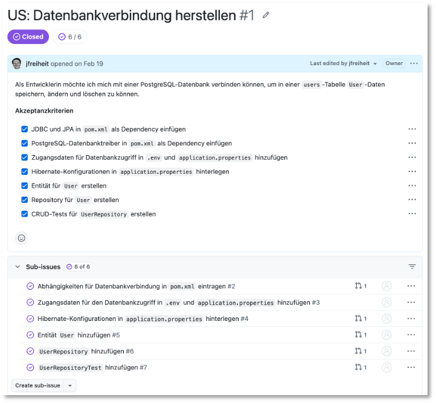
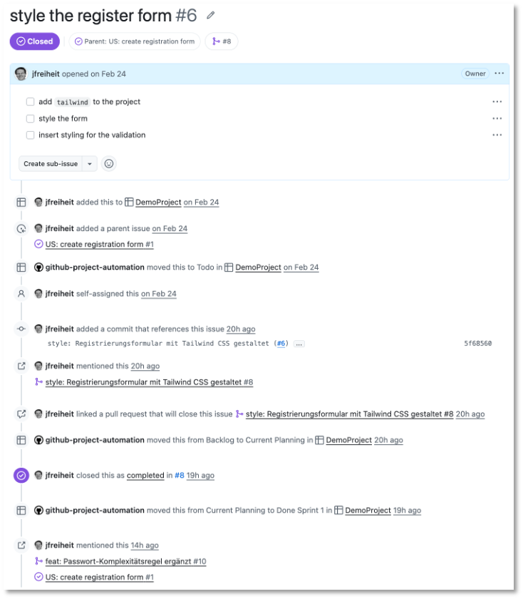
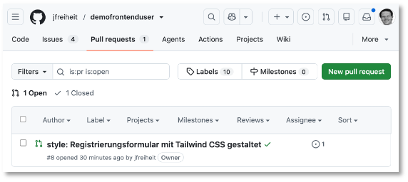
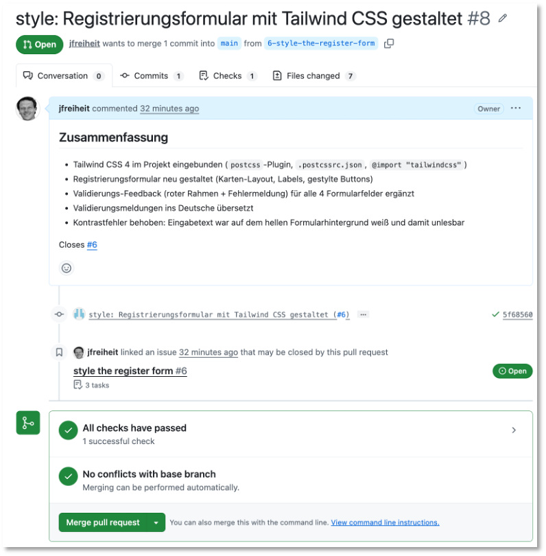
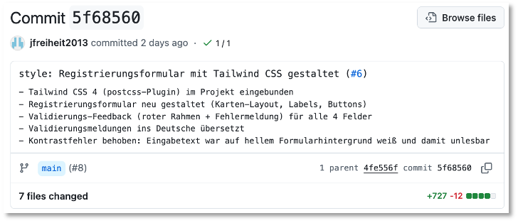
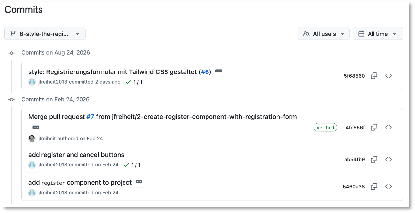
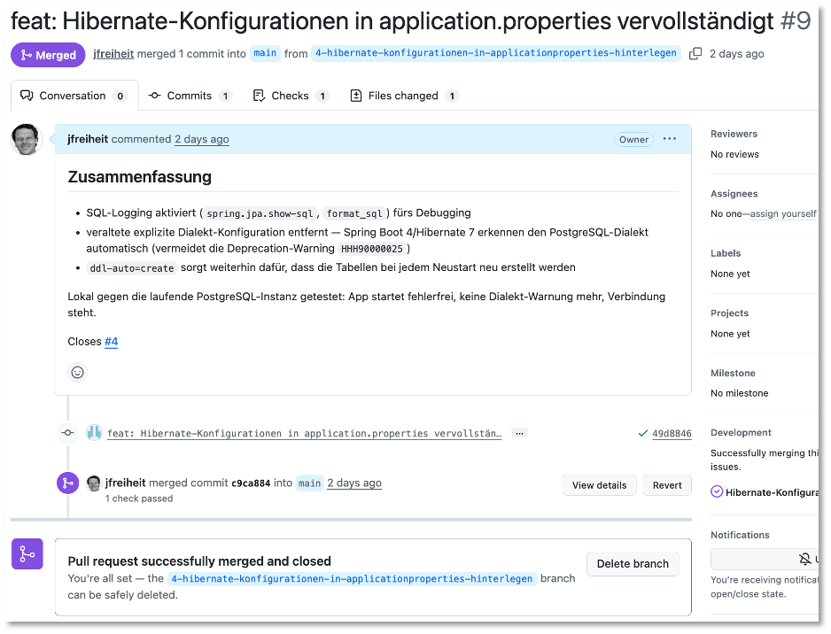
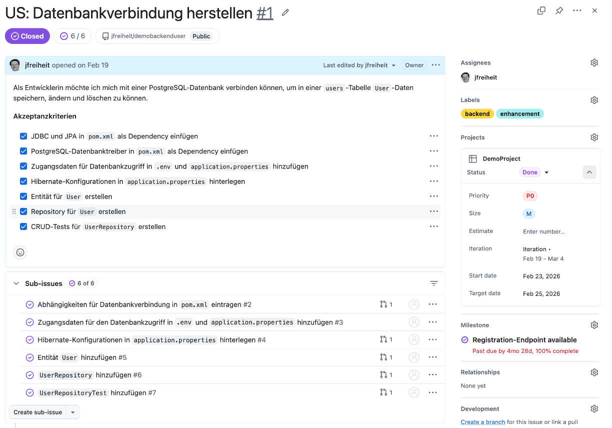
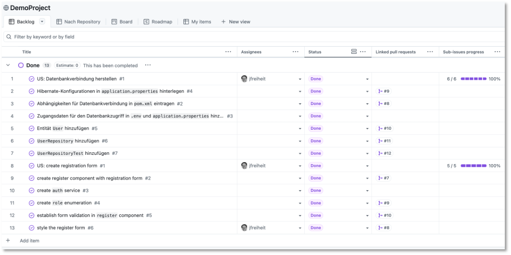

# GitHub

Die folgenden Beschreibungen erfolgen für [GitHub](https://github.com/). Zwar betreibt die HTW eine eigene [GitLab](https://gitlab.rz.htw-berlin.de/)-Instanz, diese hat jedoch zwei Nachteile:

1. Die Repos auf [https://gitlab.rz.htw-berlin.de/](https://gitlab.rz.htw-berlin.de/) sind nicht öffentlich und Sie können diese somit nicht in Bewerbungen etc. verwenden. 
2. Die Funktionen auf [https://gitlab.rz.htw-berlin.de/](https://gitlab.rz.htw-berlin.de/) sind stark eingeschränkt.

## Konfigurationen

Sollten Sie auf verschiedenen Rechnern entwickeln und in das Repo committen, beachten Sie bitte unbedingt, dass Sie überall unter dem selben Namen (und mit derselben E-Mail) agieren. Setzen Sie dazu überall

```bash
git config --global user.name "Ihr Name"
git config --global user.email "vorname.nachname@student.htw-berlin.de"
```


Erstellen Sie 2 Repositories auf GitHub:

- ein `frontend`-Repository und 
- ein `backend`-Repository.

Erstellen Sie ein [Projekt](https://docs.github.com/de/issues/planning-and-tracking-with-projects/creating-projects/creating-a-project). Als Template wählen Sie entweder `Kanban` (empfohlen) oder `Iterative Development` aus. Die Templates liefern nur Startzustände Ihres Boards. Sie können später alles, unabhängig von der Wahl des Templates, anpassen.

Wählen Sie eines der beiden Repositories als das Standardrepository für Ihr Projekt aus (leider kann nur ein Repository ausgewählt werden). gehen Sie auch auf das andere Repository und [verbinden Sie auch dieses](https://docs.github.com/de/issues/planning-and-tracking-with-projects/managing-your-project/adding-your-project-to-a-repository) mit Ihrem Projekt. Studieren Sie außerdem die GitHub-Dokumente zu [Projekten](https://docs.github.com/de/issues/planning-and-tracking-with-projects/learning-about-projects/about-projects).

## User Stories, Features und Branches

Der prinzipielle Prozess bei der Softwareentwicklung mithilfe von GitHub ist wie folgt:

**User Story → Akzeptanzkriterien → Features (Sub-Issues) → Feature-Branch → Commits → Pull Request → Merge**

Am folgenden, real umgesetzten Beispiel aus dem Demo-Projekt (Repository [`demofrontenduser`](https://github.com/jfreiheit/demofrontenduser)) wird dieser Weg Schritt für Schritt gezeigt.

### 1. User Story mit Akzeptanzkriterien

Eine User Story beschreibt eine Anforderung aus Sicht einer Nutzerin oder eines Nutzers, nicht aus Sicht der Technik. Sie wird als eigenes GitHub-Issue angelegt, dessen Titel mit `US:` beginnt, damit User Stories im Issue-Board sofort von Features unterscheidbar sind. Beispiel aus dem Backend-Repository ([`demobackenduser` Issue #1](https://github.com/jfreiheit/demobackenduser/issues/1)):


<figure markdown="span">
  { width="80%" }
  <figcaption>User Story mit Akzeptanzkriterien und Sub-Issues</figcaption>
</figure>

oder als Markdown (nur die User Story mit Akzeptanzkriterien):

```markdown
Titel: US: Datenbankverbindung herstellen

Als Entwicklerin möchte ich mich mit einer PostgreSQL-Datenbank verbinden können,
um in einer `users`-Tabelle `User`-Daten speichern, ändern und löschen zu können.

**Akzeptanzkriterien**
- [ ] JDBC und JPA in `pom.xml` als Dependency einfügen
- [ ] PostgreSQL-Datenbanktreiber in `pom.xml` als Dependency einfügen
- [ ] Zugangsdaten für Datenbankzugriff in `.env` und `application.properties` hinzufügen
- [ ] Hibernate-Konfigurationen in `application.properties` hinterlegen
- [ ] Entität für `User` erstellen
- [ ] Repository für `User` erstellen
- [ ] CRUD-Tests für `UserRepository` erstellen
```

Wichtig ist, dass jedes Akzeptanzkriterium **konkret und überprüfbar** ist — man muss eindeutig sagen können, ob es erfüllt ist oder nicht. Die User Story bekommt außerdem passende Labels (z. B. `enhancement` und `backend`/`frontend`) und wird einem Milestone zugeordnet, das die übergeordnete Ausbaustufe beschreibt (z. B. „Registration-Endpoint available").

### 2. Features aus der User Story ableiten

Jedes Akzeptanzkriterium (oder eine sinnvolle Gruppe davon) wird als eigenes **Feature-Issue** angelegt und über GitHubs native [Sub-Issues](https://docs.github.com/de/issues/tracking-your-work-with-issues/using-issues/adding-sub-issues) mit der User Story verknüpft. So sieht man in der User Story jederzeit den Fortschritt (`Sub-issues progress`), und jedes Feature bleibt klein genug, um in einem einzigen Branch bearbeitet zu werden. Beispiel: Die Story „US: create registration form" ([`demofrontenduser` Issue #1](https://github.com/jfreiheit/demofrontenduser/issues/1)) wurde in fünf Feature-Issues zerlegt, u. a. [Issue #6 „style the register form"](https://github.com/jfreiheit/demofrontenduser/issues/6):


<figure markdown="span">
  { width="80%" }
  <figcaption>Ein Sub-Issue</figcaption>
</figure>

Sobald ein Feature-Issue über seinen [Pull Request](https://docs.github.com/de/pull-requests/how-tos/create-pull-requests/creating-a-pull-request) geschlossen wird, wird der passende Punkt in der Akzeptanzkriterien-Liste der User Story von Hand nachgezogen (Checkbox abhaken) — die Sub-Issue-Verknüpfung allein aktualisiert diese Freitext-Liste nicht automatisch.

Pull Request erscheint unter dem Tab `Pull requests`:


<figure markdown="span">
  { width="80%" }
  <figcaption>Anzeige des Pull Requests</figcaption>
</figure>


Durch Klicken auf den Pull Request erscheint die Zusammenfassung mit dem Button `Merge pull request`:


<figure markdown="span" id="fig4">
  { width="80%" }
  <figcaption>Detail-Anzeige des Pull Requests mit Button zum Mergen</figcaption>
</figure>


Durch Klicken auf diesen Button wird der Branch des Feature-Issues in den `main`-Branch gemerged.


### 3. Feature-Branch erstellen und bearbeiten

Für jedes Feature-Issue wird ein eigener Branch erstellt — entweder über den Button „Create a branch" direkt am Issue, oder von Hand mit dem gleichen Namensschema, das GitHub dabei vorschlägt:

```text
<issue-nummer>-<issue-titel-als-slug>
```

Für `Issue #6 „style the register form"` ergibt das den Branch `6-style-the-register-form`. Der Branch-Name referenziert damit schon selbst das Issue, das er bearbeitet. Auf diesem Branch wird ausschließlich an diesem einen Feature gearbeitet. Ist es fertig abgearbeitet, wird gepusht und ein [Pull Request](https://docs.github.com/de/pull-requests/how-tos/create-pull-requests/creating-a-pull-request) eröffnet.

### 4. Aussagekräftige Commit-Nachrichten

Commit-Nachrichten folgen dem Schema der [Conventional Commits](https://www.conventionalcommits.org/): ein englisches Typ-Präfix, gefolgt von einer deutschen Beschreibung (Sie können aber selbstverständlich auch englische Beschreibungen verwenden - das hat auch den großen Vorteil, dass es keine Probleme mit Umlauten in den Branch-Namen gibt) dessen, *was sich ändert und warum* — nicht nur *dass* sich etwas ändert.

```text
<typ>: <deutsche oder englische Beschreibung> (#<issue-nummer>)
```

Gebräuchliche Typen: 

- `feat` (neue Funktionalität), 
- `fix` (Fehlerbehebung), 
- `style` (rein optische/gestalterische Änderung ohne Funktionsänderung), 
- `test`, 
- `docs`, 
- `refactor`. 

[Beispiel-Commit](https://github.com/jfreiheit/demofrontenduser/commit/5f68560202e2967effc9dc4a812f7f8e2fd2c9de) aus [Issue #6](https://github.com/jfreiheit/demofrontenduser/commits/6-style-the-register-form/):


<figure markdown="span">
  { width="80%" }
  <figcaption>Beispiel-Commit für Issue #6</figcaption>
</figure>

mit dieser Commit-Nachricht:

```markdown
style: Registrierungsformular mit Tailwind CSS gestaltet (#6)

- Tailwind CSS 4 (postcss-Plugin) im Projekt eingebunden
- Registrierungsformular neu gestaltet (Karten-Layout, Labels, Buttons)
- Validierungs-Feedback (roter Rahmen + Fehlermeldung) für alle 4 Felder
- Validierungsmeldungen ins Deutsche übersetzt
- Kontrastfehler behoben: Eingabetext war auf hellem Formularhintergrund weiß und damit unlesbar
```

Die erste Zeile ist eine knappe Zusammenfassung; darunter folgen bei Bedarf Stichpunkte mit Details. Die Issue-Referenz `(#6)` am Ende der ersten Zeile verknüpft den Commit sichtbar mit dem Feature-Issue, schließt es aber noch nicht.

<figure markdown="span">
  { width="80%" }
  <figcaption>Commit-Historie für Issue #6</figcaption>
</figure>

### 5. Pull Request, Verknüpfung mit dem Issue und Merge

Der Pull Request wird vom Feature-Branch gegen den Standard-Branch (z. B. `main`) erstellt. In der Beschreibung des Pull Requests steht eines der GitHub-„Closing Keywords" (`Closes`, `Fixes` oder `Resolves`, gefolgt von der Issue-Nummer):

```text
Closes #6
```

Das hat zwei Effekte: Im Issue erscheint ein sichtbarer Link auf den Pull Request, und sobald der Pull Request gemerged wird, schließt sich das Issue **automatisch**. So bleibt am Ende jedes Issue mit genau dem Code verknüpft, der es umgesetzt hat — nachvollziehbar für alle im Team, auch Monate später.

Konkretes Beispiel: [Pull Request #8](https://github.com/jfreiheit/demofrontenduser/pull/8) im Repository `demofrontenduser`, vom Branch `6-style-the-register-form`, mit `Closes #6` in der Beschreibung. Nach dem Merge war `Issue #6` automatisch geschlossen (siehe [Screenshot oben](#fig4)).

Gemerged wird per normalem Merge-Commit (nicht „Squash" oder „Rebase"), damit die einzelnen, aussagekräftigen Commits eines Features in der Historie erhalten bleiben.

### Ein zweites Beispiel: derselbe Ablauf im Backend

Der Ablauf ist unabhängig vom Repository immer derselbe. Im Repository [`demobackenduser`](https://github.com/jfreiheit/demobackenduser) wurde z.B. Feature-[Issue #4 „Hibernate-Konfigurationen in `application.properties` hinterlegen"](https://github.com/users/jfreiheit/projects/1?pane=issue&itemId=158428387&issue=jfreiheit%7Cdemobackenduser%7C4) genauso bearbeitet: 

1. Branch [4-hibernate-konfigurationen-in-applicationproperties-hinterlegen](https://github.com/jfreiheit/demobackenduser/tree/4-hibernate-konfigurationen-in-applicationproperties-hinterlegen), 
2. ein Commit [feat: Hibernate-Konfigurationen in application.properties vervollständigt (#4)](https://github.com/jfreiheit/demobackenduser/commit/49d88462f35013431cae2e572d3a11ed2613a0c2), 
3. [Pull Request #9](https://github.com/jfreiheit/demobackenduser/pull/9) mit `Closes #4`.

Dabei zeigte sich übrigens ein wichtiger Punkt: Vor dem Commit wurde die Anwendung natürlich lokal gegen die echte Datenbank gestartet. Dabei fiel eine Deprecation-Warnung von Hibernate auf (ein explizit gesetzter Datenbank-Dialekt war mit der verwendeten Spring-Boot-Version nicht mehr nötig), die dann direkt mit behoben wurde. Ein Feature erst lokal auszuprobieren, bevor man committet und pusht, gehört zu einem sauberen Workflow genauso dazu wie eine gute Commit-Message.

<figure markdown="span">
  { width="80%" }
  <figcaption>Abgeschlossener Pull Request</figcaption>
</figure>

Die restlichen Feature-Issues der User Story 

- [#5 „Entität `User` hinzufügen"](https://github.com/users/jfreiheit/projects/1?pane=issue&itemId=158429655&issue=jfreiheit%7Cdemobackenduser%7C5), 
- [#6 „`UserRepository` hinzufügen"](https://github.com/users/jfreiheit/projects/1?pane=issue&itemId=158434561&issue=jfreiheit%7Cdemobackenduser%7C6), 
- [#7 „`UserRepositoryTest` hinzufügen"](https://github.com/users/jfreiheit/projects/1?pane=issue&itemId=158435284&issue=jfreiheit%7Cdemobackenduser%7C7) 

wurden nach demselben Schema abgearbeitet — jeweils 

1. eigener Branch ([#5](https://github.com/jfreiheit/demobackenduser/tree/5-entit%C3%A4t-user-hinzuf%C3%BCgen), [#6](https://github.com/jfreiheit/demobackenduser/tree/6-userrepository-hinzuf%C3%BCgen), [#7](https://github.com/jfreiheit/demobackenduser/tree/7-userrepositorytest-hinzuf%C3%BCgen)), 
2. ein aussagekräftiger Commit mit Issue-Referenz ([#5](https://github.com/jfreiheit/demobackenduser/commit/01a197b3c3283c4bd945d4a66eb52138a085e6fc), [#6](https://github.com/jfreiheit/demobackenduser/commit/bd144b1e327caf80ddc58bfb6f4445b04c3187ea), [#7](https://github.com/jfreiheit/demobackenduser/commit/7bda89dc8717b356116b0145b89753965e2247c2)), 
3. Pull Request mit `Closes #<nr>` ([#10](https://github.com/jfreiheit/demobackenduser/pull/10), [#11](https://github.com/jfreiheit/demobackenduser/pull/11), [#12](https://github.com/jfreiheit/demobackenduser/pull/12)). 


### User Story abschließen

Eine User Story ist fertig, wenn alle ihre Feature-Issues (Sub-Issues) geschlossen sind. Das schließt die User Story selbst aber **nicht automatisch** — dafür gibt es keine Closing-Keyword-Verknüpfung, da die User Story ja nicht über einen eigenen Pull Request umgesetzt wird. Zwei Dinge sind daher von Hand zu erledigen, sobald der letzte Teilschritt gemergt ist:

1. In der Akzeptanzkriterien-Liste der User Story den letzten Punkt abhaken.
2. Die User Story selbst schließen, z. B. mit einem kurzen erklärenden Kommentar, der auf die umgesetzten Feature-Issues verweist.

Beispiel: [`US: Datenbankverbindung herstellen`](https://github.com/jfreiheit/demobackenduser/issues/1) (Backend) wurde geschlossen, nachdem alle sechs zugehörigen Feature-Issues (`#2`–`#7`) gemergt waren. Genauso im Frontend: [`US: create registration form`](https://github.com/jfreiheit/demofrontenduser/issues/1) wurde nach den fünf Feature-Issues (`#2`–`#6`) geschlossen — u. a. mit einem Rollen-Auswahlfeld (Enum `Role`, [Pull Request #9](https://github.com/jfreiheit/demofrontenduser/pull/9)) und einer zusätzlichen Passwort-Regel ([Pull Request #10](https://github.com/jfreiheit/demofrontenduser/pull/10)), die über die ursprünglich formulierten Akzeptanzkriterien hinaus sinnvoll ergänzt wurde.


<figure markdown="span">
  { width="80%" }
  <figcaption>Abgeschlossene User Story (Done)</figcaption>
</figure>


## Views im Projekt einrichten

Ein GitHub-[Projekt (Project)](https://docs.github.com/de/issues/planning-and-tracking-with-projects/learning-about-projects/about-projects) zeigt dieselben Issues (aus beliebig vielen verknüpften Repositories) wahlweise als Tabelle, Kanban-Board oder Zeitstrahl an — jede dieser Darstellungen ist eine eigene **View**, die Sie über den Reiter oben im Projekt anlegen (`+ New view`) oder umbenennen/löschen können. Siehe [DemoProject](https://github.com/users/jfreiheit/projects/1/views/1) für das hier beschriebene Projekt.

<figure markdown="span">
  { width="100%" }
  <figcaption>DemoProject - erste View</figcaption>
</figure>

Beim Anlegen eines Projekts über ein Vorlagen-Template (z. B. „Team planning") werden automatisch mehrere Views mit generischen Namen und Beispiel-Daten angelegt (`Backlog`, `Board`, `Roadmap`, `Current iteration`, eine unbenannte `View 2` …). Diese Vorbelegung sollten Sie an Ihr eigenes Projekt anpassen.

Am [DemoProject](https://github.com/users/jfreiheit/projects/1/views/1)-Board wurde das so aufgeräumt:

- Die unbenannte **„View 2"** wurde zu **„Nach Repository"** umbenannt und zeigt (wie die anderen Tabellen-Views auch) die User-Story-Issues mit ihren Feature-Sub-Issues eingerückt darunter — praktisch, um zu sehen, wie eine User Story aus einem Repository sich in ihre Features aufteilt.
- Die **„Board"**-View ist automatisch nach dem Status-Feld gruppiert (eine Spalte pro Status-Wert: Backlog, Current Planning, In Progress, Done) — das ist die klassische Kanban-Ansicht.

Für eine Tabellen-View lässt sich über den Button **„View" → „Group by"** oben rechts zusätzlich festlegen, nach welchem Feld gruppiert werden soll (z. B. nach `Repository`, um Backend- und Frontend-Issues optisch zu trennen, oder nach `Milestone`). Das ist eine reine Oberflächen-Einstellung, die nur im Browser vorgenommen werden kann. Weitere Informationen zu Views finden Sie z.B. [hier](https://docs.github.com/de/enterprise-cloud@latest/issues/planning-and-tracking-with-projects/customizing-views-in-your-project/changing-the-layout-of-a-view).

Für das agile Vorgehen in Sprints bieten sich [Iterationen](). Eine Beschreibung dazu finden Sie z.B. [hier](https://docs.github.com/de/enterprise-cloud@latest/issues/planning-and-tracking-with-projects/understanding-fields/about-iteration-fields).
