# REST-API mit Spring

Zur Erstellung einer REST-API mit [Spring Boot](https://spring.io/projects/spring-boot) verwenden wir zur Initialisierung des Projektes den [Spring Initializr](https://start.spring.io/) (können Sie aber auch direkt in IntelliJ Ultimate machen: File -> New -> Project -> Spring Initializr) und binden zunächst folgende Abhängigkeiten in unser Projekt ein:

- [Spring Web](https://spring.io/projects/spring-ws)
- [Spring Data JPA](https://spring.io/projects/spring-data-jpa) 
- [PostgreSQL Driver](https://jdbc.postgresql.org/)

Klicken Sie auf `Generate` und speichern Sie die `rest.zip` in Ihrem Projekte-Ordner und entpacken die Datei dort. 


<figure markdown="span">
  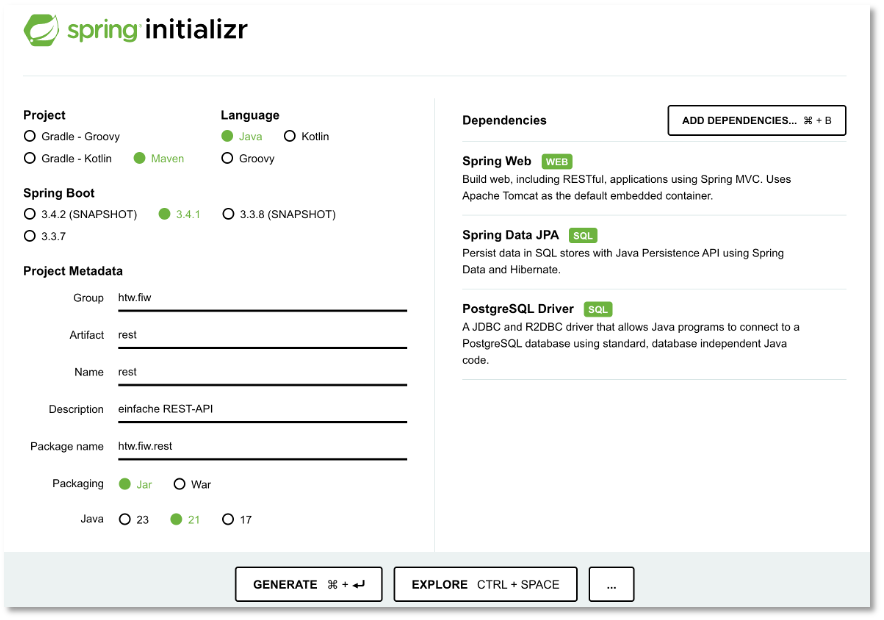{ width="500" }
  <figcaption>Spring Initializr - auch genauso in IntelliJ</figcaption>
</figure>

## Erstellen einer PostgreSQL-Datenbank

Hier wird gezeigt, wie Sie den HTW-Server [ocean.f4.htw-berlin.de](https://ocean.f4.htw-berlin.de/) verwenden und anbinden können. Sie können [PostgreSQL](https://www.postgresql.org/) aber auch einfach lokal installieren (siehe [hier](https://www.postgresql.org/download/)). 

Rufen Sie [ocean.f4.htw-berlin.de](https://ocean.f4.htw-berlin.de/) auf und erstellen sich eine Datenbank, hier `rest_jf`. Klicken Sie die neu erstellte Datenbank an und wählen dann den Tab `Users`. Erzeugen Sie dort mithilfe von `Add new user` einen neuen Nutzer für die Datenbank, hier `rest_jf_rest_user`. Lassen Sie sich das generierte Passwort anzeigen:


<figure markdown="span">
  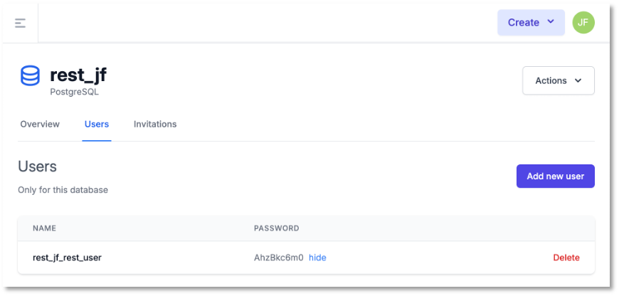{ width="500" }
  <figcaption>Datenbank rest_jf auf Ocean erstellt</figcaption>
</figure>

Öffnen Sie das Projekt in [IntelliJ](https://www.jetbrains.com/de-de/idea/). Wenn Sie sich bei [JetBrains](https://www.jetbrains.com/de-de/) mit Ihrer HTW-E-Mail-Adresse anmelden, erhalten Sie kostenlos die *Ultimate*-Version der IDEA. 

Im Ordner `src/main/resources` finden Sie die `applications.properties`. Öffnen Sie diese und fügen Sie die Konfigurationsdaten für Ihre Datenbank auf *Ocean* hinzu:

=== "applications.properties"
	```json
	spring.application.name=rest
	spring.datasource.url=jdbc:postgresql://psql.f4.htw-berlin.de:5432/rest_jf
	spring.datasource.username=rest_jf_rest_user
	spring.datasource.password=AhzBkc6m0
	spring.jpa.hibernate.ddl-auto=create
	spring.jpa.properties.hibernate.dialect=org.hibernate.dialect.PostgreSQLDialect
	```

Für die Eigenschaft `spring.jpa.hibernate.ddl-auto` haben Sie 5 Werte zur Auswahl:

- `create` – Beim Start Ihrer Anwendung werden alle Tabellen, die von Hibernate verwaltet werden, gelöscht und gänzlich neu kreiert. 
- `create-drop` – Beim Start Ihrer Anwendung werden alle Tabellen, die von Hibernate verwaltet werden, neu kreiert und wenn die Anwendung geschlossen wird, werden die Tabellen gelöscht.
- `update` – Beim Start der Anwendung werden die bereits existierenden Tabllen an die Schemata von Hibernate angepasst, wenn nötig. 
- `validate` – Beim Start der Anwendung wird geprüft, ob die existierenden Tabellen mit den Schemata von Hibernate übereinstimmen. Wenn nicht, wird eine Exception geworfen. 
- `none` – Es wird keine automatische Schemata-Verwaltung durchgeführt. 

Es ist nicht gut, die sensitiven Daten, wie z.B. `password` in Klarsicht in der `application.properties` abzulegen. Sie sollten sich dazu eigene Umgebeungsvariablen erstellen, z.B. `OCEAN_PASSWORD` und können dann in der `application.properties` per `${OCEAN_PASSWORD}` darauf zugreifen. Siehe z.B. [external configuration](https://vaadin.com/docs/latest/flow/security/advanced-topics/external-configuration).

Sie können Ihre Anwendung jetzt bereits einmal starten. Es sollten keine Fehler auftreten. 

## Eine Java-Entität mit Hibernate erstellen

Wir wollen eine Entität `User` erstellen. Diese soll folgende Attribute enthalten:

- `id`
- `username`
- `password`
- `email`
- `role`

Erstellen Sie dazu im Package `htw.fiw.rest` ein neues Package `user` und darin eine neue Java-Klasse `User`. Diese Klasse sieht wie folgt aus:

=== "user/User.java"
	```java linenums="1"
	package htw.fiw.rest.user;

	import java.util.Objects;

	import jakarta.persistence.Entity;
	import jakarta.persistence.Table;
	import jakarta.persistence.GeneratedValue;
	import jakarta.persistence.Id;

	@Entity
	@Table(name="users")
	public class User {

	    private @Id
	    @GeneratedValue Long id;
	    private String username;
	    private String password;
	    private String email;
	    private String role;

	    public User() {}

	    public User(String username, String password, String email, String role) {

	        this.username = username;
	        this.password = password;
	        this.email = email;
	        this.role = role;
	    }

	    public Long getId() {
	        return this.id;
	    }

	    public String getUsername() {
	        return this.username;
	    }

	    public String getPassword() {
	        return this.password;
	    }
	    public String getEmail() {
	        return this.email;
	    }
	    public String getRole() {
	        return this.role;
	    }

	    public void setId(Long id) {
	        this.id = id;
	    }

	    public void setUsername(String username) {
	        this.username = username;
	    }

	    public void setPassword(String password) {
	        this.password = password;
	    }

	    public void setEmail(String email) {
	        this.email = email;
	    }

	    public void setRole(String role) {
	        this.role = role;
	    }

	    @Override
	    public boolean equals(Object o) {
	        if(o == null) return false;
	        if (this == o) return true;
	        if (!(o instanceof User))  return false;
	        User user = (User) o;
	        return  Objects.equals(this.id, user.id) &&
	                Objects.equals(this.username, user.username) &&
	                Objects.equals(this.email, user.email) &&
	                Objects.equals(this.role, user.role);
	    }

	    @Override
	    public int hashCode() {
	        return Objects.hash(this.id, this.username, this.email, this.role);
	    }

	    @Override
	    public String toString() {
	        return "User{" + "id=" + this.id + ", username='" + this.username + '\'' +
	                ", email='" + this.email + '\'' + ", role='" + this.role + '\'' + '}';
	    }
	}
	```

Wir bräuchten nur die Annotation `@Entity`, auf `@Table` könnte verzichtet werden. Dann würde in PostgreSQL eine Tabelle erstellt werden, die `user` heißt. Mit der `@Table`-Annotation können wir z.B. deren Namen (auf `users`) ändern.  

## Ein Java-Repository erstellen

Wir haben nun eine Entität definiert, für die eine Tabelle in der Datenbank erstellt wird. Für diese Tabelle wollen wir die *CRUD*-Funktionen implementieren, um 

- `user` der Tabelle hinzuzufügen (**C**reate), 
- `user` auszulesen, einen, alle oder nach bestimmten Eigenschaften suchen (**R**ead),
- `user`-Daten zu aktualisieren/zu ändern (**U**pdate),
- `user` zu löschen (**D**elete).

Dafür existieren verschiedene *Repository*-Implementierungen, die diese *CRUD*-Funktionen bereits als abstrakte Methoden zur Verfügung stellen. Wir bleiben bei Hibernate (JPA) und verwenden das Interface `JpaRepository`. Wir erstellen uns im package `user` das **Interface** `UserRepository`, welches von `JpaRepository` erbt. 


=== "user/UserRepository.java"
	```java linenums="1"
	package htw.fiw.rest.user;

	import htw.fiw.rest.entities.User;
	import org.springframework.data.jpa.repository.JpaRepository;

	public interface UserRepository extends JpaRepository<User, Long> {
	}
	```

Damit haben wir bereits ein ausführbares Programm und sind nun in der Lage, *CRUD*-Funktionlitäten konkret zu implementieren. Zunächst wollen wir jedoch unsere Tabelle schonmal mit ein paar Daten vorbefüllen:

## Daten laden

Wir erstellen uns eine Klasse `LoadUserData` in unserem Package `user`:

=== "user/LoadUserData.java"
	```java linenums="1"
	package htw.fiw.rest.user;

	import htw.fiw.rest.entities.User;
	import htw.fiw.rest.repositories.UserRepository;
	import org.slf4j.Logger;
	import org.slf4j.LoggerFactory;
	import org.springframework.boot.CommandLineRunner;
	import org.springframework.context.annotation.Bean;
	import org.springframework.context.annotation.Configuration;

	@Configuration
	public class LoadUserData {
	    private static final Logger log = LoggerFactory.getLogger(LoadUserData.class);

	    @Bean
	    CommandLineRunner initDatabase(UserRepository repository) {

	        return args -> {
	            log.info("Preloading " + repository.save(new User("user1", "pass1234", "user1@test.de", "admin")));
	            log.info("Preloading " + repository.save(new User("user2", "pass1234", "user2@test.de", "user")));
	            log.info("Preloading " + repository.save(new User("user3", "pass1234", "user3@test.de", "user")));
	            log.info("Preloading " + repository.save(new User("user4", "pass1234", "user4@test.de", "user")));
	        };
	    }
	}
	```

Spring Boot führt automatisch alle `CommandLineRunner`-Beans aus, sobald die Anwendung. Der `CommandLineRunner` in `LoadUserData` erwartet ein `UserRepository` und kann dafür `save()`-Methode aufrufen, die 4 `user` in die Tabelle `user` einträgt. 

### pgAdmin4

Installieren Sie sich [pgAdmin](https://www.pgadmin.org/download/) und verbinden Sie sich dort mit dem *Ocean*-Server. Beachten Sie, dass Sie bei der Verbindungsherstellung den Nutzernamen (und das Passwort) verwenden, mit dem Sie sich im Spring-Boot-Projekt authentifiziert haben. In `pgAdmin` können Sie sich anschauen, ob die Daten in die Datenbank eingetragen wurden:


<figure markdown="span">
  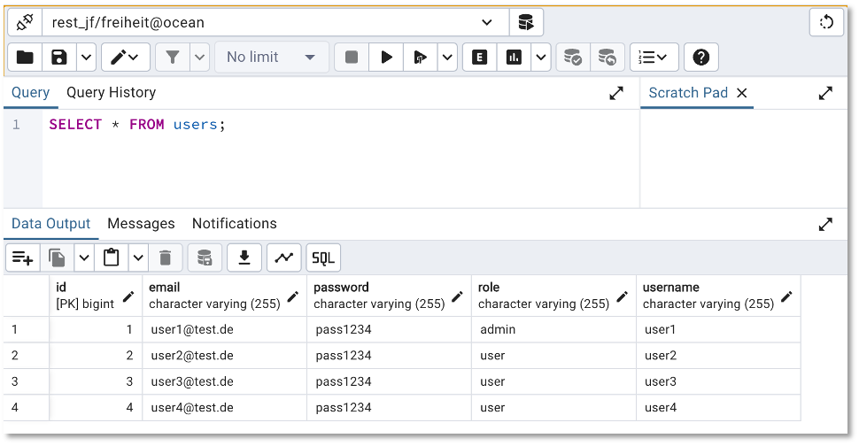{ width="500" }
  <figcaption>pgAdmin4</figcaption>
</figure>

Sie können sich aber auch in IntelliJ direkt mit der Datenbank verbinden, siehe z.B. [hier](https://www.jetbrains.com/help/idea/postgresql.html#connect-to-postgresql-database).

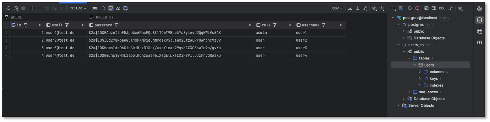

### Passwörter verschlüsseln

An dieser Stelle fällt auf, dass wir die Passwörter unverschlüsselt in der Datenbank abspeichern. Das wollen wir natürlich nicht. Wir verwenden BCrypt zur Verschlüsselung und zum Vergleich von Passwörtern mit verschlüsselten Passwörtern. Dazu müssen wir zunächst folgende *dependency* unserem `pom.xml` hinzufügen:

=== "pom.xml"
	```xml
		<dependency>
			<groupId>org.springframework.security</groupId>
			<artifactId>spring-security-core</artifactId>
		</dependency>
	```


Nun fügen wir der (Programm-)Klasse `RestApplication` ein *Bean* hinzu. *Beans* sind Komponenten in unserer Anwendung. Die `run()`-Methode innerhalb der `main()`-Methode liefert uns den sogenannten *Anwendungskontext*. Das sind, vereinfacht gesagt, alle Komponenten, die der Anwendung zur Verfügung stehen. Die Anzahl der Komponenten lässt sich erweitern. Wir erweitern um die Komponente `BCryptPasswordEncoder`:

=== "RestApplication.java"
	```java linenums="1" hl_lines="15-18"
	package htw.fiw.rest;

	import org.springframework.boot.SpringApplication;
	import org.springframework.boot.autoconfigure.SpringBootApplication;
	import org.springframework.context.annotation.Bean;
	import org.springframework.security.crypto.bcrypt.BCryptPasswordEncoder;

	@SpringBootApplication
	public class RestApplication {

		public static void main(String[] args) {
			SpringApplication.run(RestApplication.class, args);
		}

		@Bean
		public BCryptPasswordEncoder bCryptPasswordEncoder() {
			return new BCryptPasswordEncoder();
		}
	}
	```

Dieses *Bean* lässt sich nun überall injizieren. Wir injizieren das *Bean* in unsere Klasse `LoadUserData.java` und rufen die Methode `encode()` auf, um unsere Passwörter zu verschlüsseln:

=== "user/LoadUserData.java"
	```java linenums="1" hl_lines="11 17-18 24-27"
	package htw.fiw.rest.user;

	import org.slf4j.Logger;
	import org.slf4j.LoggerFactory;
	import org.springframework.beans.factory.annotation.Autowired;
	import org.springframework.boot.CommandLineRunner;
	import org.springframework.context.annotation.Bean;
	import org.springframework.context.annotation.Configuration;
	import org.springframework.security.crypto.bcrypt.BCryptPasswordEncoder;

	@Configuration
	public class LoadUserData {
	    private static final Logger log = LoggerFactory.getLogger(LoadUserData.class);
	    private final BCryptPasswordEncoder bCryptPasswordEncoder;

	    public LoadUserData(BCryptPasswordEncoder bCryptPasswordEncoder) {
	        this.bCryptPasswordEncoder = bCryptPasswordEncoder;
	    }
	    
	    @Bean
	    CommandLineRunner initDatabase(UserRepository repository) {

	        return args -> {
	            log.info("Preloading " + repository.save(new User("user1", bCryptPasswordEncoder.encode("pass1234"), "user1@test.de", "admin")));
	            log.info("Preloading " + repository.save(new User("user2", bCryptPasswordEncoder.encode("pass1234"), "user2@test.de", "user")));
	            log.info("Preloading " + repository.save(new User("user3", bCryptPasswordEncoder.encode("pass1234"), "user3@test.de", "user")));
	            log.info("Preloading " + repository.save(new User("user4", bCryptPasswordEncoder.encode("pass1234"), "user4@test.de", "user")));
	        };
	    }
	}
	```

Die Passwörter werden nun verschlüsselt in der Datenbank abgelegt:

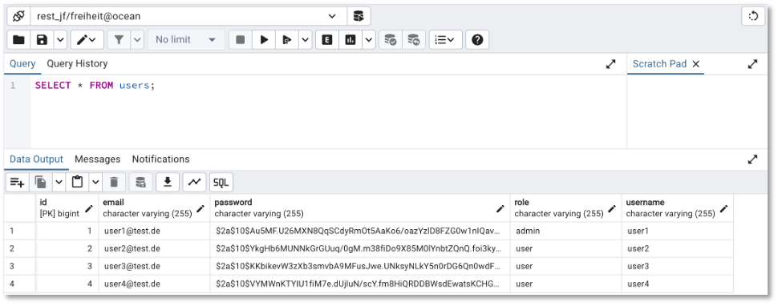

## Endpunkte definieren - GET all

Nun müssen wir nur noch eine HTTP-Anbindung durchführen, d.h. unser `Repository` wird von einer "Web-Schicht" umschlossen. Dazu verwenden wir die Annotation `@RestController` in einer neuen Klasse `UserController`. In diese Klasse injizieren wir das `UserRepository`. Dann haben wir passend zu den HTTP-Anfragemethoden die entsprechenden Annotationen, um unsere Routen zu definieren:

| Annotation für die Route | HTTP-Anfragemethode | CRUD-Funktion |
|-------------------------------|--------------------------|---------------|
| `@GetMapping`                 | `GET`               | `R`ead      |
| `@PostMapping`                | `POST`              | `C`reate    |
| `@PutMapping`                 | `PUT`               | `U`pdate    |
| `@DeleteMapping`              | `DELETE`            | `D`elete    |

Wir erstellen die Klasse `UserController` und definieren uns unseren ersten Endpunkt `GET /user`.


=== "user/UserController.java"
	```java linenums="1"
	package htw.fiw.rest.user;

	import org.springframework.web.bind.annotation.*;

	import java.util.List;

	@RestController
	public class UserController {

	    private final UserRepository userRepository;

	    public UserController(UserRepository userRepository) {
	        this.userRepository = userRepository;
	    }

	    @GetMapping("/user")
	    List<User> getAll() {
	        return userRepository.findAll();
	    }


	    /*
	     * hier definieren wir gleich noch weitere Endpunkte
	     */
	}
	```

Wir können unseren Endpunkt nun bereits testen. Wir führen die Anwendung aus und der Webserver `http://localhost` "lauscht" am Port `8080` auf eingehende `Requests`. Da es sich um eine `GET`-Anfrage handelt, können wir diese sogar im Browser aufrufen:

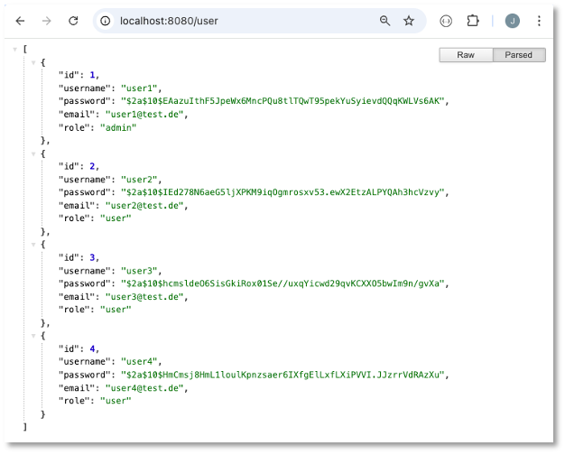

Für die anderen HTTP-Anfragemethoden können wir den Browser jedoch nicht mehr verwenden. Stattdessen sollten wir einen REST-Client, wie z.B. [Postman](https://www.postman.com/downloads/) installieren:

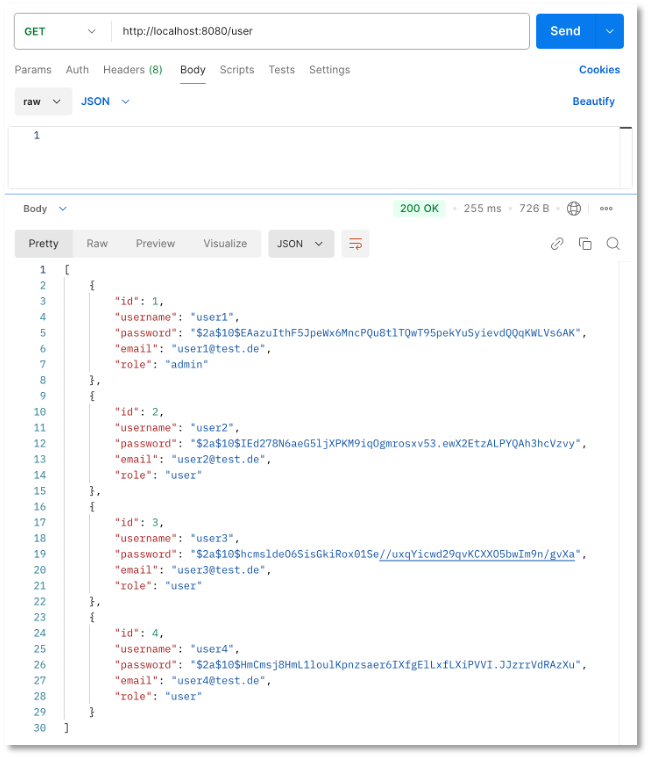

Eine weitere Möglichkeit besteht darin, HTTP-Request direkt in IntelliJ auszuführen, siehe dazu [hier](https://www.jetbrains.com/pages/intellij-idea-http-client/). Klicken Sie dazu links vom `GET-Endpunkt` auf das kleine Icon `Open in HTTP Client`. Es öffnet sich ein Editorfenster `generated-request.htpp`. Dort können Sie den Endpunkt ausführen:

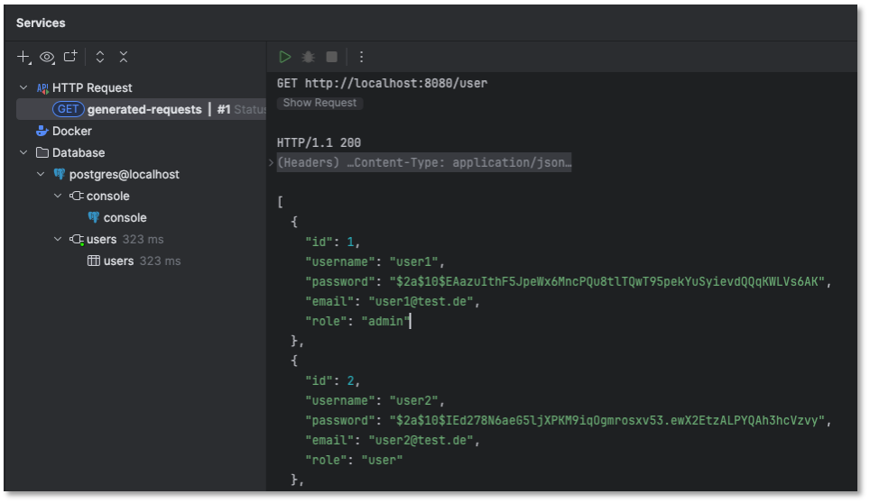

Wir verwenden im Folgenden [Postman](https://www.postman.com/product/rest-client/).


### GET one by id

Wir wollen einen weiteren Endpunkt erstellen, `GET /user/:id`, d.h. wir wollen den `user` als Response erhalten, der in der Datenbank unter einer bestimmten `id` gespeichert ist. Es handelt sich dabei um eine *parametrisierte* Route. Wir führen zwei Neuerungen ein:

- die Behandlung von *parametrisierten* Routen und
- die Behandlung von nicht gefundenen Ressourcen. Es kann ja sein, dass eine `id` angefragt wird, für die es keinen passenden Datensatz in der Datenbank gibt.

Zunächst der Endpunkt:

=== "user/UserController.java"
	```java linenums="21"
    @GetMapping("/user/{id}")
    User one(@PathVariable Long id) {

        return userRepository.findById(id)
                .orElseThrow(() -> new UserNotFoundException(id));
    }
	```


Wir übergeben der `one()`-Methode die gesuchte `id` als `@PathVariable`. Es wird in der Datenbank nach einem `user` mit der `id` gesucht (`findById()`) und dieser `user` als Response zurückgegeben. Falls ein solcher `user` (die `id`) jedoch nicht existiert, werfen wir eine `UserNotFoundException`. Diese definieren wir uns im Folgenden:

=== "user/UserNotFoundException.java"
	```java linenums="1"
	package htw.fiw.rest.user;

	public class UserNotFoundException extends RuntimeException {
	    public UserNotFoundException(Long id) {
	        super("Could not find user with id=" + id);
	    }
	}
	```

Die Klasse erbt von `RunTimeException` und übergibt dem Konstruktor von `RunTimeException` die error-Message `"Could not find user with id=" + id`. Damit dieser `404`-Fehler auch in der Response erscheint (derzeit wird einfach nur eine Exception geworfen), benötigen wir noch eine `@RestControllerAdvice`. 

=== "user/UserNotFoundAdvice.java"
	```java linenums="1"
	package htw.fiw.rest.user;

	import org.springframework.http.HttpStatus;
	import org.springframework.web.bind.annotation.ExceptionHandler;
	import org.springframework.web.bind.annotation.ResponseStatus;
	import org.springframework.web.bind.annotation.RestControllerAdvice;

	@RestControllerAdvice
	public class UserNotFoundAdvice {

	    @ExceptionHandler(UserNotFoundException.class)
	    @ResponseStatus(HttpStatus.NOT_FOUND)
	    String userNotFoundHandler(UserNotFoundException ex) {
	        return ex.getMessage();
	    }
	}
	```

Der `@ExceptionHandler` sorgt dafür, dass der `@RestControllerAdvice` genau dann in das Response-Objekt eingefügt wird, wenn eine `UserNotFoundException` geworfen wird. Der `@ResponseStatus` wird auf die vordefinierte Konstatnte `HttpStatus.NOT_Found` gesetzt, das ist der `404`-Http-Status.

Nach Neustart der Anwendung können wir diesen Endpunkt nun ausprobieren. Wenn die `id` existiert  (hier `GET http://localhost:8080/user/2`), dann wird der entsprechende Datensatz zurückgegeben (Http-Status `200`):


<figure markdown="span">
  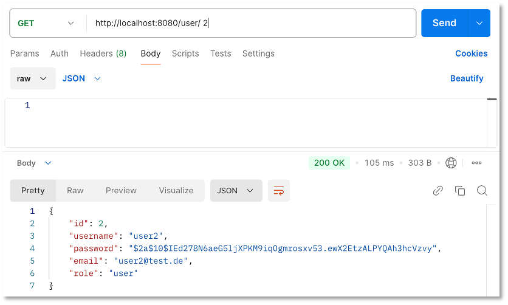{ width="500" }
  <figcaption>gefundener Datensatz als Response - 200 OK</figcaption>
</figure>

Existiert der Datensatz jedoch nicht (hier `GET http://localhost:8080/user/5`), dann erscheint eine Fehlermeldung mit Http-Status `404`:


<figure markdown="span">
  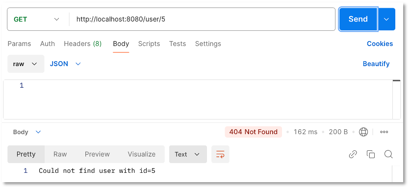{ width="500" }
  <figcaption>Http-Status-Code 404 Not Found</figcaption>
</figure>


### POST new user

Wir erzeugen einen Endpunkt, mit dem wir einen neuen `user` in der Datenbank anlegen können. Dazu wird als Http-Anfragemethode `POST` verwendet, d.h. wir nutzen die Annotation `@PostMapping`. Außerdem müssen nun die Daten über den neuen `user` im `Body` des `Request`-Objektes mitgesendet werden. Dazu verwenden wir als Annotation des Parameters der Methode nun `@RequestBody`. Eine sehr einfache Implementierung würde wie folgt aussehen:


=== "user/UserController.java"
	```java linenums="28"
    @PostMapping("/user")
    User newEmployee(@RequestBody User newUser) {
        return userRepository.save(newUser);
    }
	```

Das würde auch bereits funktionieren:


<figure markdown="span">
  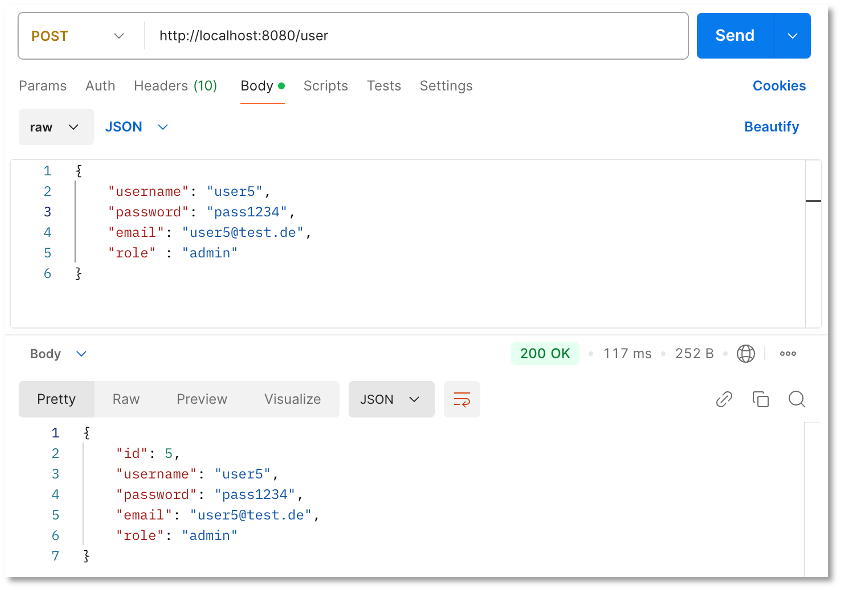{ width="500" }
  <figcaption>speichert bereits, aber noch problematisch</figcaption>
</figure>


In der oberen Hälfte in Postman wird das `Request`-Objekt spezifiziert. Wir haben dort im `Body` (beachte `raw` und `JSON`) den zu erzeugenden Datensatz definiert:

```json
{
    "username": "user5",
    "password": "pass1234",
    "email": "user5@test.de",
    "role" : "admin"
}
```

Außerdem wurde als Anfragemethode `POST` gewählt und die Route ist `/user`. Als `Response` erhalten wir den neu erzeugten Datensatz in der Datenbank. PostgreSQL vergibt beim Einfügen automatisch eine eindeutige `id`, diese wird uns in der `Response` mitgeschickt.

Zwei Dinge stören jedoch an dieser einfachen Implementierung:

- das Password wird nicht verschlüsselt und
- es wird nicht geprüft, ob der `username` und/oder die `email` eventuell bereits existier_t/en. Für den Fall soll der neue `user` nicht angelegt werden. 

Wir kümmern uns zunächst um die Verschlüsselung des Passwortes. Wie bereits in der Klasse `LoadUserData` injizieren wir das *Bean* `BCryptPasswordEncoder` in die Klasse `UserController`:


=== "user/UserController.java"
	```java linenums="12" hl_lines="2 4 6"
    private final UserRepository userRepository;
    private final BCryptPasswordEncoder bCryptPasswordEncoder;

    public UserController(UserRepository userRepository, BCryptPasswordEncoder bCryptPasswordEncoder) {
        this.userRepository = userRepository;
        this.bCryptPasswordEncoder = bCryptPasswordEncoder;
    }
	```

und können damit das Passwort verschlüsseln:


=== "user/UserController.java"
	```java linenums="32" hl_lines="3-4"
    @PostMapping("/user")
    User newEmployee(@RequestBody User newUser) {
        String hashPassword = bCryptPasswordEncoder.encode(newUser.getPassword());
        newUser.setPassword(hashPassword);
        return userRepository.save(newUser);
    }
	```


<figure markdown="span">
  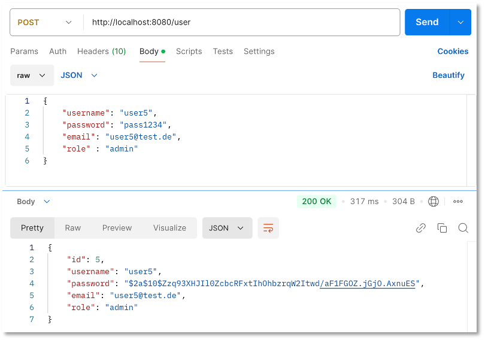{ width="500" }
  <figcaption>Passwort nun verschlüsselt in der Datenbank</figcaption>
</figure>

Um herauszubekommen, ob ein bestimmter `username` oder eine `email` bereits in der Datenbank existiert, bräuchten wir eine Methode `findByUsername()` und/oder `findByEmail()`. Wir haben beim `GET /user/id`-Endpunkt bereits mit der `findById()`-Methode gearbeitet. Es existiert im `JpaRepository` jedoch weder die Methode `findByUsername()` noch `findByEmail()`. Diese müssen wir uns erst [erstellen](https://docs.spring.io/spring-data/jpa/reference/jpa/query-methods.html). Dazu ergänzen wir diese Methoden im `UserRepository`:


=== "user/UserRepository.java"
	```java linenums="1" hl_lines="11 13-14 16-18"
	package htw.fiw.rest.user;

	import org.springframework.data.jpa.repository.JpaRepository;
	import org.springframework.data.jpa.repository.Query;
	import org.springframework.data.repository.query.Param;

	import java.util.List;

	public interface UserRepository extends JpaRepository<User, Long> {

	    List<User> findByUsername(String username);

	    @Query("select u from User u where u.email = ?1")
	    List<User> findByEmail(String email);

	    @Query("select u from User u where u.username = :username or u.email = :email")
	    List<User> findByUsernameOrEmail(@Param("username") String username,
	                                     @Param("email") String email);
	}
	```

Wir haben gleich drei Methoden hinzugefügt, um die unterschiedlichen Prinzipien zu zeigen. 

- Das Erstaunliche ist, dass bereits die Methode `findByUsername(String username)` funktioniert, ohne dass eine `@Query` dafür angegeben wurde. Spring erkennt an den Namen (der Methode und des Parameters), dass nach `username` gesucht wird. 
- Die Methode `List<User> findByEmail(String email)` würde deshalb auch ohne `@Query` funktionieren, aber wir haben hier die Verwendung mal gezeigt. Für den namenlosen Parameter `?1` wird `String email` eingesetzt. 
- Bei der Definition der Methode `findByUsernameOrEmail()` haben wir in der `@Query` *benannte* Parameter verwendet (`:username` und `:email`). Das Binding an diese Parameter erfolgt mittels `@Param()`.

Wir verwenden jetzt die `findByUsernameOrEmail()`-Methode, um zu verhindern, dass ein `user` neu hinzugefügt wird, dessen `username` und/oder `email` bereits in der Datenbank enthalten ist:

=== "user/UserController.java"
	```java linenums="32" hl_lines="3-4 8"
    @PostMapping("/user")
    User newUser(@RequestBody User newUser) {
        List<User> response = userRepository.findByUsernameOrEmail(newUser.getUsername(), newUser.getEmail());
        if (response.isEmpty()) {
            String hashPassword = bCryptPasswordEncoder.encode(newUser.getPassword());
            newUser.setPassword(hashPassword);
            return userRepository.save(newUser);
        } else throw new UserAlreadyExistsException(newUser.getUsername(), newUser.getEmail());
    }
	```

Wir werfen eine `UserAlreadyExistsException`, falls der `username` und/oder die `email` bereits existiert. Diese `UserAlreadyExistsException`-Klasse müssen wir uns erst noch erstellen:


=== "user/UserAlreadyExistsException.java"
	```java linenums="1"
	package htw.fiw.rest.user;

	public class UserAlreadyExistsException extends RuntimeException {
	    public UserAlreadyExistsException(String username, String email) {

	        super("user with username " + username + " and/or with email " + email + " already exists");
	    }
	}
	```

und sie mit in die Klasse `UserNotFoundAdvice` integrieren:


=== "user/UserNotFoundAdvice.java"
	```java linenums="1"
	package htw.fiw.rest.user;

	import org.springframework.http.HttpStatus;
	import org.springframework.web.bind.annotation.ExceptionHandler;
	import org.springframework.web.bind.annotation.ResponseStatus;
	import org.springframework.web.bind.annotation.RestControllerAdvice;

	@RestControllerAdvice
	public class UserNotFoundAdvice {

	    @ExceptionHandler(UserNotFoundException.class)
	    @ResponseStatus(HttpStatus.NOT_FOUND)
	    String userNotFoundHandler(UserNotFoundException ex) {
	        return ex.getMessage();
	    }


	    @ExceptionHandler(UserAlreadyExistsException.class)
	    @ResponseStatus(HttpStatus.CONFLICT)
	    String userExistsFoundHandler(UserAlreadyExistsException ex) {
	        return ex.getMessage();
	    }
	}
	```

Ganz optimal ist der Name der Klasse nun nicht mehr, aber sobald eine `UserAlreadyExistsException` wird der Http-Status `409` in der Response übermittelt und die Nachricht (Beispiel) `user with username user5 and/or with email user5@test.de already exists`.

Wenn wir spezieller darauf reagieren wollen, ob genau der `username` oder genau die `email` bereits verwendet wird, müssen wir die Methode `findByUsername()` und `findByEmail()` verwenden. Derzeit benutzen wir diese gar nicht. 

Eine weitere Verbesserungsmöglichkeit des Endpunktes besteht darin, dass die `save()`-Methode den Http-Status `200` zurückgibt. Für das Erzeugen neuer daten gibt es jedoch extra den Http-Status `201 - Created`. Um diesen in der Response zurückzugeben, führen wir folgende Änderung durch:

=== "user/UserController.java"
	```java linenums="32" hl_lines="2 7"
    @PostMapping("/user")
    ResponseEntity<User> newUser(@RequestBody User newUser) {
        List<User> response = userRepository.findByUsernameOrEmail(newUser.getUsername(), newUser.getEmail());
        if (response.isEmpty()) {
            String hashPassword = bCryptPasswordEncoder.encode(newUser.getPassword());
            newUser.setPassword(hashPassword);
            return new ResponseEntity<>(userRepository.save(newUser), HttpStatus.CREATED);
        } else throw new UserAlreadyExistsException(newUser.getUsername(), newUser.getEmail());
    }
	```

Unsere Methode gibt nun eine `ResponseEntity` typisiert mit `User` zurück. Diese erzeugen wir mithilfe von `new ResponseEntity<>()`, wobei der erste Parameter den Body unserer Response füllt und der zweite den Http-Status überträgt. Nun passt es:


<figure markdown="span">
  { width="500" }
  <figcaption>Http-Status-Code nun 201 Created</figcaption>
</figure>


### PUT user

Wir erstellen uns einen Endpunkt, um die Daten eines bereits existierenden Nutzers zu ändern. Eine einfache Implementierung könnte wie folgt aussehen:


=== "user/UserController.java"
	```java linenums="48"
    @PutMapping("/user/{id}")
    User replaceUser(@RequestBody User newUser, @PathVariable Long id) {

        return userRepository.findById(id)
                .map(user -> {
                    user.setUsername(newUser.getUsername());
                    user.setEmail(newUser.getEmail());
                    user.setRole(newUser.getRole());
                    return userRepository.save(user);
                })
                .orElseGet(() -> userRepository.save(newUser));
    }
	```

Es wird nach der `id` (wird als Parameter der Route hinzugefügt) gesucht und wenn der Datensatz gefunden wird, werden die Eigenschaften (`username`, `email` und `role`) mit den Daten aus dem Request-Body aktualisiert. Wird der `user` jedoch nicht über seine `id` gefunden, wird er der Datenbank neu hinzugefügt. Das beinhaltet jedoch mehrere Probleme:

- Der Endpunkt sollte genau nur zur Änderung eines bereits bestehenden `user` genutzt werden und nicht für ein Erzeugen eines neuen. `orElseGet()` sollte also besser eine `UserNotFoundException` werfen.
- Die Daten aus dem Request-Body werden ungeprüft eingelesen. Dabei könnte es z.B. vorkommen, dass ein `user` auf einen `username` bzw. auf eine `email` gändert wird, die bereits existiert. Das wollten wir ja genau vermeiden (siehe oben [Post new user]()).
- Außerdem wäre es sinnvoll, dass sich der `user` mit seinem Passwort autorisiert, um überhaupt die Änderungen durchführen zu dürfen. 

Die erste einfache Änderung ist das Werfen der `UserNotFoundException`:

=== "user/UserController.java"
	```java linenums="48" hl_lines="11"
    @PutMapping("/user/{id}")
    User replaceUser(@RequestBody User newUser, @PathVariable Long id) {

        return userRepository.findById(id)
                .map(user -> {
                    user.setUsername(newUser.getUsername());
                    user.setEmail(newUser.getEmail());
                    user.setRole(newUser.getRole());
                    return userRepository.save(user);
                })
                .orElseThrow(() -> new UserNotFoundException(id));
    }
	```

Nun prüfen wir, ob der neue `username` bzw. die neue `email` nicht bereits existiert:

=== "user/UserController.java"
	```java linenums="48" hl_lines="6-7 12"
    @PutMapping("/user/{id}")
    User replaceUser(@RequestBody User newUser, @PathVariable Long id) {

        return userRepository.findById(id)
                .map(user -> {
                    List<User> response = userRepository.findByUsernameOrEmail(newUser.getUsername(), newUser.getEmail());
                    if (response.isEmpty() || (response.size() == 1 && response.getFirst().getId().equals(id))) {
                        user.setUsername(newUser.getUsername());
                        user.setEmail(newUser.getEmail());
                        user.setRole(newUser.getRole());
                        return userRepository.save(user);
                    } else throw new UserAlreadyExistsException(newUser.getUsername(), newUser.getEmail());
                })
                .orElseThrow(() -> new UserNotFoundException(id));
    }
	```

Dabei ist zu beachten, dass es ja sein kann, dass der `user` seinen `username` und/oder seine `email` behalten möchte und z.B. nur die Rolle ändern. Dann wäre ja die `response-List` nicht leer, sondern würde den `user` selbst enthalten. Wir prüfen deshalb neben `response.isEmpty()` auch noch den Fall `response.size() == 1 && response.getFirst().getId().equals(id)`. 

Nun prüfen wir noch, ob das Passwort überhaupt korrekt ist. Das Passwort im Request-Body (`newUser`) wird in Klarsicht übertragen (später per `https`, deshalb ist es okay) und muss mit dem in der Datenbank verschlüsselt abgelegten Passwort übereinstimmen. Dafür beietet *BCrypt* die Methode `matches(plain, hashed)`.

=== "user/UserController.java"
	```java linenums="48" hl_lines="6 13"
    @PutMapping("/user/{id}")
    User replaceUser(@RequestBody User newUser, @PathVariable Long id) {

        return userRepository.findById(id)
                .map(user -> {
                    if(bCryptPasswordEncoder.matches(newUser.getPassword(), user.getPassword())) {
                        List<User> response = userRepository.findByUsernameOrEmail(newUser.getUsername(), newUser.getEmail());
                        if (response.isEmpty() || (response.size() == 1 && response.getFirst().getId().equals(id))) {
                            user.setUsername(newUser.getUsername());
                            user.setEmail(newUser.getEmail());
                            user.setRole(newUser.getRole());
                            return userRepository.save(user);
                        } else throw new UserAlreadyExistsException(newUser.getUsername(), newUser.getEmail());
                    }
                    else throw new UserNotAuthorizedException();
                })
                .orElseThrow(() -> new UserNotFoundException(id));
    }
	```

Falls das Passwort nicht übereinstimmt, werfen wir eine `UserNotAuthorizedException`. Die Erstellung kennen wir bereits:


=== "user/UserAlreadyExistsException.java"
	```java linenums="1"
	package htw.fiw.rest.user;

	public class UserNotAuthorizedException extends RuntimeException {
	    public UserNotAuthorizedException() {
	        super("user not authorized");
	    }
	}
	```

=== "user/UserNotFoundAdvice.java"
	```java linenums="1" hl_lines="23-27"
	package htw.fiw.rest.user;

	import org.springframework.http.HttpStatus;
	import org.springframework.web.bind.annotation.ExceptionHandler;
	import org.springframework.web.bind.annotation.ResponseStatus;
	import org.springframework.web.bind.annotation.RestControllerAdvice;

	@RestControllerAdvice
	public class UserNotFoundAdvice {

	    @ExceptionHandler(UserNotFoundException.class)
	    @ResponseStatus(HttpStatus.NOT_FOUND)
	    String userNotFoundHandler(UserNotFoundException ex) {
	        return ex.getMessage();
	    }

	    @ExceptionHandler(UserAlreadyExistsException.class)
	    @ResponseStatus(HttpStatus.CONFLICT)
	    String userExistsFoundHandler(UserAlreadyExistsException ex) {
	        return ex.getMessage();
	    }

	    @ExceptionHandler(UserNotAuthorizedException.class)
	    @ResponseStatus(HttpStatus.FORBIDDEN)
	    String userNotAuthorizedHandler(UserNotAuthorizedException ex) {
	        return ex.getMessage();
	    }
	}
	```


Angenommen, in unserer Datenbank existiert folgender `user`:

```json
{
    "id": 5,
    "username": "user5",
    "password": "$2a$10$ngnQ0uPtXfc6QIihLHOjGu11DngHr3NesAjY7XKzUOFKC6cCgE7hi",
    "email": "user5@test.de",
    "role": "admin"
}
```

Das verschlüsselte Passwort entspricht `pass1234`. Wir können nun folgende Anfragen stellen, um den Endpunkt zu testen:

<figure markdown="span">
  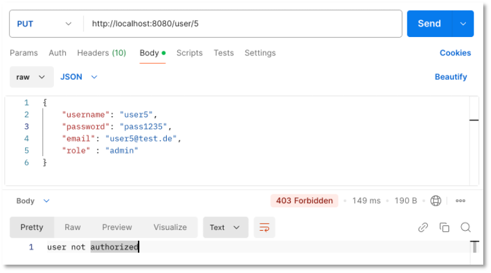{ width="500" }
  <figcaption>Falsches Passwort - Http-Status 403</figcaption>
</figure>


<figure markdown="span">
  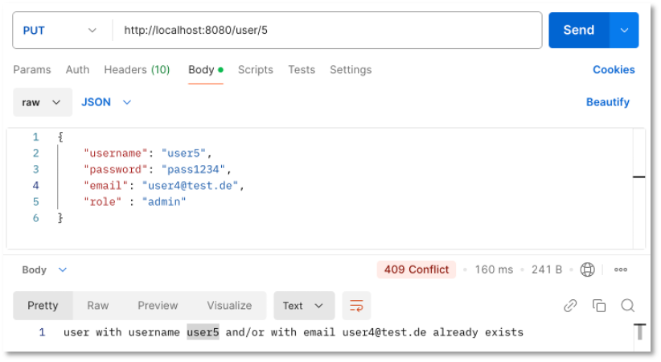{ width="500" }
  <figcaption>E-Mail existiert bereits - Http-Status 409</figcaption>
</figure>


<figure markdown="span">
  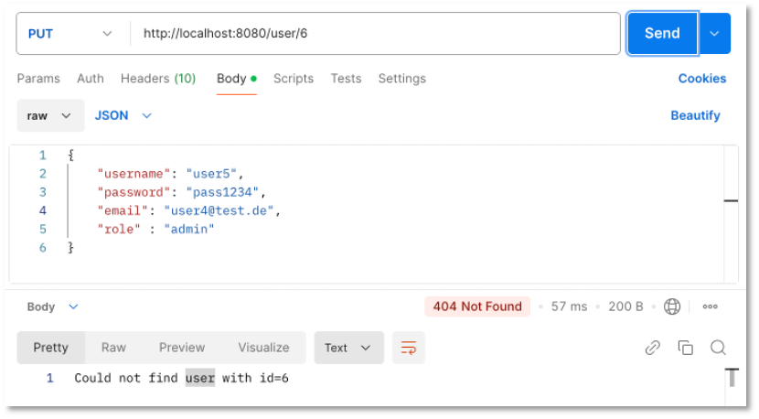{ width="500" }
  <figcaption>id existiert nicht - Http-Status 404</figcaption>
</figure>


<figure markdown="span">
  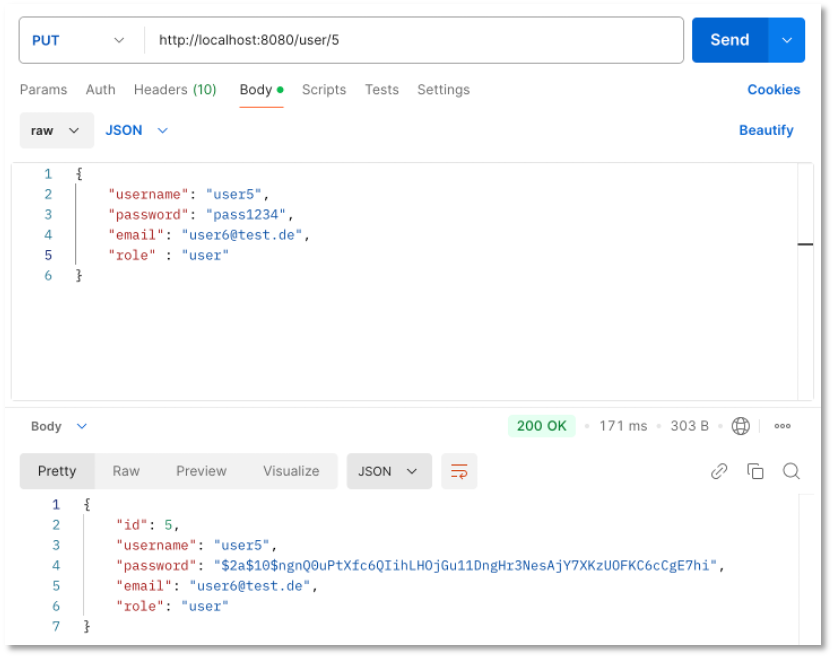{ width="500" }
  <figcaption>E-Mail und Rolle geändert - Http-Status 200</figcaption>
</figure>


### DELETE one by id

Jetzt benötigen wir nur noch einen Endpunkt, um die *CRUD*-Funktionalitäten vollständig abgebildet zu haben: einen *DELETE*-Endpunkt, um einen Datensatz zu löschen. Wir löschen einen `user`, indem wir seine `id` als Parameter der Route hinzufügen:

=== "user/UserController.java"
	```java linenums="48" hl_lines="6 13"
    @PutMapping("/user/{id}")
    User replaceUser(@RequestBody User newUser, @PathVariable Long id) {

        return userRepository.findById(id)
                .map(user -> {
                    if(bCryptPasswordEncoder.matches(newUser.getPassword(), user.getPassword())) {
                        List<User> response = userRepository.findByUsernameOrEmail(newUser.getUsername(), newUser.getEmail());
                        if (response.isEmpty() || (response.size() == 1 && response.getFirst().getId().equals(id))) {
                            user.setUsername(newUser.getUsername());
                            user.setEmail(newUser.getEmail());
                            user.setRole(newUser.getRole());
                            return userRepository.save(user);
                        } else throw new UserAlreadyExistsException(newUser.getUsername(), newUser.getEmail());
                    }
                    else throw new UserNotAuthorizedException();
                })
                .orElseThrow(() -> new UserNotFoundException(id));
    }
	```


!!! success "REST-API"
	Wir haben unsere erste REST-API mit Spring Boot erstellt. Es handelt sich um eine einfache Nutzerverwaltung. Wesentliche Bestandteile sind
	<ul>
	<li> die Entität `User` (Klasse `User`) zur Erstellung einer Tabelle `users`, </li>
	<li> ein `UserRepository` (Interface `UserRepository`) zur Bereitstellung der wesentlichen Datenbankmethoden (`find(), save(), ...`), </li>
	<li> ein `UserController` (Klasse `UserController`) zur Bereitstellung der Endpunkte (HTTP-Anfragemethoden + Routen) </li>
	</ul>
	Darüber hinaus haben wir noch einige Hilfsklassen implementiert:
	<ul>
	<li> eine Klasse `LoadUserData`, um bereits Daten bei Start der Anwendung in die Tabelle einzufügen, </li>
	<li> mehrere Exception-Klassen (`UserNotFoundException`, `UserAlreadyExistsException`, `UserNotAuthorizedException`) und </li>
	<li> eine *Advice*-Klasse (Klasse `UserNotFoundAdvice`), die dafür sorgt, dass bei Werfen einer Exception ein geeigneter Fehlercode als Response gesendet wird (und eine Fehlermeldung).</li>
	</ul>
	Die hier beschriebenen Prinzipien lassen sich für die meisten Fälle bei der Erstellung von REST-APIs mithilfe von Spring Boot anwenden. 


