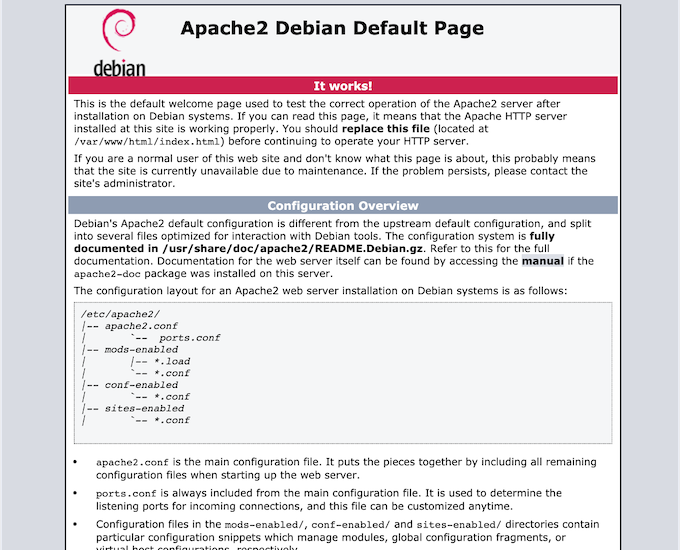

# Virtuellen Server einrichten

Wir wollen erläutern, wie Sie sich einen Virtuellen Server einrichten können. Einen solchen Server erhalten Sie auf Antrag bei den Laboringenieuren in der 6. Etage des C-Gebäudes. Wir beschreiben hier die Einrichtung eines solchen Servers, der hier die IP `141.45.146.202` und den Namen `htwfb5.f4.htw-berlin.de` hat. Nach Einrichtung durch die Laboringenieure hat ein solcher Server zwei User: `local` und `root`. Sie können sich baer weder per `ssh` noch per `sftp` als `root` auf dem Server einloggen. 

## Einloggen per `ssh`

Sie können sich nur als `local` einloggen. Geben Sie dazu im Terminal 

```bash
 % ssh local@141.45.146.202
The authenticity of host '141.45.146.202 (141.45.146.202)' can't be established.
ECDSA key fingerprint is SHA256:Kh3JNWKv1J29LDdFn12p2p+cKzP8zzQHpwuhVoQqOio.
Are you sure you want to continue connecting (yes/no/[fingerprint])? yes
Warning: Permanently added '141.45.146.202' (ECDSA) to the list of known hosts.
local@141.45.146.202's password: 
Linux htwfb5 4.19.0-5-amd64 #1 SMP Debian 4.19.37-5 (2019-06-19) x86_64

The programs included with the Debian GNU/Linux system are free software;
the exact distribution terms for each program are described in the
individual files in /usr/share/doc/*/copyright.

Debian GNU/Linux comes with ABSOLUTELY NO WARRANTY, to the extent
permitted by applicable law.
Last login: Mon Oct 19 10:19:16 2020 from 141.45.154.161
local@htwfb5:~$ 
```

und auf Nachfrage das Passwort des Users `local` ein. Anstelle von `ssh local@141.45.146.202` hätten Sie auch `ssh local@htwfb5.f4.htw-berlin.de` verwenden können. Um nun `root`-Rechte zu erlangen, geben Sie `su -` (super user - Minus nicht vergessen!) und das Passwort für `root` ein. 

```bash
local@htwfb5:~$ su -
Password: 
root@htwfb5:/home/local# 
```

Sie sind nun als `root` auf dem Server eingeloggt. 

## Systeminformationen

Probieren Sie ein paar Befehle aus, um Informationen über das Sytem zu ermitteln. Zunächst Details über das Betriebssystem:

```bash
root@htwfb5:~# hostnamectl
   Static hostname: htwfb5
         Icon name: computer-vm
           Chassis: vm
        Machine ID: 8074a4fe7a1e4160882b8739fc91ff6b
           Boot ID: 1289d3137b284315b3e780bae4672d53
    Virtualization: xen
  Operating System: Debian GNU/Linux 10 (buster)
            Kernel: Linux 4.19.0-5-amd64
      Architecture: x86-64
root@htwfb5:~# 
```

Und so fragen Sie laufende Prozesse ab:

```bash 
ps aux 
```

Liste aller Nutzer (`less` mit `q`beenden):

```bash
less /etc/passwd 
```

Liste aller Gruppen:

```bash
less /etc/group q
```

## Die Firewall anpassen

Als erstes passen wir die *firewall* an, da es standardmäßig nicht erlaubt ist, sich von außerhalb des HTW-Netzes auf einen solchen Server einzuloggen (Sie müssten dann immer erst einen VPN-Tunnel aufmachen). 

```bash
root@htwfb5:/home/local# cd /root
root@htwfb5:~# ls -la
total 36
drwx------  2 root root 4096 Oct 19 13:40 .
drwxr-xr-x 22 root root 4096 Oct 19 09:20 ..
-rw-------  1 root root  417 Oct 19 10:19 .bash_history
-rw-r--r--  1 root root  570 Jan 31  2010 .bashrc
-rw-r--r--  1 root root  148 Aug 17  2015 .profile
-rw-------  1 root root 1587 Oct 19 13:40 .viminfo
-rwxr-xr-x  1 root root   90 Jul  8  2019 firewall-disable.sh
-rwxr-xr-x  1 root root 4112 Jul  8  2019 firewall.sh
root@htwfb5:~# 
```

Öffnen Sie die `firewall.sh` mit `vim` (ist bereits installiert), also `vim firewall.sh` und entfernen Sie dann in folgenden Zeilen das `#` (den Kommentar): 

```bash
iptables -A INPUT -p tcp --dport 22 -j ACCEPT
iptables -A OUTPUT -p tcp --dport 22 -j ACCEPT

iptables -A INPUT -p tcp --dport 443 -j ACCEPT
iptables -A OUTPUT -p tcp --dport 443 -j ACCEPT

iptables -A INPUT -p tcp --dport 8080 -j ACCEPT
iptables -A OUTPUT -p tcp --dport 8080 -j ACCEPT
```

jeweils 2 Mal (für außerhalb und innerhalb). Alles andere sollte zunächst so bleiben. Lesen Sie die aktualisierte `firewall.sh` ein (als `root`):

```bash
./firewall.sh
``` 

Jetzt können Sie sich auch von außen als `local` einloggen und können auch von außen `sftp` verwenden.

## Installationen

Wir wollen im folgenden ein System aus 

- Apache Webserver
- MySQL (und phpMyAdmin)

erstellen und installieren dafür nun die entsprechenden Komponenten. Vor jeder Neuinstallation geben wir zunächst (als `root`)

```bash
apt update
```
 ein und falls es etwas zu upgraden gibt:

```bash
apt full-upgrade
```

### Apche Webserver

Um den Apache Webserver zu installieren, geben wir 

```bash
apt install apache2
```

ein und drücken bei Nachfragen einfach `Enter`. Nach der Installation können Sie den Status des Webservers abfragen: 

```bash
root@htwfb5:~# systemctl status apache2
* apache2.service - The Apache HTTP Server
   Loaded: loaded (/lib/systemd/system/apache2.service; enabled; vendor preset: enabled)
   Active: active (running) since Mon 2020-10-19 14:51:24 UTC; 26min ago
     Docs: https://httpd.apache.org/docs/2.4/
 Main PID: 24209 (apache2)
    Tasks: 55 (limit: 1074)
   Memory: 4.6M
   CGroup: /system.slice/apache2.service
           |-24209 /usr/sbin/apache2 -k start
           |-24211 /usr/sbin/apache2 -k start
           `-24212 /usr/sbin/apache2 -k start

Oct 19 14:51:23 htwfb5 systemd[1]: Starting The Apache HTTP Server...
Oct 19 14:51:24 htwfb5 systemd[1]: Started The Apache HTTP Server.
root@htwfb5:~# 
```

und auch die URL `http://htwfb5.f4.htw-berlin.de/` in den Browser eingeben. Es erscheint:


Falls Sie den Webserver neu starten wollen/müssen, geben Sie einfach

```bash 
systemctl restart apache2
```

ein. Sollte es Probleme mit dem Webserver geben, schauen Sie sich die `*.log`-Dateien unter `/var/log/apache2` an:

```bash
root@htwfb5:/var/log/apache2# ls -la
total 16
drwxr-x--- 2 root adm  4096 Oct 19 14:51 .
drwxr-xr-x 6 root root 4096 Oct 19 14:51 ..
-rw-r----- 1 root adm  1024 Oct 19 15:22 access.log
-rw-r----- 1 root adm   281 Oct 19 14:51 error.log
-rw-r----- 1 root adm     0 Oct 19 14:51 other_vhosts_access.log
root@htwfb5:/var/log/apache2# 
```

### PHP installieren

Um zum Beispiel `phpMyAdmin` für unsere `MySQL`-Datenbank nutzen zu können, benötigen wir PHP. Dazu installieren wir

```bash
apt install php php-cgi php-mysqli php-pear php-mbstring php-gettext libapache2-mod-php php-common php-phpseclib php-mysql
```

und drücken bei Nachfragen einfach `Enter`. Die erfolgreiche Installation können Sie überprüfen, indem Sie 

```bash
root@htwfb5:~# php --version
PHP 7.3.19-1~deb10u1 (cli) (built: Jul  5 2020 06:46:45) ( NTS )
Copyright (c) 1997-2018 The PHP Group
Zend Engine v3.3.19, Copyright (c) 1998-2018 Zend Technologies
    with Zend OPcache v7.3.19-1~deb10u1, Copyright (c) 1999-2018, by Zend Technologies
root@htwfb5:~# 
```

eingeben. 

### MySQL installieren

Es spricht gar nichts dagegen, anstelle von MySQL MariaDB zu installieren. In der Verwendung sind beide Datenbankmanagementsysteme kompatibel. Wir zeigen hier die Installation von MySQL. 

Zunächst benötigen wir das GnuPG Package, eine Open-Source-Implementierung des OpenPGP-Standards. Geben Sie 

```bash
apt install gnupg
```

ein und drücken bei Nachfragen einfach `Enter`.

Öffnen Sie im Browser nun die Seite `https://dev.mysql.com/downloads/repo/apt/` und klicken dort den "Download"-Button. Auf der folgenden Seite klicken Sie weder auf den "Login"- noch auf den "Sign Up"-Button, sondern **rechts-klicken**(!) auf den Link **No thanks, just start my download**. Kopieren Sie diesen Link in Ihre Zwischenablage. Geben Sie nun im Terminal ein:

```bash
wget https://dev.mysql.com/get/mysql-apt-config_0.8.15-1_all.deb
``` 

Die `https://...`-Adresse ist der kopierte Link! Ihr Ordner enthält dann die `mysql-...deb`-Datei. Geben Sie nun 

```bash
dpkg -i mysql-apt-config*
```

in Ihr Terminal ein. Es erscheint ein blaues Fenster. Durch die Menüpunkte können Sie mit den Pfeiltasten navigieren. Sie können aber alles so lassen (den oberen Menüpunkt) und mit der `Tab-Taste` zu `<Ok>` wechseln. Drücken Sie `Enter`. Auch auf der nächsten Seite. Geben Sie nun 

```bash
root@htwfb5:~# apt-get update
Get:1 http://repo.mysql.com/apt/debian buster InRelease [21.5 kB]
Hit:2 http://security.debian.org buster/updates InRelease      
Hit:3 http://httpredir.debian.org/debian buster InRelease      
Get:4 http://repo.mysql.com/apt/debian buster/mysql-8.0 Sources [951 B]
Get:5 http://repo.mysql.com/apt/debian buster/mysql-apt-config amd64 Packages [563 B]
Get:6 http://repo.mysql.com/apt/debian buster/mysql-8.0 amd64 Packages [7542 B]
Get:7 http://repo.mysql.com/apt/debian buster/mysql-tools amd64 Packages [5210 B]
Fetched 35.8 kB in 1s (69.7 kB/s)                
Reading package lists... Done
root@htwfb5:~# 
```
ein. Nun haben wir die Pakete verfügbar und können installieren:

```bash
apt install mysql-server
```

Während der Installation werden Sie nach dem `root`-Passwort für MySQL gefragt, d.h. Sie sollen sich eins überlegen. Notieren Sie sich dieses Passwort! Sie können auch das Passwort des `local`-Users des Virtuellen Servers verwenden (um sich nicht so viele Passwörter merken zu müssen). Wählen Sie danach "Strong password encryption" aus und drücken `<Ok>`. 

Prüfen, ob MySQL korrekt installiert ist und läuft:

```bash
root@htwfb5:~# systemctl status mysql
* mysql.service - MySQL Community Server
   Loaded: loaded (/lib/systemd/system/mysql.service; enabled; vendor preset: enabled)
   Active: active (running) since Mon 2020-10-19 15:55:55 UTC; 17h ago
     Docs: man:mysqld(8)
           http://dev.mysql.com/doc/refman/en/using-systemd.html
  Process: 6290 ExecStartPre=/usr/share/mysql-8.0/mysql-systemd-start pre (code=exited, status=0/S
 Main PID: 6325 (mysqld)
   Status: "Server is operational"
    Tasks: 37 (limit: 1074)
   Memory: 331.3M
   CGroup: /system.slice/mysql.service
           `-6325 /usr/sbin/mysqld

Oct 19 15:55:54 htwfb5 systemd[1]: Starting MySQL Community Server...
Oct 19 15:55:55 htwfb5 systemd[1]: Started MySQL Community Server.
```

Sie können die MySQL-Konfiguration noch absichern, um die Nutzerinnen zu zwingen, relativ starke Passwörter zu verwenden. Dazu gibt es das Tool `mysql_secure_installation`, welches mit dem MySQL-Server geliefert wird. Sie können darin entscheiden, ob Sie eine Passwortvalidierung verwenden wollen und welche Stärke das Passwort haben soll. ob Sie anonyme User und das `root`-Login von außen verbieten wollen und ob die `test`-Datenbank, auf die jeder Zugriff hat, gelöscht werden soll. Wir werden dieses Werkzeug jetzt (noch) nicht ausführen, spätestens aber, wenn wir mit einer Webanwendung auf dem Server in Produktion gehen. 

Sie können nun aber das MySQL-Administrationstool `mysqladmin` verwenden:

```bash
mysqladmin -u root -p version
``` 

`-u root` gibt an, dass Sie sich als `root` (MySQL-`root`) anmelden und `-p` gibt an, dass das (MySQL-)`root`-Passwort eingegeben werden muss. 

Für `mysqladmin -u root -p version` erhalten Sie ungefähr folgende Ausgabe: 

```bash
root@htwfb5:~# mysqladmin -u root -p version
Enter password: 
mysqladmin  Ver 8.0.22 for Linux on x86_64 (MySQL Community Server - GPL)
Copyright (c) 2000, 2020, Oracle and/or its affiliates. All rights reserved.

Oracle is a registered trademark of Oracle Corporation and/or its
affiliates. Other names may be trademarks of their respective
owners.

Server version		8.0.22
Protocol version	10
Connection		Localhost via UNIX socket
UNIX socket		/var/run/mysqld/mysqld.sock
Uptime:			18 hours 7 min 43 sec

Threads: 2  Questions: 8  Slow queries: 0  Opens: 127  Flush tables: 3  Open tables: 48  Queries per second avg: 0.000
root@htwfb5:~# 
```

`mysqladmin` ist ein recht mächtiges Tool. Insbesondere können Sie damit auch alle Nutzerinnen-Passwörter ändern (auch das von `root`). Weitere Informationen zu `mysqladmin` finden Sie [**hier**](https://dev.mysql.com/doc/refman/8.0/en/mysqladmin.html)

### phpMyAdmin

Wir könnten nun Datenbanken, Tabellen usw. über die Kommandozeile des MySQl-Servers anlegen, ändern und löschen, aber wir verwenden dafür lieber die grafische Weboberfläche `phpMyAdmin`. Wir laden die aktuelle Version von `phpMyAdmin` zunächst herunter: 

```bash
wget -P Downloads https://www.phpmyadmin.net/downloads/phpMyAdmin-latest-all-languages.tar.gz
```

Mit der Option `Downloads` geben wir an, dass der Download in einen Download-Ordner in dem aufrufenden Ordner erfolgt, d.h. in dem aufrufenden Ordner wird ein Ordner `Downloads` angelegt, falls er noch nicht existiert. Um die Signatur der heruntergeladenen Datei zu überprüfen, laden wir uns noch den GPG key für `phpMyAdmin` herunter (ebenfalls in das `Downloads`- Verzeichnis:

```bash
wget -P Downloads https://files.phpmyadmin.net/phpmyadmin.keyring
```

Wir wechseln in den `Downloads`- Ordner und importieren den `keyring`:

```bash
root@htwfb5:~# cd Downloads/
root@htwfb5:~/Downloads# gpg --import phpmyadmin.keyring
gpg: directory '/root/.gnupg' created
gpg: keybox '/root/.gnupg/pubring.kbx' created
gpg: /root/.gnupg/trustdb.gpg: trustdb created
gpg: key 9C27B31342B7511D: public key "Michal \xc4\x8ciha\xc5\x99 <michal@cihar.com>" imported
gpg: key FEFC65D181AF644A: public key "Marc Delisle <marc@infomarc.info>" imported
gpg: key CE752F178259BD92: public key "Isaac Bennetch <bennetch@gmail.com>" imported
gpg: key DA68AB39218AB947: public key "phpMyAdmin Security Team <security@phpmyadmin.net>" imported
gpg: Total number processed: 4
gpg:               imported: 4
```

Wir verlassen den `Downloads`-Ordner wieder und laden uns das `.asc`- File von `phpmyadmin`herunter. asc-Dateien sind ASCII-Skript-Dateien. Hier enthält es eine digitale Signatur als Text und kann von Ver- und Entschlüsselungsprogrammen, wie z.B. * Pretty Good Privacy (PGP)* geprüft werden. 

```bash
root@htwfb5:~/Downloads# cd ..
root@htwfb5:~# wget -P Downloads https://www.phpmyadmin.net/downloads/phpMyAdmin-latest-all-languages.tar.gz.asc
--2020-10-20 10:41:33--  https://www.phpmyadmin.net/downloads/phpMyAdmin-latest-all-languages.tar.gz.asc
Resolving www.phpmyadmin.net (www.phpmyadmin.net)... 195.181.175.48
Connecting to www.phpmyadmin.net (www.phpmyadmin.net)|195.181.175.48|:443... connected.
HTTP request sent, awaiting response... 302 Found
Location: https://files.phpmyadmin.net/phpMyAdmin/5.0.4/phpMyAdmin-5.0.4-all-languages.tar.gz.asc [following]
--2020-10-20 10:41:33--  https://files.phpmyadmin.net/phpMyAdmin/5.0.4/phpMyAdmin-5.0.4-all-languages.tar.gz.asc
Resolving files.phpmyadmin.net (files.phpmyadmin.net)... 195.181.175.55
Connecting to files.phpmyadmin.net (files.phpmyadmin.net)|195.181.175.55|:443... connected.
HTTP request sent, awaiting response... 200 OK
Length: 833 [application/octet-stream]
Saving to: 'Downloads/phpMyAdmin-latest-all-languages.tar.gz.asc'

phpMyAdmin-latest-all-languages 100%[=====================================================>]     833  --.-KB/s    in 0s      

2020-10-20 10:41:33 (12.5 MB/s) - 'Downloads/phpMyAdmin-latest-all-languages.tar.gz.asc' saved [833/833]
```  

Nun können wir die `phpmyadmin`- Signatur überprüfen:

```bash
root@htwfb5:~# cd Downloads
root@htwfb5:~/Downloads# gpg --verify phpMyAdmin-latest-all-languages.tar.gz.asc
gpg: assuming signed data in 'phpMyAdmin-latest-all-languages.tar.gz'
gpg: Signature made Thu Oct 15 18:10:40 2020 UTC
gpg:                using RSA key 3D06A59ECE730EB71B511C17CE752F178259BD92
gpg: Good signature from "Isaac Bennetch <bennetch@gmail.com>" [unknown]
gpg:                 aka "Isaac Bennetch <isaac@bennetch.org>" [unknown]
gpg: WARNING: This key is not certified with a trusted signature!
gpg:          There is no indication that the signature belongs to the owner.
Primary key fingerprint: 3D06 A59E CE73 0EB7 1B51  1C17 CE75 2F17 8259 BD92
```

#### Zugriff auf phpMyAdmin über den Webserver

Wir haben `phpMyAdmin` nun heruntergeladen und den Download verifiziert. Jetzt wollen wir es für die Nutzung zur Verfügung stellen. Damit es über eine URL, wie z.B. `http://htwfb5.f4.htw-berlin.de/phpmyadmin` erreichbar ist, kopieren wir `phpmyadmin` in unser * DocumentRoot* . Das ist in Linux-Systemen typischerweise `var/www/html`. Wir wechesln in dieses Verzeichnis und erstellen dort den Ordner `phpmyadmin`:

```bash
root@htwfb5:~/Downloads# cd /var/www/html
root@htwfb5:/var/www/html# ls -la
total 20
drwxr-xr-x 2 root root  4096 Oct 19 14:51 .
drwxr-xr-x 3 root root  4096 Oct 19 14:51 ..
-rw-r--r-- 1 root root 10701 Oct 19 14:51 index.html
root@htwfb5:/var/www/html# mkdir phpmyadmin
root@htwfb5:/var/www/html# ls -la
total 24
drwxr-xr-x 3 root root  4096 Oct 20 10:53 .
drwxr-xr-x 3 root root  4096 Oct 19 14:51 ..
-rw-r--r-- 1 root root 10701 Oct 19 14:51 index.html
drwxr-xr-x 2 root root  4096 Oct 20 10:53 phpmyadmin
```

Danach wechseln wir wieder in unseren `Downloads`-Ordner zurück und entpacken dort unsere gezippte `phpmyadmin`-Datei direkt in den `/var/www/html/phpmyadmin`-Ordner:

```bash
root@htwfb5:/var/www/html# cd /root/Downloads/
root@htwfb5:~/Downloads# tar xvf phpMyAdmin-latest-all-languages.tar.gz --strip-components=1 -C /var/www/html/phpmyadmin
``` 

Es erscheint eine sehr lange Liste von Dateien, die alle in den `/var/www/html/phpmyadmin`-Ordner entpackt werden. Jetzt könnte man die URL `http://htwfb5.f4.htw-berlin.de/phpmyadmin/` bereits in den Browser eingeben und es käme bereits das Anmeldeformular für `phpmyadmin`: 

Wir wollen uns aber zunächst noch um eine sichere Anmeldung kümmern. Dazu wechseln wir in das `/var/www/html/phpmyadmin`-Verzeichnis. Darin gibt es eine Datei `config.sample.inc.php`, welche eine Beispiel-Konfiguration für `phpmyadmin` enthält. Diese Datei kopieren wir in eine `config.inc.php`-Datei (diese wird erstellt):  

```bash
cd /var/www/html/phpmyadmin
cp config.sample.inc.php config.inc.php
```

Wir öffnen diese `config.inc.php`mit einem Terminaleditor (z.B. `nano` oder `vim`). IN Zeile `18`in dieser Datei gibt es folgenden Eintrag:

```bash
$cfg['blowfish_secret'] = '';  /* YOU MUST FILL IN THIS FOR COOKIE AUTH! */
```

Wir benötigen eine Passphrase für den *Blowfish-Verschlüsselungsalgorithmus*, der für die Authentifikation mithilfe von Cookies verwendet wird. Diese Passphrase soll mindestens 32 Zeichen lang sein. Sie tragen diese Passphrase direkt in die Datei `config.inc.php` ein, deshalb müssen Sie sich diese auch gar nicht merken, da sie dort ja jederzeit für Sie lesbar ist. Geben Sie also ein Satz dort ein, der aus mindestens 32 Zeichen besteht (kann Sonderzeichen, Leerzeichen usw. enthalten). Speichern Sie dann die Datei `config.inc.php`. Wir wechseln die Zugriffsrechte der Datei `config.inc.php` von `644` auf `660` (schreib- und lesbar durch User und Group, aber weder noch für die Welt):

```bash
root@htwfb5:/var/www/html/phpmyadmin# chmod 660 config.inc.php
root@htwfb5:/var/www/html/phpmyadmin# ls -la config.inc.php
-rw-rw---- 1 root root 4590 Oct 20 11:18 config.inc.php
``` 

Wir haben das gesamte Verzeichnis `phpmyadmin` in `/var/www/html` als `root`angelegt. Dadurch ist `root` dort auch Owner. Das wollen wir ändern. Rekursiv wird das gesamte Verzeichnis dem User (und der Group) `www-data` zugeordnet. 

```bash
chown -R www-data:www-data phpmyadmin
```

Jetzt starten wir noch unseren Webserver neu und dann können wir `phpmyadmin` im Browser aufrufen:

```bash
systemctl restart apache2
```

??? "Mögliche Login-Probleme phpmyadmin"
	- eventuelle Fehlerausschrift: `mysqli::real_connect(): The server requested authentication method unknown to the client [caching_sha2_password]` 
	- und/oder `mysqli::real_connect(): (HY000/2054): The server requested authentication method unknown to the client`
	- mögliche Lösungen: PHP-Update auf 7.4 (davor hat `mysqli` `caching_sha2` nicht unterstützt)
	- wenn das auch nicht hilft:
		- per `mysql -u root -p` als `root` auf den MySQl-Server anmelden
		- ALTER USER 'root'@'localhost' IDENTIFIED WITH mysql_native_password BY 'hierDasRootPasswort';
		- dann wird wieder native Passwort geprüft

#### Eine Testdatenbank

Rufen Sie `phpmyadmin` im Browser auf und loggen sich als `root` ein. In der linken Spalte sind alle bisherigen Datenbanken aufgelistet. Klicken Sie dort auf `Neu` und erstellen Sie eine neue Datenbank `Test20`. Wählen Sie diese Datenbank links aus, indem Sie sie anklicken. Gehen Sie auf den Reiter `SQL` und kopieren Sie folgenden Inhalt in das `SQL`-Terminal:

??? "Test20.sql"
    ```sql
    -- phpMyAdmin SQL Dump
    -- version 5.0.4
    -- https://www.phpmyadmin.net/
    --
    -- Host: localhost
    -- Erstellungszeit: 20. Okt 2020 um 15:44
    -- Server-Version: 8.0.22
    -- PHP-Version: 7.3.19-1~deb10u1

    SET SQL_MODE = "NO_AUTO_VALUE_ON_ZERO";
    START TRANSACTION;
    SET time_zone = "+00:00";


    /*!40101 SET @OLD_CHARACTER_SET_CLIENT=@@CHARACTER_SET_CLIENT */;
    /*!40101 SET @OLD_CHARACTER_SET_RESULTS=@@CHARACTER_SET_RESULTS */;
    /*!40101 SET @OLD_COLLATION_CONNECTION=@@COLLATION_CONNECTION */;
    /*!40101 SET NAMES utf8mb4 */;

    --
    -- Datenbank: `Test20`
    --

    -- --------------------------------------------------------

    --
    -- Tabellenstruktur für Tabelle `assistenten`
    --

    CREATE TABLE `assistenten` (
      `pers_nr` int NOT NULL,
      `name` varchar(30) NOT NULL,
      `fachgebiet` varchar(30) DEFAULT NULL,
      `von` int DEFAULT NULL
    ) ENGINE=InnoDB DEFAULT CHARSET=utf8mb4 COLLATE=utf8mb4_0900_ai_ci;

    --
    -- Daten für Tabelle `assistenten`
    --

    INSERT INTO `assistenten` (`pers_nr`, `name`, `fachgebiet`, `von`) VALUES
    (3002, 'Sokrates', 'Ideenlehre', 2125),
    (3003, 'Aristoteles', 'Syllogistik', 2125),
    (3004, 'Wittgenstein', 'Sprachtheorie', 2126),
    (3005, 'Mitchell', 'Planetenbewegung', 2127),
    (3006, 'Newton', 'Keplersche Gesetze', 2134),
    (3007, 'Whitehead', 'analytische Philosophie', 2134);

    -- --------------------------------------------------------

    --
    -- Tabellenstruktur für Tabelle `hoeren`
    --

    CREATE TABLE `hoeren` (
      `matr_nr` int NOT NULL,
      `vorl_nr` int NOT NULL
    ) ENGINE=InnoDB DEFAULT CHARSET=utf8mb4 COLLATE=utf8mb4_0900_ai_ci;

    --
    -- Daten für Tabelle `hoeren`
    --

    INSERT INTO `hoeren` (`matr_nr`, `vorl_nr`) VALUES
    (25403, 5022),
    (26120, 5001),
    (27550, 4052),
    (27550, 5001),
    (28106, 5041),
    (28106, 5052),
    (28106, 5216),
    (28106, 5259),
    (29120, 5001),
    (29120, 5041),
    (29120, 5049),
    (29555, 5001),
    (29555, 5022);

    -- --------------------------------------------------------

    --
    -- Tabellenstruktur für Tabelle `professoren`
    --

    CREATE TABLE `professoren` (
      `pers_nr` int NOT NULL,
      `name` varchar(30) NOT NULL,
      `rang` char(2) DEFAULT NULL,
      `raum` int DEFAULT NULL
    ) ;

    --
    -- Daten für Tabelle `professoren`
    --

    INSERT INTO `professoren` (`pers_nr`, `name`, `rang`, `raum`) VALUES
    (2125, 'Hypathia', 'C4', 226),
    (2126, 'Russel', 'C4', 232),
    (2127, 'Meitner', 'C3', 310),
    (2133, 'Gauss', 'C3', 52),
    (2134, 'Kepler', 'C3', 309),
    (2136, 'Curie', 'C4', 36),
    (2137, 'Galileo', 'C4', 7);

    -- --------------------------------------------------------

    --
    -- Tabellenstruktur für Tabelle `pruefen`
    --

    CREATE TABLE `pruefen` (
      `matr_nr` int NOT NULL,
      `vorl_nr` int NOT NULL,
      `pers_nr` int DEFAULT NULL,
      `note` decimal(2,1) DEFAULT NULL
    ) ;

    --
    -- Daten für Tabelle `pruefen`
    --

    INSERT INTO `pruefen` (`matr_nr`, `vorl_nr`, `pers_nr`, `note`) VALUES
    (25403, 5041, 2125, '2.0'),
    (27550, 4630, 2137, '2.0'),
    (28106, 5001, 2126, '1.0');

    -- --------------------------------------------------------

    --
    -- Tabellenstruktur für Tabelle `studenten`
    --

    CREATE TABLE `studenten` (
      `matr_nr` int NOT NULL,
      `name` varchar(30) NOT NULL,
      `semester` int DEFAULT NULL
    ) ENGINE=InnoDB DEFAULT CHARSET=utf8mb4 COLLATE=utf8mb4_0900_ai_ci;

    --
    -- Daten für Tabelle `studenten`
    --

    INSERT INTO `studenten` (`matr_nr`, `name`, `semester`) VALUES
    (24002, 'Dijkstra', 18),
    (25403, 'Einstein', 12),
    (26120, 'Goeppert-Mayer', 10),
    (26830, 'Noether', 8),
    (27550, 'Goedel', 6),
    (28106, 'Lovelace', 3),
    (29120, 'Bartik', 2),
    (29555, 'Pasteur', 2);

    -- --------------------------------------------------------

    --
    -- Tabellenstruktur für Tabelle `voraussetzen`
    --

    CREATE TABLE `voraussetzen` (
      `vorgaenger` int NOT NULL,
      `nachfolger` int NOT NULL
    ) ENGINE=InnoDB DEFAULT CHARSET=utf8mb4 COLLATE=utf8mb4_0900_ai_ci;

    --
    -- Daten für Tabelle `voraussetzen`
    --

    INSERT INTO `voraussetzen` (`vorgaenger`, `nachfolger`) VALUES
    (5041, 5052),
    (5041, 5216),
    (5043, 5052),
    (5052, 5022),
    (5259, 5041),
    (5259, 5043),
    (5259, 5049);

    -- --------------------------------------------------------

    --
    -- Tabellenstruktur für Tabelle `vorlesungen`
    --

    CREATE TABLE `vorlesungen` (
      `vorl_nr` int NOT NULL,
      `titel` varchar(30) DEFAULT NULL,
      `sws` int DEFAULT NULL,
      `gelesen_von` int DEFAULT NULL
    ) ENGINE=InnoDB DEFAULT CHARSET=utf8mb4 COLLATE=utf8mb4_0900_ai_ci;

    --
    -- Daten für Tabelle `vorlesungen`
    --

    INSERT INTO `vorlesungen` (`vorl_nr`, `titel`, `sws`, `gelesen_von`) VALUES
    (4052, 'Medizin', 4, 2125),
    (4630, 'Mechanik', 4, 2137),
    (5001, 'Physik', 4, 2137),
    (5022, 'Astronomie', 2, 2134),
    (5041, 'Ethik', 4, 2125),
    (5043, 'Erkenntnistheorie', 3, 2126),
    (5049, 'Philosophie', 2, 2125),
    (5052, 'Wissenschaftstheorie', 3, 2126),
    (5216, 'Logik', 2, 2126),
    (5259, 'Mathematik', 2, 2133);

    --
    -- Indizes der exportierten Tabellen
    --

    --
    -- Indizes für die Tabelle `assistenten`
    --
    ALTER TABLE `assistenten`
      ADD PRIMARY KEY (`pers_nr`),
      ADD KEY `von` (`von`);

    --
    -- Indizes für die Tabelle `hoeren`
    --
    ALTER TABLE `hoeren`
      ADD PRIMARY KEY (`matr_nr`,`vorl_nr`);

    --
    -- Indizes für die Tabelle `professoren`
    --
    ALTER TABLE `professoren`
      ADD PRIMARY KEY (`pers_nr`),
      ADD UNIQUE KEY `raum` (`raum`);

    --
    -- Indizes für die Tabelle `pruefen`
    --
    ALTER TABLE `pruefen`
      ADD PRIMARY KEY (`matr_nr`,`vorl_nr`);

    --
    -- Indizes für die Tabelle `studenten`
    --
    ALTER TABLE `studenten`
      ADD PRIMARY KEY (`matr_nr`);

    --
    -- Indizes für die Tabelle `voraussetzen`
    --
    ALTER TABLE `voraussetzen`
      ADD PRIMARY KEY (`vorgaenger`,`nachfolger`);

    --
    -- Indizes für die Tabelle `vorlesungen`
    --
    ALTER TABLE `vorlesungen`
      ADD PRIMARY KEY (`vorl_nr`);

    --
    -- Constraints der exportierten Tabellen
    --

    --
    -- Constraints der Tabelle `assistenten`
    --
    ALTER TABLE `assistenten`
      ADD CONSTRAINT `assistenten_ibfk_1` FOREIGN KEY (`von`) REFERENCES `professoren` (`pers_nr`);
    COMMIT;

    /*!40101 SET CHARACTER_SET_CLIENT=@OLD_CHARACTER_SET_CLIENT */;
    /*!40101 SET CHARACTER_SET_RESULTS=@OLD_CHARACTER_SET_RESULTS */;
    /*!40101 SET COLLATION_CONNECTION=@OLD_COLLATION_CONNECTION */;

    ```

Klicken Sie dann auf `OK`. Es werden mehrere Tabellen erstellt und diese befüllt. Prüfen Sie das Ergebnis. Anstelle des Hineinkopierens des SQL-Codes können Sie auch unter dem Reiter `Importieren` die Datei `Test20.sql` hochladen und ausführen lassen. Laden Sie sich dazu die Datei [**Test20.sql**](./files/Test20.sql) herunter, speichern Sie ab und laden Sie dann unter dem Reiter `Importieren` hoch. 

## git

Damit Sie Ihr Repository / Ihre Repositories auch auf den virtuellen Server "pullen" können, benötigen Sie noch [**git**](https://git-scm.com/). Die Installation ist einfach:

```bash
apt install git
```

Beantworten Sie eventuelle Fragen einfach mit `Enter`. Testen Sie, ob die Installation erfolgreich war:

```bash
git --version
```

Es sollte etwas wie `git version 2.20.1` ausgegeben werden. 

### Verwendung von git

Sie müssen nun Ihr *Remote Rpository* (die entsprechende URL erhalten Sie bei GitHub oder GitLab oder welchen git-Host Sie auch verwenden) *genau ein Mal clonen* (`git clone RemoteRepositoryCloneURL`). Meistens wollen Sie genau in den Ordner `/var/www/html` clonen, da dort dann Ihr lokales Repository angelegt wird und Sie gleichzeitig im *DocumentRoot* sind. 

Wir zeigen hier einmal exemplarisch das Clonen des GitHub-Repositories mit der Clone_URL `https://github.com/jfreiheit/projekte.git`. Wir wechseln zunächst in das Verzeichnis `/var/www/html/` und clonen dorthin unser Repository. 

```bash
root@htwfb5:/# cd /var/www/html 
root@htwfb5:/var/www/html# git clone https://github.com/jfreiheit/projekte.git
Cloning into 'projekte'...
remote: Enumerating objects: 12, done.
remote: Counting objects: 100% (12/12), done.
remote: Compressing objects: 100% (11/11), done.
remote: Total 12 (delta 1), reused 11 (delta 0), pack-reused 0
Unpacking objects: 100% (12/12), done.
root@htwfb5:/var/www/html#  
```

Es entsteht ein Ordner `projekte` innerhalb von `/var/www/html`. Um über den Browser auf diesen Ordner zuzugreifen, müssen Sie jetzt nur noch die URL `http://htwfb5.f4.htw-berlin.de/projekte` in Ihrem Browser aufrufen. 

Nachdem Sie einmal geclont haben, müssen Sie stets nur noch innerhalb des `projekte`-Ordners (`cd /var/www/html/projekte`) aufrufen:

```bash
git pull
```

, um sich die neueste Version Ihres Repositories auf den virtuellen Server zu ziehen. 