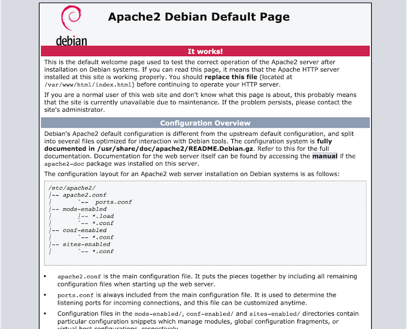

# Virtuellen Server einrichten

Wir wollen erläutern, wie Sie sich einen Virtuellen Server einrichten können. Einen solchen Server erhalten Sie auf Antrag bei den Laboringenieuren in der 6. Etage des C-Gebäudes. Wir beschreiben hier die Einrichtung eines solchen Servers, der hier die IP `141.45.146.63` und den Namen `fiwprojekte.f4.htw-berlin.de` hat. Nach Einrichtung durch die Laboringenieure hat ein solcher Server zwei User: `local` und `root`. Sie können sich aber weder per `ssh` noch per `sftp` als `root` auf dem Server einloggen. 

!!! warning
    Zum Einloggen auf den Server außerhalb des HTW-Netzwerkes benötigen Sie außerdem eine VPN-Verbindung (siehe [hier](https://rz.htw-berlin.de/anleitungen/vpn/)). 

## Einloggen per `ssh`

Sie können sich nur als `local` einloggen. Geben Sie dazu im Terminal 

```bash
 % ssh local@141.45.146.63
```

oder 

```bash
% ssh local@fiwprojekte.f4.htw-berlin.de
```

und auf Nachfrage das Passwort des Users `local` ein. Um nun `root`-Rechte zu erlangen, geben Sie `su -` (super user - Minus nicht vergessen!) und das Passwort für `root` ein. 

```bash
local@fiwprojekte:~$ su -
Password: 
```

Sie sind nun als `root` auf dem Server eingeloggt. 

## Einloggen mithilfe eines Zertifikates

Um zu vermeiden, dass Sie immer das Passwort beim Login angeben müssen, erstellen Sie sich am besten ein Zertifikat und spielen dieses auf den Server. 

#### Unter MacOS (und Linux)

Auf einem **Mac** geht das (hier am Beispiel des Servers `fiwprojekte` - bei Ihnen natürlich anders) wie folgt:

1. Schlüsselpaar auf dem Mac erstellen

    Öffnen Sie das Terminal generieren dort mithilfe von 

    ```bash
    ssh-keygen -t ed25519 -C "local@htw-berlin"
    ```

    ein Schlüsselpaar. 

    1. Bestätigen Sie den standardmäßigen Speicherort (`~/.ssh/id_ed25519`) mit ++enter++.
    2. Geben Sie optional eine Passphrase ein oder drücke zweimal Enter für einen schlüssellosen Zugriff (Letzteres ist einfacher, aber unsicherer).

2. Öffentlichen Schlüssel auf den Debian-Server übertragen
    
    Verwenden Sie das integrierte Tool `ssh-copy-id`, um den öffentlichen Schlüssel direkt in die Datei `~/.ssh/authorized_keys` auf dem Server einzufügen:

    ```bash
    ssh-copy-id -i ~/.ssh/id_ed25519.pub local@fiwprojekte.f4.htw-berlin.de
    ```

    Geben Sie bei der Abfrage das aktuelle Passwort des Nutzers `local` auf dem HTW-Server ein.


    Für den Fall, dass `ssh-copy-id` fehlschlägt, müssen Sie den Schlüssel wie folgt manuell übertragen:

    ```bash
    cat ~/.ssh/id_ed25519.pub | ssh local@fiwprojekte.f4.htw-berlin.de "mkdir -p ~/.ssh && chmod 700 ~/.ssh && cat >> ~/.ssh/authorized_keys && chmod 600 ~/.ssh/authorized_keys"
    ```

3. Verbindung per SSH testen

    Der Server sollte Sie nun direkt (bzw. nach Eingabe deiner Schlüssel-Passphrase) ohne Server-Passwort einloggen:

    ```bash
    ssh local@fiwprojekte.f4.htw-berlin.de
    ```

4. Bequemer Shortcut via SSH-Config (**Optional!**)

    Fügen Sie in der Datei `~/.ssh/config` auf dem Mac folgenden Block ein (z.B. mit [vi](https://www-user.tu-chemnitz.de/~hot/VIM/vi.html) oder [nano](https://www.nano-editor.org/dist/latest/cheatsheet.html) im Terminal):

    ```bash
    Host fiw
        HostName fiwprojekte.f4.htw-berlin.de
        User local
        IdentityFile ~/.ssh/id_ed25519
    ```


    Damit genügt fortan der Befehl `ssh fiw` im Terminal.


#### Unter Windows

Unter **Windows** ist das Vorgehen in der PowerShell fast identisch:

1. SSH-Schlüsselpaar in PowerShell erstellen

    Öffnen Sie die PowerShell (oder Windows Terminal) und führen Sie folgenden Befehl aus:

    ```bash
    ssh-keygen -t ed25519 -C "local@htw-berlin"
    ```

    1. Bestätigen Sie den Speicherort (`C:\Users\<DeinName>\.ssh\id_ed25519`) mit ++enter++.
    2. Vergeben Sie eine sichere Passphrase oder drücken zweimal Enter für keine.

2. Öffentlichen Schlüssel auf den Debian-Server übertragen

    In der Windows PowerShell lesen Sie den Schlüsselinhalt aus und hängen ihn direkt an die `authorized_keys` auf dem Server an:

    ```bash
    Get-Content $HOME\.ssh\id_ed25519.pub | ssh local@fiwprojekte.f4.htw-berlin.de "mkdir -p ~/.ssh && chmod 700 ~/.ssh && cat >> ~/.ssh/authorized_keys && chmod 600 ~/.ssh/authorized_keys"
    ```

    Geben Sie einmalig das Passwort des Nutzers `local` auf dem Server ein.

3. Windows SSH-Agent aktivieren und Passphrase speichern (erfordert Administrator-Rechte für Schritt 1.)

    Damit Windows deine Passphrase dauerhaft speichert, aktivieren Sie den Windows-Dienst:

    1. Öffnen Sie die PowerShell als Administrator und starte den Dienst dauerhaft:

        ```bash
        Get-Service ssh-agent | Set-Service -StartupType Automatic -PassThru | Start-Service
        ```

    2. Wechseln Sie zurück in die "normale" PowerShell (oder Sie bleiben im Fenster als Admin) und hinterlegen den Schlüssel:

        ```bash
        ssh-add $HOME\.ssh\id_ed25519
        ```

    3. Geben Sie nun Ihre Passphrase ein. Sie wird nun vom Windows-Systemdienst verwaltet und muss nicht erneut eingetippt werden.

4. Verbindung testen

    Loggen Sie sich ohne Passworteingabe auf dem Server ein:

    ```bash
    ssh local@fiwprojekte.f4.htw-berlin.de
    ```

5. SSH-Config unter Windows anlegen (**Optional!**)

    Erstellen Sie die Datei `config` im Ordner `.ssh` (z.B. via `notepad $HOME\.ssh\config`):

    ```bash
    Host fiw
        HostName fiwprojekte.f4.htw-berlin.de
        User local
        IdentityFile ~/.ssh/id_ed25519
    ```
    
    Danach reicht auch unter Windows einfach der Befehl `ssh fiw`.

## Systeminformationen

Probieren Sie ein paar Befehle aus, um Informationen über das Sytem zu ermitteln. Zunächst Details über das Betriebssystem:

```bash
root@fiwprojekte# hostnamectl
 Static hostname: fiwprojekte
       Icon name: computer-vm
         Chassis: vm 🖴
      Machine ID: 00e8594aff574f13a461ebeabc2e0231
         Boot ID: eaf47cb1b0e647c683ada5eb4bb355c1
    Product UUID: 8f804060-6f4f-4f5e-b6f0-b2343befbe8b
  Virtualization: xen
Operating System: Debian GNU/Linux 13 (trixie)        
          Kernel: Linux 6.12.107+deb13-amd64
    Architecture: x86-64
```

Und so fragen Sie laufende Prozesse ab:

```bash 
ps aux 
```

Liste aller Nutzer (`less` mit `q`beenden):

```bash
less /etc/passwd 
```

Liste aller Gruppen:

```bash
less /etc/group q
```

## Die Firewall anpassen

Das Anpassen der Firewall erfolgt über das Skript `nftables.conf` aus dem `root`-Verzeichnis:

```bash
root@gaw:~# ls -la
# gekürzt #
-rwxr-xr-x  1 root root   136  2. Mär 16:22 firewall-disable.sh
-rwxr-xr-x  1 root root   354  2. Mär 16:40 firewall.sh
-rw-rw-r--  1 root root  2068  4. Jun 10:08 nftables.conf
# gekürzt #
```

Das sind die 3 Skripte, die für die Firewall relevant sind. Mithilfe von 

```bash
./firewall-disable.sh
```

können Sie die Firewall vollständig außer Kraft setzen (bleibt aber trotzdem alles im HTW-Netzwerk). Dieses Skript sollten Sie nur selten und dann immer nur kurzfristig ausführen. Wir werden es beim Anlegen der Zertifikate für `https` einmal kurz verwenden. 

Danach schnell immer wieder 

```bash
./firewall.sh 
```

ausführen. Dieses Skript liest die `nftables.conf`. Darin gibt es bspw. Zeilen, wie 

```bash
# SSH aus dem HTW-Netz
ip saddr {141.45.0.0/16, 10.4.0.0/16} tcp dport 22 counter packets 0 bytes 0 accept
# HTTPS - aus dem HTW-Netz für apache2 
ip saddr {141.45.0.0/16, 10.4.0.0/16} tcp dport {80, 443} counter packets 0 bytes 0 accept
```

Diese Zeilen legen fest, dass die Ports `22` (sftp), `80` (http) und `443` (https) sowohl für den Eingang (`chain input`) als auch für den Ausgang (`chain OUTPUT`) nur aus dem HTW-Netz verfügbar sind. 

Wenn Sie diese Ports öffnen wollen (sinnvoll für `80` und `443`), dann ändern Sie die Zeile zu 

```bash
# HTTPS - aus dem HTW-Netz für apache2 
tcp dport {80, 443} counter packets 0 bytes 0 accept
```

, entfernen als die Einschränkung `ip saddr {141.45.0.0/16, 10.4.0.0/16} `. Das machen Sie sowohl für `input` als auch für `OUTPUT`. 

Siehe auch z.B. [hier](https://wiki.archlinux.org/title/Nftables).


## Installationen

Wir wollen im folgenden ein System aus 

- Apache Webserver und
- PostgreSQL

erstellen und installieren dafür nun die entsprechenden Komponenten. Vor jeder Neuinstallation geben wir zunächst (als `root`)

```bash
apt update
```
 ein und falls es etwas zu upgraden gibt:

```bash
apt full-upgrade
```

Wir müssen uns auch nicht zwingend als `root` einloggen, sondern stattdessen vor jeden Befehl `sudo` einfügen. Um `sudo` zu installieren, führen sie einmalig als `root` 

```bash
apt install sudo
```

aus.

### Apcahe Webserver

Um den Apache Webserver zu installieren, geben wir 

```bash
apt install apache2
```

ein und drücken bei Nachfragen einfach `Enter`. Nach der Installation können Sie den Status des Webservers abfragen: 

```bash
root@fiwprojekte:~# systemctl status apache2
* apache2.service - The Apache HTTP Server
     Loaded: loaded (/usr/lib/systemd/system/apache2.service; enabled; preset: enabled)
     Active: active (running) since Mon 2026-08-31 07:29:50 UTC; 1h 48min ago
 Invocation: 4a73e6315ceb47a6ae138400f21b1eee
       Docs: https://httpd.apache.org/docs/2.4/
   Main PID: 654 (apache2)
      Tasks: 55 (limit: 1106)
     Memory: 25M (peak: 26.3M)
        CPU: 972ms
     CGroup: /system.slice/apache2.service
             |-654 /usr/sbin/apache2 -k start
             |-663 /usr/sbin/apache2 -k start
             `-670 /usr/sbin/apache2 -k start

Aug 31 07:29:49 fiwprojekte systemd[1]: Starting apache2.service - The Apache HTTP Server...
Aug 31 07:29:50 fiwprojekte systemd[1]: Started apache2.service - The Apache HTTP Server.
```

und auch die URL `http://fiwprojekte.f4.htw-berlin.de/` in den Browser eingeben. Es erscheint:


Falls Sie den Webserver neu starten wollen/müssen, geben Sie einfach

```bash 
systemctl restart apache2
```

ein. Sollte es Probleme mit dem Webserver geben, schauen Sie sich die `*.log`-Dateien unter `/var/log/apache2` an:

```bash
root@fiwprojekte:/var/log/apache2# ls -la
total 932
drwxr-x---  2 root adm    4096 Aug 31 00:00 .
drwxr-xr-x 10 root root   4096 Aug 31 08:55 ..
-rw-r-----  1 root adm   62066 Aug 31 09:12 access.log
-rw-r-----  1 root adm    1608 Aug 31 07:29 error.log
-rw-r-----  1 root adm       0 Dec  6  2022 other_vhosts_access.log
```

### https mit Certbot einrichten

Für die Installation der Zertifikate gehen Sie am besten, wie in [certbot](https://certbot.eff.org/instructions?ws=apache&os=snap) beschrieben, vor (Webseite läuft auf Apache, Linux (snap)). Wichtig ist, dass die Ports `80` und `443`, wie oben beschrieben` freigeschaltet sind. 

1. System aktualisieren und Webserver-Plugin wählen

    ```bash
    sudo apt update
    sudo apt install -y certbot python3-certbot-apache
    ```
2. SSL-Zertifikat anfordern und HTTPS einrichten

    ```bash
    sudo certbot --apache -d fiwprojekte.f4.htw-berlin.de
    ```

    Sollte dieser Befhl bei Ihnen fehlschlagen (Zeitüberschreitung), dann schalten Sie kurfristig die Firewall aus (`~/fiewall-diable.sh`), führen den Befehl erneut aus und schalten dann die Firewall wieder ein (`~/firewall.sh`).

    Die Zertifikate liegen anschließend unter `/etc/letsencrypt/live/fiwprojekte.f4.htw-berlin.de/`.

### PostgreSQL installieren


1. System aktualisieren 

    ```bash
    sudo apt update && sudo apt upgrade -y
    ```

2. PostgreSQL und Zusatzpakete installieren 

    ```bash
    sudo apt install -y postgresql postgresql-contrib
    ```

3. Dienst aktivieren und Status prüfen

    ```bash
    sudo systemctl enable postgresql
    sudo systemctl start postgresql
    sudo systemctl status postgresql
    ```

4. Benutzer und Datenbank anlegen

    Wechseln Sie zum Standardbenutzer `postgres`, erstellen Sie einen eigenen Anwendungsbenutzer (hier `mein_nutzer`) und eine dazugehörige Datenbank (hier `mein_projekt`):

    ```bash
    # In die PostgreSQL-Kommandozeile wechseln
    sudo -u postgres psql

    # Benutzer und Datenbank in psql erstellen (Passwort anpassen):
    CREATE USER mein_nutzer WITH PASSWORD 'sicheres_passwort';
    CREATE DATABASE mein_projekt OWNER mein_nutzer;
    GRANT ALL PRIVILEGES ON DATABASE mein_projekt TO mein_nutzer;

    # psql verlassen
    \q
    ```

## git

Damit Sie Ihr Repository / Ihre Repositories auch auf den virtuellen Server "pullen" können, benötigen Sie noch [**git**](https://git-scm.com/). Die Installation ist einfach:

```bash
apt install git
```

Beantworten Sie eventuelle Fragen einfach mit `Enter`. Testen Sie, ob die Installation erfolgreich war:

```bash
git --version
```

Es sollte etwas wie `git version 2.47.3` ausgegeben werden. 

### Verwendung von git

Sie müssen nun Ihr *Remote Rpository* (die entsprechende URL erhalten Sie bei GitHub oder GitLab oder welchen git-Host Sie auch verwenden) *genau ein Mal clonen* (`git clone RemoteRepositoryCloneURL`). 

Die Wahl des Verzeichnisses, in das Sie clonen, hängt primär davon ab, wo gebaut wird (direkt auf dem Server via Git-Clone vs. über eine CI/CD-Pipeline) und wie sauber der [Linux Filesystem Hierarchy Standard (FHS)](https://de.wikipedia.org/wiki/Filesystem_Hierarchy_Standard) eingehalten werden soll.

Für ein Produktions-Setup auf Debian sind folgende Pfadstrukturen üblich und bewährt:

1. Empfohlene Zielordner für die fertigen (deployten) Anwendungen (Runtime)

    Unabhängig davon, wo der Quellcode liegt, sollten die lauffähigen Artefakte an dedizierten Orten liegen:

    1. Frontend (Angular Build-Output `dist/`):

        ```bash
        /var/www/<app-name>/frontend/ oder /var/www/html/<app-name>/
        ```

        Das ist das Standard-Verzeichnis für Webserver (Nginx/Apache) und ist optimiert für Berechtigungen (`www-data`) und statisches Ausliefern.

    2. Backend (Spring Boot JAR):

        ```bash
        /opt/<app-name>/ (z. B. /opt/<app-name>/backend/<app-name>.jar)
        ```

        `/opt` ist laut FHS für eigenständige Softwarepakete vorgesehen. Der Spring-Boot-Dienst läuft idealerweise unter einem dedizierten Service-User (z. B. `appuser`) via [systemd](https://wiki.ubuntuusers.de/systemd/).

2. Empfohlene Zielordner für die Git-Repositories (Quellcode)

    Das ist abhängig davon, wie der Deployment-Workflow aussieht. Es gibt zwei Varianten:

    1. Variante A: Wir führen das Build selbst auf dem Server aus ( jeweils `git pull` und dann `mvn build` und `ng build`). Dann legen wir die Repos unter `/opt` ab (unter `/srv` ginge auch)

        ```bash
        /opt/<app-name>/
        ├── source/
        │   ├── backend/   (Git Repo Spring Boot)
        │   └── frontend/  (Git Repo Angular)
        └── release/
            ├── backend/   (JAR-Datei für systemd)
            └── frontend/  (dist-Dateien für Webserver-Root)
        ```

        Sollten Sie ein gemeinsames Repository für Front- und Backend haben, dann wäre hier `/opt/source` Ihr Repository. 

    2. Variante B: Das Deployment erfolgt per GitHub Actions 

Nachdem Sie einmal geclont haben, müssen Sie stets nur noch innerhalb des `projekte`-Ordners (`cd /var/www/html/projekte`) aufrufen:

```bash
git pull
```

, um sich die neueste Version Ihres Repositories auf den virtuellen Server zu ziehen. 