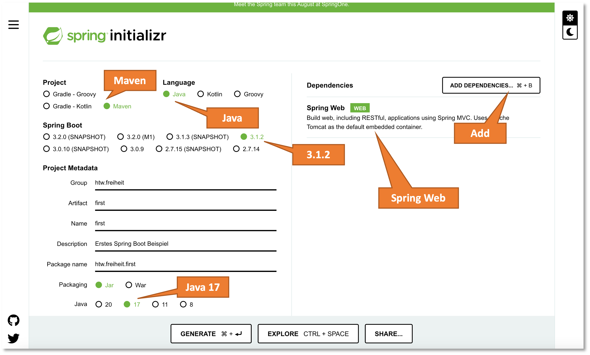
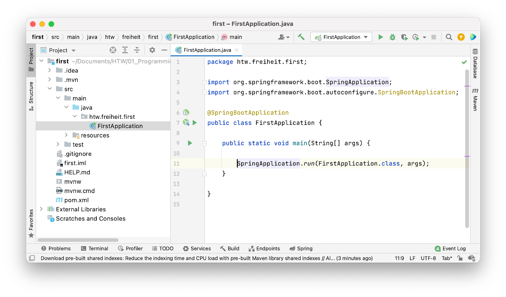
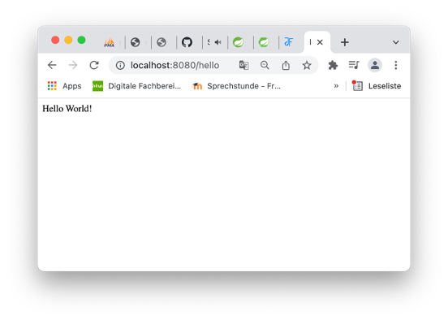

# Spring

[Spring](https://spring.io/) ist ein Open-Source-Java-Framework, um große Anwendungen zu schreiben. [Spring Boot](https://spring.io/projects/spring-boot) ist eine Konfigurationsplattform, die bei der Erstellung einer Spring-Anwendung hilft. Wesentliche Konzepte bzw. Kernfunktionalitäten von Spring sind

- *Dependency Injection*
- *Model View Controller (MVC) Webanwendungen*
- *RESTful Webservices*
- *Datenbankanbindungen (Java Database Connectivity - JDBC)* 

Wir werden alle diese Konzepte im Laufe der Verwendung von Spring kennenlernen. Wir beginnen mit einer ganz einfachen Anwendung. 

## IntelliJ

Die Screenshots von Programmcode zeigen die IDE [IntelliJ](https://www.jetbrains.com/de-de/idea/). es wird empfohlen, diese IDE für die Java-Entwicklung zu verwenden. Gute Alternativen sind die aus der Prog-Vorlesung bekannte IDE [Eclipse](https://www.eclipse.org/downloads/) oder [Visual Studio Code](https://code.visualstudio.com/docs/languages/java). Letzteres eignet sich insbesondere für die Entwicklung von Webanwendungen. In WebTech und IKT verwenden wir es auch. 

Um die *Ultimate*-Version von *IntelliJ* kostenlos verwenden zu können, müssen Sie bei [JetBrains](https://account.jetbrains.com/login) einen Account unter Verwendung Ihrer HTW-E-Mail-Adresse anlegen. Dann erhalten Sie über die *Student Pack License* eine kostenlose Version von *IntelliJ IDEA Ultimate*. 


## FirstApplication

1. Um ein Spring Boot Projekt anzulegen, bietet sich der *Spring Initializr* an. Dies ist eine Webanwendung, in der sich mit einigen Auswahlklicks ein Projekt vorkonfigurieren lässt. Spring Boot gibt es seit einiger Zeit in Version `3`. Diese wollen wir auch nutzen. Wir benötigen dazu die JDK in Version `17` oder höher. Wir rufen die Webseite [https://start.spring.io/](https://start.spring.io/) (den * Initializr* auf):

	

2. Wählen Sie in `Group` ein passendes `package`, hier z.B. `htw.freiheit`. Wählen Sie in `Artifact` (ist gleich mit `Name`) einen passenden Namen für Ihr Projekt, hier z.B. `first`. 

3. `GENERATE` klicken. Die Datei `first.zip` wird heruntergeladen. Die Datei entpacken und den Ordner `first` in Ihren *workspace* schieben. 

4. Öffnen Sie das Projekt `first` in Ihrer IDE und öffnen Sie dann die `FirstApplication.java` im Editor:

	

5. Ergänzen Sie die `FirstApplication.java` wie folgt:

	```java linenums="1" hl_lines="5-7 10 18-21"
	package htw.freiheit.first;

	import org.springframework.boot.SpringApplication;
	import org.springframework.boot.autoconfigure.SpringBootApplication;
	import org.springframework.web.bind.annotation.GetMapping;
	import org.springframework.web.bind.annotation.RequestParam;
	import org.springframework.web.bind.annotation.RestController;

	@SpringBootApplication
	@RestController
	public class FirstApplication {

		public static void main(String[] args) {

			SpringApplication.run(FirstApplication.class, args);
		}

		@GetMapping("/hello")
		public String hello(@RequestParam(value = "name", defaultValue = "World") String name) {
			return String.format("Hello %s!", name);
		}

	}
	```

	Erläuterungen zum Code:

	- Die `@RestController`-Annotation gibt an, dass die Anwendung Endpunkte (hier einen Endpunkt) einer RESTful API definiert, die über das Web verfügbar sind. Durch die Annotation wird die Klasse als [Bean](https://docs.spring.io/spring-framework/reference/core/beans/introduction.html) zur Verfügung gestellt. [Beans](https://www.baeldung.com/spring-bean) werden per *dependency injection* (auch *Inversion of Control* (*IoC*)) automatisch dort *injiziert*, wo sie benötigt werden.
	- Die `@GetMapping("/hello")`-Annotation gibt an, dass die folgende `hello()`-Methode verwendet wird, um den *GET-Request* (die *GET-Anfrage*) an den Endpunkt `http://localhost:8080/hello` zu beantworten.
	- Die `@RequestParam`-Annotation gibt an, dass der folgende Parameter `name` einen Wert in der Anfrage erwartet. Sollte für `name` kein Wert übergeben werden, dann wird der Standardwert `"World"` verwendet.

6. Das Projekt übersetzen und ausführen. Im Ordner `first` im Terminal `./mvnw spring-boot:run` ausführen (unter Windows ruft man den Maven-Wrapper mit `mvnw.cmd spring-boot:run` auf). Der Befehl muss in dem Ordner ausgeführt werden, in dem sich die `pom.xml` befindet. Zunächst wird das Projekt kompiliert und gepackt und dann wird die Anwendung ausgeführt. Es erscheinen ungefähr folgende Ausgaben:

	```bash
	jornfreiheit@MB-JF first % ./mvnw spring-boot:run
	[INFO] Scanning for projects...
	[INFO] 
	[INFO] -------------------------< htw.freiheit:first >-------------------------
	[INFO] Building first 0.0.1-SNAPSHOT
	[INFO]   from pom.xml
	[INFO] --------------------------------[ jar ]---------------------------------
	[INFO] 
	[INFO] >>> spring-boot:3.1.2:run (default-cli) > test-compile @ first >>>
	[INFO] 
	[INFO] --- resources:3.3.1:resources (default-resources) @ first ---
	[INFO] Copying 1 resource from src/main/resources to target/classes
	[INFO] Copying 0 resource from src/main/resources to target/classes
	[INFO] 
	[INFO] --- compiler:3.11.0:compile (default-compile) @ first ---
	[INFO] Changes detected - recompiling the module! :source
	[INFO] Compiling 1 source file with javac [debug release 17] to target/classes
	[INFO] 
	[INFO] --- resources:3.3.1:testResources (default-testResources) @ first ---
	[INFO] skip non existing resourceDirectory /Users/jornfreiheit/Documents/HTW/04_Projekte/Code/first/src/test/resources
	[INFO] 
	[INFO] --- compiler:3.11.0:testCompile (default-testCompile) @ first ---
	[INFO] Changes detected - recompiling the module! :dependency
	[INFO] Compiling 1 source file with javac [debug release 17] to target/test-classes
	[INFO] 
	[INFO] <<< spring-boot:3.1.2:run (default-cli) < test-compile @ first <<<
	[INFO] 
	[INFO] 
	[INFO] --- spring-boot:3.1.2:run (default-cli) @ first ---
	[INFO] Attaching agents: []

	  .   ____          _            __ _ _
	 /\\ / ___'_ __ _ _(_)_ __  __ _ \ \ \ \
	( ( )\___ | '_ | '_| | '_ \/ _` | \ \ \ \
	 \\/  ___)| |_)| | | | | || (_| |  ) ) ) )
	  '  |____| .__|_| |_|_| |_\__, | / / / /
	 =========|_|==============|___/=/_/_/_/
	 :: Spring Boot ::                (v3.1.2)

	2023-07-27T15:48:46.288+02:00  INFO 72114 --- [           main] htw.freiheit.first.FirstApplication      : Starting FirstApplication using Java 20.0.1 with PID 72114 (/Users/jornfreiheit/Documents/HTW/04_Projekte/Code/first/target/classes started by jornfreiheit in /Users/jornfreiheit/Documents/HTW/04_Projekte/Code/first)
	2023-07-27T15:48:46.289+02:00  INFO 72114 --- [           main] htw.freiheit.first.FirstApplication      : No active profile set, falling back to 1 default profile: "default"
	2023-07-27T15:48:46.614+02:00  INFO 72114 --- [           main] o.s.b.w.embedded.tomcat.TomcatWebServer  : Tomcat initialized with port(s): 8080 (http)
	2023-07-27T15:48:46.619+02:00  INFO 72114 --- [           main] o.apache.catalina.core.StandardService   : Starting service [Tomcat]
	2023-07-27T15:48:46.619+02:00  INFO 72114 --- [           main] o.apache.catalina.core.StandardEngine    : Starting Servlet engine: [Apache Tomcat/10.1.11]
	2023-07-27T15:48:46.669+02:00  INFO 72114 --- [           main] o.a.c.c.C.[Tomcat].[localhost].[/]       : Initializing Spring embedded WebApplicationContext
	2023-07-27T15:48:46.670+02:00  INFO 72114 --- [           main] w.s.c.ServletWebServerApplicationContext : Root WebApplicationContext: initialization completed in 358 ms
	2023-07-27T15:48:46.795+02:00  INFO 72114 --- [           main] o.s.b.w.embedded.tomcat.TomcatWebServer  : Tomcat started on port(s): 8080 (http) with context path ''
	2023-07-27T15:48:46.800+02:00  INFO 72114 --- [           main] htw.freiheit.first.FirstApplication      : Started FirstApplication in 0.654 seconds (process running for 0.781)
	```

Nun im Browser `http://localhost:8080/hello` eingeben. Es erscheint:



Nun im Browser `http://localhost:8080/hello?name=FIW` und es erscheint `Hello FIW!`.


## Maven

Das erste Spring-Projekt `first` haben wir mithilfe von [Maven](https://maven.apache.org/) übersetzt und ausgeführt. Maven ist ein *Build-Werkzeug*, ähnlich wie [make](https://cmake.org/) für C-Programme oder [Gradle](https://gradle.org/), ebenfalls für Java.

Maven erwartet folgende einheitliche Projektstruktur des Java-Projektes:

```bash
projekt 
+- pom.xml
+- src/
   +- main/
      +- java/
      +- resources/
   +- test/
      +- java/
      +- resources/
+- target/
```

In der `pom.xml` werden alle Abhängigkeiten definiert. Die `pom.xml` aus dem `first`-Projekt sieht z.B. so aus:

```xml
<?xml version="1.0" encoding="UTF-8"?>
<project xmlns="http://maven.apache.org/POM/4.0.0" xmlns:xsi="http://www.w3.org/2001/XMLSchema-instance"
	xsi:schemaLocation="http://maven.apache.org/POM/4.0.0 https://maven.apache.org/xsd/maven-4.0.0.xsd">
	<modelVersion>4.0.0</modelVersion>
	<parent>
		<groupId>org.springframework.boot</groupId>
		<artifactId>spring-boot-starter-parent</artifactId>
		<version>3.1.2</version>
		<relativePath/> <!-- lookup parent from repository -->
	</parent>
	<groupId>htw.freiheit</groupId>
	<artifactId>first</artifactId>
	<version>0.0.1-SNAPSHOT</version>
	<name>first</name>
	<description>Erstes Spring Boot Beispiel</description>
	<properties>
		<java.version>17</java.version>
	</properties>
	<dependencies>
		<dependency>
			<groupId>org.springframework.boot</groupId>
			<artifactId>spring-boot-starter-web</artifactId>
		</dependency>

		<dependency>
			<groupId>org.springframework.boot</groupId>
			<artifactId>spring-boot-starter-test</artifactId>
			<scope>test</scope>
		</dependency>
	</dependencies>

	<build>
		<plugins>
			<plugin>
				<groupId>org.springframework.boot</groupId>
				<artifactId>spring-boot-maven-plugin</artifactId>
			</plugin>
		</plugins>
	</build>

</project>
```

Es handelt sich um eine [XML](https://www.quality.de/lexikon/xml/)-Datei, die alle zur Ausführung des Projektes notwendigen Informationen (*Abhängigkeiten - dependencies*) enthält. *POM* steht für *Project Object Model*. 

## Testgetriebene Entwicklung

Spring Boot unterstützt sehr gut Unit-Tests. Die Testklassen liegen unterhalb des Pfades `src/test/java` und die für die Tests benötigten Ressourcen werden typischer Weise unter `src/test/resources` abgelegt (Letzteres existiert aber noch nicht). Ein gutes Vorgehen zur Erstellung einer REST-API ist das Beschreiben der Anforderungen in Unit-Tests. Diese schlagen zunächst fehl. Die Implementierung wird dann so gestaltet, dass diese Tests irgendwann erfolgreich durchlaufen werden. Diese Vorgehen nennt sich *testgetriebene Entwicklung* (*test-driven development*). Siehe dazu auch [Test-Driven Development im Prog2-Skript](https://freiheit.f4.htw-berlin.de/prog2/junit/#test-driven-development).

Die Tests werden mithilfe des Befehls `./mvnw test` (unter Windows `mvnw.cmd test`) ausgeführt. Wir betrachten ein einfaches Beispiel. Zunächst erstellen wir ein Unterpaket `rest` und darin eine Klasse `UserController.java`:

=== "src/main/java/htw.freiheit.first.rest/UserController.java"
	```java linenums="1"
	package htw.freiheit.first.rest;

	import org.springframework.http.ResponseEntity;
	import org.springframework.web.bind.annotation.GetMapping;
	import org.springframework.web.bind.annotation.RestController;

	@RestController
	public class UserController {

	    @GetMapping("/user")
	    public ResponseEntity<?> getUsers() {
	        return ResponseEntity.ok("");
	    }

	}
	```

Darin vereinbaren wir einen *Endpunkt* `/user` über den wir alle eingetragenen Nutzerinnen aus der Datenbank (die wir später anlegen) auslesen wollen. Dieses Auslesen übernimmt die Methode `getUsers()`. Derzeit liefert dieses Methode jedoch nur den Http-Statuscode der Anfrage zurück. Die Methode macht also noch nicht wirklich etwas, wir wollen jedoch einen entsprechenden Unit-Test dafür schreiben:

=== "src/test/java/htw.freiheit.first.rest/UserControllerTest.java"
	```java linenums="1"
	package htw.freiheit.first.rest;

	import org.junit.jupiter.api.Test;
	import org.springframework.beans.factory.annotation.Autowired;
	import org.springframework.boot.test.autoconfigure.web.servlet.AutoConfigureMockMvc;
	import org.springframework.boot.test.context.SpringBootTest;
	import org.springframework.test.web.servlet.MockMvc;
	import org.springframework.test.web.servlet.request.MockMvcRequestBuilders;
	import org.springframework.test.web.servlet.result.MockMvcResultMatchers;

	@SpringBootTest
	@AutoConfigureMockMvc
	public class UserControllerTest {

	    @Autowired
	    private MockMvc mockMvc;

	    @Test
	    public void testGetUsers() throws Exception {
	        mockMvc.perform(MockMvcRequestBuilders.get("/user"))
	                .andExpect(MockMvcResultMatchers.status().isOk());
	    }
	}
	```


Wenn wir nun den Test mithilfe von `/mvnw test` (bzw. `mvnw.cmd test`) starten, dann werden die Tests erfolgreich durchlaufen, da unsere Implementierung des `UserController` sehr rudimentär ist. Es wird lediglich der Statuscode `200 - OK` zurückgegeben und das ist auch genau das, was im Test abgefragt wird. Die Terminalausgabe sieht ungefähr so aus:

```bash
./mvnw test
[INFO] ------------------------------------------------------------------------
[INFO] BUILD SUCCESS
[INFO] ------------------------------------------------------------------------
[INFO] Total time:  18:26 h
[INFO] Finished at: 2023-07-28T10:15:14+02:00
[INFO] ------------------------------------------------------------------------
jornfreiheit@MB-JF first % ./mvnw test
[INFO] Scanning for projects...
[INFO] 
[INFO] -------------------------< htw.freiheit:first >-------------------------
[INFO] Building first 0.0.1-SNAPSHOT
[INFO]   from pom.xml
[INFO] --------------------------------[ jar ]---------------------------------
[INFO] 
[INFO] --- resources:3.3.1:resources (default-resources) @ first ---
[INFO] Copying 1 resource from src/main/resources to target/classes
[INFO] Copying 0 resource from src/main/resources to target/classes
[INFO] 
[INFO] --- compiler:3.11.0:compile (default-compile) @ first ---
[INFO] Changes detected - recompiling the module! :input tree
[INFO] Compiling 2 source files with javac [debug release 17] to target/classes
[INFO] 
[INFO] --- resources:3.3.1:testResources (default-testResources) @ first ---
[INFO] skip non existing resourceDirectory /Users/jornfreiheit/Documents/HTW/04_Projekte/Code/first/src/test/resources
[INFO] 
[INFO] --- compiler:3.11.0:testCompile (default-testCompile) @ first ---
[INFO] Changes detected - recompiling the module! :dependency
[INFO] Compiling 2 source files with javac [debug release 17] to target/test-classes
[INFO] 
[INFO] --- surefire:3.0.0:test (default-test) @ first ---
[INFO] Using auto detected provider org.apache.maven.surefire.junitplatform.JUnitPlatformProvider
Downloading from central: https://repo.maven.apache.org/maven2/org/apache/maven/surefire/surefire-junit-platform/3.0.0/surefire-junit-platform-3.0.0.pom
Downloaded from central: https://repo.maven.apache.org/maven2/org/apache/maven/surefire/surefire-junit-platform/3.0.0/surefire-junit-platform-3.0.0.pom (4.5 kB at 24 kB/s)
Downloading from central: https://repo.maven.apache.org/maven2/org/apache/maven/surefire/surefire-providers/3.0.0/surefire-providers-3.0.0.pom
Downloaded from central: https://repo.maven.apache.org/maven2/org/apache/maven/surefire/surefire-providers/3.0.0/surefire-providers-3.0.0.pom (2.5 kB at 127 kB/s)
Downloading from central: https://repo.maven.apache.org/maven2/org/apache/maven/surefire/common-java5/3.0.0/common-java5-3.0.0.pom
Downloaded from central: https://repo.maven.apache.org/maven2/org/apache/maven/surefire/common-java5/3.0.0/common-java5-3.0.0.pom (2.7 kB at 76 kB/s)
Downloading from central: https://repo.maven.apache.org/maven2/org/junit/platform/junit-platform-launcher/1.3.2/junit-platform-launcher-1.3.2.pom
Downloaded from central: https://repo.maven.apache.org/maven2/org/junit/platform/junit-platform-launcher/1.3.2/junit-platform-launcher-1.3.2.pom (2.2 kB at 117 kB/s)
Downloading from central: https://repo.maven.apache.org/maven2/org/junit/platform/junit-platform-engine/1.3.2/junit-platform-engine-1.3.2.pom
Downloaded from central: https://repo.maven.apache.org/maven2/org/junit/platform/junit-platform-engine/1.3.2/junit-platform-engine-1.3.2.pom (2.4 kB at 120 kB/s)
Downloading from central: https://repo.maven.apache.org/maven2/org/junit/platform/junit-platform-commons/1.3.2/junit-platform-commons-1.3.2.pom
Downloaded from central: https://repo.maven.apache.org/maven2/org/junit/platform/junit-platform-commons/1.3.2/junit-platform-commons-1.3.2.pom (2.0 kB at 106 kB/s)
Downloading from central: https://repo.maven.apache.org/maven2/org/apache/maven/surefire/surefire-junit-platform/3.0.0/surefire-junit-platform-3.0.0.jar
Downloaded from central: https://repo.maven.apache.org/maven2/org/apache/maven/surefire/surefire-junit-platform/3.0.0/surefire-junit-platform-3.0.0.jar (27 kB at 938 kB/s)
Downloading from central: https://repo.maven.apache.org/maven2/org/apache/maven/surefire/common-java5/3.0.0/common-java5-3.0.0.jar
Downloading from central: https://repo.maven.apache.org/maven2/org/junit/platform/junit-platform-launcher/1.3.2/junit-platform-launcher-1.3.2.jar
Downloading from central: https://repo.maven.apache.org/maven2/org/junit/platform/junit-platform-engine/1.3.2/junit-platform-engine-1.3.2.jar
Downloading from central: https://repo.maven.apache.org/maven2/org/junit/platform/junit-platform-commons/1.3.2/junit-platform-commons-1.3.2.jar
Downloaded from central: https://repo.maven.apache.org/maven2/org/apache/maven/surefire/common-java5/3.0.0/common-java5-3.0.0.jar (18 kB at 763 kB/s)
Downloaded from central: https://repo.maven.apache.org/maven2/org/junit/platform/junit-platform-commons/1.3.2/junit-platform-commons-1.3.2.jar (78 kB at 1.0 MB/s)
Downloaded from central: https://repo.maven.apache.org/maven2/org/junit/platform/junit-platform-launcher/1.3.2/junit-platform-launcher-1.3.2.jar (95 kB at 1.2 MB/s)
Downloaded from central: https://repo.maven.apache.org/maven2/org/junit/platform/junit-platform-engine/1.3.2/junit-platform-engine-1.3.2.jar (138 kB at 1.5 MB/s)
Downloading from central: https://repo.maven.apache.org/maven2/org/junit/platform/junit-platform-launcher/1.9.3/junit-platform-launcher-1.9.3.pom
Downloaded from central: https://repo.maven.apache.org/maven2/org/junit/platform/junit-platform-launcher/1.9.3/junit-platform-launcher-1.9.3.pom (3.0 kB at 159 kB/s)
Downloading from central: https://repo.maven.apache.org/maven2/org/junit/platform/junit-platform-launcher/1.9.3/junit-platform-launcher-1.9.3.jar
Downloaded from central: https://repo.maven.apache.org/maven2/org/junit/platform/junit-platform-launcher/1.9.3/junit-platform-launcher-1.9.3.jar (169 kB at 2.0 MB/s)
[INFO] 
[INFO] -------------------------------------------------------
[INFO]  T E S T S
[INFO] -------------------------------------------------------
[INFO] Running htw.freiheit.first.rest.UserControllerTest
10:15:28.194 [main] INFO org.springframework.test.context.support.AnnotationConfigContextLoaderUtils -- Could not detect default configuration classes for test class [htw.freiheit.first.rest.UserControllerTest]: UserControllerTest does not declare any static, non-private, non-final, nested classes annotated with @Configuration.
10:15:28.241 [main] INFO org.springframework.boot.test.context.SpringBootTestContextBootstrapper -- Found @SpringBootConfiguration htw.freiheit.first.FirstApplication for test class htw.freiheit.first.rest.UserControllerTest

  .   ____          _            __ _ _
 /\\ / ___'_ __ _ _(_)_ __  __ _ \ \ \ \
( ( )\___ | '_ | '_| | '_ \/ _` | \ \ \ \
 \\/  ___)| |_)| | | | | || (_| |  ) ) ) )
  '  |____| .__|_| |_|_| |_\__, | / / / /
 =========|_|==============|___/=/_/_/_/
 :: Spring Boot ::                (v3.1.2)

2023-07-28T10:15:28.396+02:00  INFO 34264 --- [           main] h.f.first.rest.UserControllerTest        : Starting UserControllerTest using Java 20.0.1 with PID 34264 (started by jornfreiheit in /Users/jornfreiheit/Documents/HTW/04_Projekte/Code/first)
2023-07-28T10:15:28.396+02:00  INFO 34264 --- [           main] h.f.first.rest.UserControllerTest        : No active profile set, falling back to 1 default profile: "default"
2023-07-28T10:15:28.821+02:00  INFO 34264 --- [           main] o.s.b.t.m.w.SpringBootMockServletContext : Initializing Spring TestDispatcherServlet ''
2023-07-28T10:15:28.821+02:00  INFO 34264 --- [           main] o.s.t.web.servlet.TestDispatcherServlet  : Initializing Servlet ''
2023-07-28T10:15:28.822+02:00  INFO 34264 --- [           main] o.s.t.web.servlet.TestDispatcherServlet  : Completed initialization in 0 ms
2023-07-28T10:15:28.831+02:00  INFO 34264 --- [           main] h.f.first.rest.UserControllerTest        : Started UserControllerTest in 0.54 seconds (process running for 0.917)
OpenJDK 64-Bit Server VM warning: Sharing is only supported for boot loader classes because bootstrap classpath has been appended
[INFO] Tests run: 1, Failures: 0, Errors: 0, Skipped: 0, Time elapsed: 1.17 s - in htw.freiheit.first.rest.UserControllerTest
[INFO] Running htw.freiheit.first.FirstApplicationTests
2023-07-28T10:15:29.290+02:00  INFO 34264 --- [           main] t.c.s.AnnotationConfigContextLoaderUtils : Could not detect default configuration classes for test class [htw.freiheit.first.FirstApplicationTests]: FirstApplicationTests does not declare any static, non-private, non-final, nested classes annotated with @Configuration.
2023-07-28T10:15:29.293+02:00  INFO 34264 --- [           main] .b.t.c.SpringBootTestContextBootstrapper : Found @SpringBootConfiguration htw.freiheit.first.FirstApplication for test class htw.freiheit.first.FirstApplicationTests

  .   ____          _            __ _ _
 /\\ / ___'_ __ _ _(_)_ __  __ _ \ \ \ \
( ( )\___ | '_ | '_| | '_ \/ _` | \ \ \ \
 \\/  ___)| |_)| | | | | || (_| |  ) ) ) )
  '  |____| .__|_| |_|_| |_\__, | / / / /
 =========|_|==============|___/=/_/_/_/
 :: Spring Boot ::                (v3.1.2)

2023-07-28T10:15:29.302+02:00  INFO 34264 --- [           main] h.freiheit.first.FirstApplicationTests   : Starting FirstApplicationTests using Java 20.0.1 with PID 34264 (started by jornfreiheit in /Users/jornfreiheit/Documents/HTW/04_Projekte/Code/first)
2023-07-28T10:15:29.302+02:00  INFO 34264 --- [           main] h.freiheit.first.FirstApplicationTests   : No active profile set, falling back to 1 default profile: "default"
2023-07-28T10:15:29.392+02:00  INFO 34264 --- [           main] h.freiheit.first.FirstApplicationTests   : Started FirstApplicationTests in 0.097 seconds (process running for 1.478)
[INFO] Tests run: 1, Failures: 0, Errors: 0, Skipped: 0, Time elapsed: 0.106 s - in htw.freiheit.first.FirstApplicationTests
[INFO] 
[INFO] Results:
[INFO] 
[INFO] Tests run: 2, Failures: 0, Errors: 0, Skipped: 0
[INFO] 
[INFO] ------------------------------------------------------------------------
[INFO] BUILD SUCCESS
[INFO] ------------------------------------------------------------------------
[INFO] Total time:  3.157 s
[INFO] Finished at: 2023-07-28T10:15:29+02:00
[INFO] ------------------------------------------------------------------------

```

Beachten Sie, dass zwei Tests durchgeführt werden, da auch bereits eine `FirstApplicationTests.java` existiert. [MockMvc](https://docs.spring.io/spring-framework/reference/testing/spring-mvc-test-framework.html) ist ein Spring MVC Test Framework. Wir erweitern noch um einen weiteren Test mit MockUp-Daten, um ein wenig komplexere Anfragen zu erläutern. Später werden diese Daten in einer Datenbank vorgehalten. 

### Statische Importe

Zunächst wollen wir den Code jedoch noch insofern vereinfachen, als dass wir nicht immer die verwendeten Klassen, von denen wir statische Methoden aufrufen, explizit aufrufen müssen. Das betrifft z.B. folgenden Code: 

```java
@Test
public void testGetUsers() throws Exception {
  mockMvc.perform(MockMvcRequestBuilders.get("/user"))
          .andExpect(MockMvcResultMatchers.status().isOk());
}
```

Hier werden `MockMvcRequestBuilders` und `MockMvcResultMatchers` immer explizit aufgerufen (*qualifizieren*). Es hat sich jedoch bewährt, die statischen Methoden dieser Klassen statisch zu importieren, um die Lesbarkeit des Codes zu verbessern. Wir passen also den Import durch das Hinzufügen der Deklaration `static` und der zu verwendenden Methoden an:


=== "src/test/java/htw.freiheit.first.rest/UserControllerTest.java"
	```java linenums="1" hl_lines="8 9 20 21"
	package htw.freiheit.first.rest;

	import org.junit.jupiter.api.Test;
	import org.springframework.beans.factory.annotation.Autowired;
	import org.springframework.boot.test.autoconfigure.web.servlet.AutoConfigureMockMvc;
	import org.springframework.boot.test.context.SpringBootTest;
	import org.springframework.test.web.servlet.MockMvc;
	import static org.springframework.test.web.servlet.request.MockMvcRequestBuilders.get;
	import static org.springframework.test.web.servlet.result.MockMvcResultMatchers.status;

	@SpringBootTest
	@AutoConfigureMockMvc
	public class UserControllerTest {

	    @Autowired
	    private MockMvc mockMvc;

	    @Test
	    public void testGetUsers() throws Exception {
	        mockMvc.perform(get("/user"))
	                .andExpect(status().isOk());
	    }
	}
	```

und vereinfachen somit die Lesbarkeit des Codes. 

### Ein record `UserItem`

Wir betrachten nochmals den Code von `UserController` und darin insbesondere Zeile `11`:

=== "src/main/java/htw.freiheit.first.rest/UserController.java"
	```java linenums="1"
	package htw.freiheit.first.rest;

	import org.springframework.http.ResponseEntity;
	import org.springframework.web.bind.annotation.GetMapping;
	import org.springframework.web.bind.annotation.RestController;

	@RestController
	public class UserController {

	    @GetMapping("/user")
	    public ResponseEntity<?> getUsers() {
	        return ResponseEntity.ok("");
	    }

	}
	```

Der Rückgabetyp der Methode `getUsers()` ist derzeit `ResponseEntity<?>`. Das heißt, dass der Typ `ResponseEntity` (siehe [hier](https://docs.spring.io/spring-framework/docs/current/javadoc-api/org/springframework/http/ResponseEntity.html)) zwar typisiert werden muss, wir jedoch den Typ hier nicht angeben, sondern stattdessen ein `?`. Die Rückgabe kann somit mit jedem beliebigen Referenztypen typisiert sein. Tatsächlich wollen wir aber sicherstellen, dass die Rückgabe einen konkreten Typ beinhaltet, nämlich `UserItem`. Diesen Typ erstellen wir uns:


=== "src/main/java/htw.freiheit.first.rest/UserItem.java"
	```java linenums="1"
	package htw.freiheit.first.rest;

	public record UserItem(String username, String email, String role, String password) {}
	```

*Records* stehen seit Java 17 zur Verfügung. *Records* sind Klassen für *immutable* (unveränderliche) Daten. Das bedeutet, das Äquivalent zu dem oben angegebenen *Record*  wäre eine Klasse mit 

- als `private` und `final` deklarierten Objektvariablen `username`, `email`, `password`,
- einem `public` Konstruktor, dem Werte für die Objektvariablen übergeben werden und mit diesen Werten werden die Objektvariablen belegt,
- *getter*  für die Objektvariablen (aber keine *setter*! - die Daten sollen ja unveränderlich sein),
- Implementierungen für `equals(Object o)`, `hashCode()` und `toString()`.

Ein *Record* enthält alle diese Eigenschaften automatisch, d.h. für `UserItem` existiert automatisch ein Konstruktor sowie die Implementierungen von  `equals(Object o)`, `hashCode()` und `toString()`. Die *getter* heißen wie die Objektvariablen, also `username()`, `email()` und `password()` und sind Objektmethoden. Von *Records* kann nicht geerbt werden. Alles ist `final`. 

Mithilfe dieser Klasse können wir `ResponseEntity` nun typisieren (mit `List<UserItem>`). Dann müssen wir aber auch darauf achten, dass tatsächlich eine `List<UserItem>` zurückgegeben wird. Diese erzeugen wir uns als MackUp-Daten:

=== "src/main/java/htw.freiheit.first.rest/UserController.java"
	```java linenums="1"
	package htw.freiheit.first.rest;

	import org.springframework.http.ResponseEntity;
	import org.springframework.web.bind.annotation.GetMapping;
	import org.springframework.web.bind.annotation.RestController;

	import java.util.List;

	@RestController
	public class UserController {

	    @GetMapping("/user")
	    public ResponseEntity<List<UserItem>> getUsers() {

	        List<UserItem> result = List.of(
	            new UserItem("nameone", "one@mail.de", "admin", "x1%3"),
	            new UserItem("nametwo", "two@mail.de", "user", "y4!2")
	        );

	        return ResponseEntity.ok(result);
	    }

	}
	```

Die Passwörter werden später verschlüsselt (in der Datenbank) abgelegt. 

### Test einer Response

Die `GET`-Anfrage an den Endpunkt `/user` sendet nun eine zunächst hart codierte Liste (ein Array) von zwei `UserItem`-Objekten zurück. Später wird diese Methode eine Datenbankabfrage durchführen. Wir können den Inhalt dieser *Response* mithilfe des *Matchers* [Hamcrest](https://hamcrest.org/JavaHamcrest/) verifizieren. Dieser *Matcher* stellt einfache Methoden, wie z.B. `is()` und `hasSize()` zur Verfügung (neben vielen anderen, siehe [hier](https://hamcrest.org/JavaHamcrest/javadoc/2.2/)). Im folgenden Test sind diese Methoden verwendet:


=== "src/test/java/htw.freiheit.first.rest/UserControllerTest.java"
	```java linenums="1" hl_lines="9 11-12 25-32"
	package htw.freiheit.first.rest;

	import org.junit.jupiter.api.Test;
	import org.springframework.beans.factory.annotation.Autowired;
	import org.springframework.boot.test.autoconfigure.web.servlet.AutoConfigureMockMvc;
	import org.springframework.boot.test.context.SpringBootTest;
	import org.springframework.test.web.servlet.MockMvc;
	import static org.springframework.test.web.servlet.request.MockMvcRequestBuilders.get;
	import static org.springframework.test.web.servlet.result.MockMvcResultMatchers.jsonPath;
	import static org.springframework.test.web.servlet.result.MockMvcResultMatchers.status;
	import static org.hamcrest.Matchers.hasSize;
	import static org.hamcrest.CoreMatchers.is;

	@SpringBootTest
	@AutoConfigureMockMvc
	public class UserControllerTest {

	    @Autowired
	    private MockMvc mockMvc;

	    @Test
	    public void testGetUsers() throws Exception {
	        mockMvc.perform(get("/user"))
	                .andExpect(status().isOk())
	                .andExpect(jsonPath("$").isArray())
	                .andExpect(jsonPath("$", hasSize(2)))
	                .andExpect(jsonPath("$[0].username", is("nameone")))
	                .andExpect(jsonPath("$[0].email", is("one@mail.de")))
	                .andExpect(jsonPath("$[0].role", is("admin")))
	                .andExpect(jsonPath("$[1].username", is("nametwo")))
	                .andExpect(jsonPath("$[1].email", is("two@mail.de")))
	                .andExpect(jsonPath("$[1].role", is("user")));
	    }
	}
	```

[JSON](https://www.json.org/json-de.html) steht für *JavaScript Object Notation* und `jsonPath` ist eine Abfragesprache in Java für JSON. Die *Response* wird im JSON-Format zurückgegeben. Mithilfe von `"$"` wird auf die *Response*, also das zurückgegebene JSON zugegriffen. 

### Neues `UserItem` erzeugen

