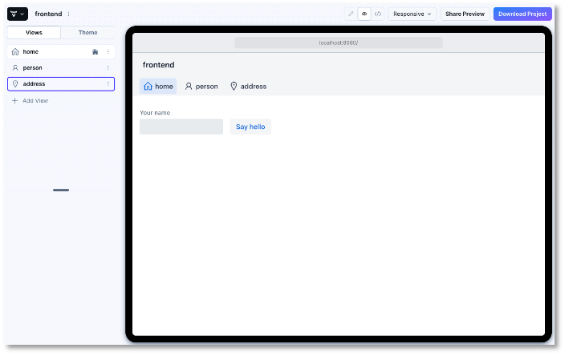
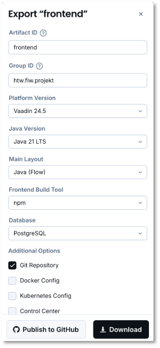

# Vaadin

## Neues Projekt erstellen

Der empfohlene (siehe [hier](https://vaadin.com/docs/latest/getting-started/project)) Weg, ein neues Vaadin-Projekt zu erstellen, ist [Vaadin Start](https://start.vaadin.com/app). Erstellen Sie ruhig schon 2-3 weitere Views, z.B. eine mit dem Hello-World-Beispiel, eine mit dem Personen-Formular und eine mit Adress-Formular. Dann sieht man auch schon das Prinzip mit den Routen. 

{: style="width: 300px;"}

Klicken Sie dann auf den Button `Download Project`. Passen Sie die Daten eventuell an, z.B.:

Entpacken Sie die heruntergeladene Datei und schieben Sie den Ordner in Ihren Workspace. 

